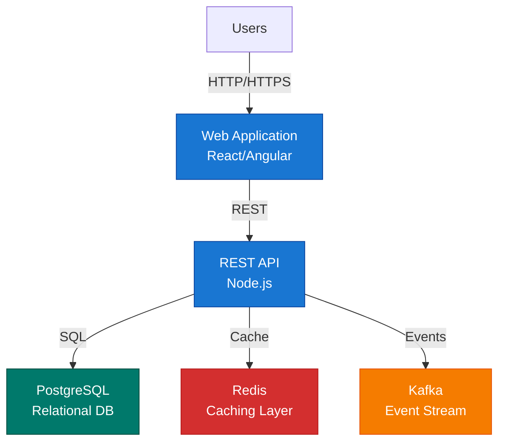

# {{architectureTitle}}

## Overview

Clear description of what this architecture describes, its scope, and strategic importance.

- **Type**: HLD / LLD / C4 Context / AWS Architecture
- **Scope**: {{scope}} (Project / Program / Enterprise)
- **Status**: {{designStatus}}
- **Last Updated**: {{modified}}

## Executive Summary

1-2 paragraphs describing the architecture at highest level for business stakeholders.
- **Key Objective**: What problem does this solve?
- **Business Value**: What's the benefit?
- **Success Criteria**: How do we measure success?

## Architecture Diagram

### C4 Context Level

```mermaid
graph TB
    User["👥 Users/Systems"]
    MainSystem["<b>{{mainSystemName}}</b>"]
    External1["External System 1"]
    External2["External System 2"]

    User -->|Uses| MainSystem
    MainSystem -->|Integrates| External1
    MainSystem -->|Consumes| External2

    style MainSystem fill:#4A90E2,stroke:#1e5ba8,color:#fff
    style User fill:#7CB342,stroke:#558b2f,color:#fff
    style External1 fill:#FB8C00,stroke:#d84315,color:#fff
    style External2 fill:#FB8C00,stroke:#d84315,color:#fff
```



**Key Participants:**
- **Main System**: [[System - {{mainSystem}}]] - Core application providing business value
- **External Systems**: Systems that feed data to or consume data from main system

### C4 Container Level



**Containers:**
- **Web Application**: User-facing web UI
- **REST API**: Business logic and data access layer
- **PostgreSQL**: Primary transactional database
- **Redis**: Caching for performance
- **Kafka**: Real-time event streaming

### Component Level (if applicable)

(Detailed component breakdown for specific layer)

### Data Flow Diagram

```mermaid
graph LR
    Source["📊 Source Systems<br/>SAP, Oracle"]
    Extract["Extract<br/>Query/API"]
    Transform["Transform<br/>Spark/Talend"]
    Load["Load<br/>Batch/Stream"]
    Target["Data Lake<br/>Snowflake"]

    Source -->|Daily| Extract
    Extract -->|Schema Mapping| Transform
    Transform -->|Validated Data| Load
    Load -->|Loaded| Target

    style Source fill:#FF9800,stroke:#e65100,color:#fff
    style Transform fill:#2196F3,stroke:#0d47a1,color:#fff
    style Target fill:#4CAF50,stroke:#2e7d32,color:#fff
```



## Architecture Details by Layer

### Presentation Layer

**Components:**
- Web UI (React, responsive design)
- Mobile app (iOS/Android, native)
- Admin dashboard (internal tools)

**Technology**: React, Angular, Bootstrap

**Key Requirements**:
- Mobile-first responsive design
- Accessibility (WCAG 2.1 AA)
- Performance (< 2s load time, Core Web Vitals)

### Application/Business Logic Layer

**Components:**
- REST API endpoints for core business operations
- Business logic services
- Data validation and transformation
- Authentication & authorization

**Technology**: Node.js/Express, Java/Spring, Python/FastAPI

**Key Requirements**:
- Stateless design for horizontal scaling
- Circuit breaker pattern for resilience
- Request validation and rate limiting
- Structured logging and metrics

**API Design**:
```yaml
GET /api/v1/invoices
  - Authentication: OAuth2
  - Rate limit: 1000 req/hour
  - Pagination: 100 records/page
  - Response time (p99): < 500ms
```

### Integration Layer

**Components:**
- [[Integration - SAP to System]]
- [[Integration - System to Data Lake]]
- [[System - Kong]] API Gateway for external API consumption

**Middleware**: SAP BTP Integration Suite, Kong, Apache Kafka

**Key Capabilities**:
- Protocol translation (REST, SOAP, Kafka, SFTP)
- Data transformation and mapping
- Error handling and retry logic
- Audit logging and compliance

### Data Layer

**Primary Storage**:
- **PostgreSQL**: Transactional data (invoices, orders, customers)
- **Snowflake**: Analytical data warehouse
- **Redis**: Session cache, rate limiting

**Secondary Storage**:
- **S3**: Data lake / archive
- **Elasticsearch**: Full-text search and logs

**Data Model**:
```yaml
Invoices Table:
  - invoice_id (PK)
  - vendor_id (FK)
  - amount
  - invoice_date
  - created_at

Vendors Table:
  - vendor_id (PK)
  - vendor_name
  - country
  - payment_terms
```

### Infrastructure Layer

**Compute**:
- AWS ECS (containerized workloads)
- AWS Lambda (serverless functions)
- RDS (managed PostgreSQL)

**Networking**:
- VPC with public and private subnets
- ALB (Application Load Balancer)
- NAT Gateway for outbound connectivity
- Security groups for network isolation

**Deployment Region**: eu-west-1 (London) for data residency

**Redundancy**: Multi-AZ (eu-west-1a, eu-west-1b, eu-west-1c)

## Non-Functional Requirements (NFRs)

### Availability & Reliability

| Requirement | Target | Rationale |
|-------------|--------|-----------|
| **Availability** | 99.95% | Business-critical application, SLA for customers |
| **RTO** | 4 hours | Recovery from infrastructure failure |
| **RPO** | 1 hour | Acceptable data loss window |
| **MTTR** | 2 hours | Mean time to repair from incident |

**Redundancy Strategy**:
- Multi-AZ deployment across 3 availability zones
- Database replication (synchronous)
- Load balancing across instances
- Health checks and auto-healing

### Performance

| Metric | Target | Measurement |
|--------|--------|-------------|
| **Page Load Time** | < 2 seconds | p95 from end-user browser |
| **API Response Time** | < 500ms | p99 from client |
| **Database Query Time** | < 100ms | p99 for transactional queries |
| **Throughput** | 5,000 req/sec | Sustained load |
| **Concurrency** | 10,000 connections | Active users |

**Performance Testing**: [Link to load test results]

### Scalability

**Horizontal Scaling**:
- Application servers: 2-20 instances (auto-scaling based on CPU > 70%)
- Database: Read replicas for query scaling, sharding for extreme scale
- Message queue: Kafka partitions scaled to throughput

**Vertical Scaling**:
- Database: Upgrade instance size for better performance
- Cache: Increase Redis memory allocation

### Security

| Aspect | Implementation |
|--------|-----------------|
| **Authentication** | OAuth2 / SAML for users, API keys for services |
| **Authorization** | Role-Based Access Control (RBAC) with least privilege |
| **Encryption in Transit** | TLS 1.3 for all APIs, HTTPS-only |
| **Encryption at Rest** | AES-256 for databases, S3 objects |
| **Network Isolation** | VPC, security groups, no public database access |
| **Secrets Management** | AWS Secrets Manager for credentials |
| **Audit Logging** | All API calls, database access, admin actions logged |

**Compliance Frameworks**:
- GDPR (contains customer data)
- SOC2 Type II
- ISO27001
- PCI-DSS (if handling payment cards)

### Disaster Recovery

**Backup Strategy**:
- Database: Continuous replication + daily snapshots
- Data: S3 with versioning and cross-region replication
- Retention: 30 days for snapshots, 7 years for audit data

**Recovery Procedures**:
1. Failure detected (health checks, monitoring alerts)
2. Automated failover to standby (if applicable)
3. Manual intervention per [[Page - DR Runbook]]
4. Recovery validation and customer notification

## Design Decisions & Rationale

### Technology Choices

| Decision | Choice | Alternative | Rationale |
|----------|--------|-------------|-----------|
| **Language** | Node.js | Java, Python | Fast development, JavaScript ecosystem |
| **Database** | PostgreSQL | Oracle, MySQL | Open-source, strong ACID, JSON support |
| **Caching** | Redis | Memcached | More features, persistence options |
| **Messaging** | Kafka | RabbitMQ | Event streaming, replay capability |
| **Cloud** | AWS | Azure, GCP | Internal standard, cost optimization |

### Architectural Patterns

**Pattern 1: Microservices**
- Rationale: Independent scaling, fault isolation
- Trade-off: Operational complexity, distributed tracing

**Pattern 2: Event-Driven Architecture**
- Rationale: Loose coupling, real-time processing
- Trade-off: Eventual consistency, debugging complexity

**Pattern 3: CQRS (Command Query Responsibility Segregation)**
- Rationale: Optimize reads and writes independently
- Trade-off: Eventual consistency, code duplication

## Implementation Plan

### Phases

**Phase 1: Foundation (3 months)**
- Build core API and database
- Deploy to AWS
- Set up CI/CD pipeline

**Phase 2: Integration (2 months)**
- Connect to SAP and other systems
- Implement event streaming
- Build initial dashboards

**Phase 3: Optimization (1 month)**
- Performance tuning
- Load testing
- Security hardening

**Phase 4: Production Deployment (2 weeks)**
- Canary deployment
- Customer onboarding
- Production support handover

### Resource Requirements

| Role | Count | Effort |
|------|-------|--------|
| **Architects** | 2 | Design, technology decisions |
| **Backend Engineers** | 4 | API, database, integrations |
| **Frontend Engineers** | 2 | UI, responsive design |
| **DevOps** | 1 | Infrastructure, CI/CD |
| **QA** | 2 | Testing, quality assurance |
| **Product Manager** | 1 | Requirements, prioritization |

**Total**: ~12 people, 6-month project

### Budget & Effort

- **Development**: 4,000 person-hours @ £75/hour = £300k
- **Infrastructure Setup**: £50k
- **AWS Annual Cost**: £120k (once in production)
- **Contingency (20%)**: £94k
- **Total**: £564k

## Monitoring & Operations

### Key Metrics to Track

**System Health**:
- Uptime / availability
- Error rate (5xx responses)
- Latency (p50, p95, p99)
- Throughput (requests/second)

**Business Metrics**:
- Active users
- Transaction volume
- Revenue impact
- Customer satisfaction

**Infrastructure**:
- CPU utilization
- Memory utilization
- Disk space
- Network bandwidth

### Monitoring Tools

- **Application Metrics**: Datadog / New Relic
- **Logs**: ELK Stack / Splunk
- **Alerting**: PagerDuty / Opsgenie
- **Uptime Monitoring**: StatusPage

### Runbook

Operations team refers to [[Page - {{architecture}} Operations Runbook]] for:
- Deployment procedures
- Troubleshooting common issues
- Incident response
- Scaling procedures
- Backup/restore procedures

## Related Architecture & Decisions

| Document | Type | Link |
|----------|------|------|
| [[ADR - Technology Selection]] | Architectural Decision | Why these technologies were chosen |
| [[Project - {{projectName}}]] | Project | Implementation project for this architecture |
| [[Page - Security Architecture]] | Design Doc | Detailed security design |
| [[Page - Data Architecture]] | Design Doc | Data model and data flows |

## Review & Sign-Off

| Role | Name | Status | Date |
|------|------|--------|------|
| **Architecture Lead** | [[Person Name]] | Approved | 2026-01-14 |
| **Enterprise Architect** | [[Person Name]] | Approved | 2026-01-14 |
| **Security Officer** | [[Person Name]] | Approved | 2026-01-14 |
| **Infrastructure Lead** | [[Person Name]] | Approved | 2026-01-14 |

## Assumptions & Constraints

### Key Assumptions
1. Budget of £500k+ available for implementation
2. Required project resources available by Q1 2026
3. Data residency must remain in EU (GDPR)
4. Existing systems (SAP, Oracle) available for integration

### Constraints
- Must leverage existing AWS infrastructure
- Cannot require new procurement of licenses
- Must support 2 million+ transaction volume daily
- Must maintain backward compatibility with legacy APIs

## Risks & Mitigations

| Risk | Impact | Probability | Mitigation |
|------|--------|-------------|-----------|
| **Integration complexity with legacy systems** | H | M | Early POC with SAP team, establish integration patterns |
| **Skill gap in event-driven architecture** | M | M | Hire consultants, conduct team training |
| **Regulatory compliance delays** | H | L | Early DPIA, security assessment in design phase |
| **Infrastructure cost overruns** | M | M | Detailed cost modeling, AWS commitment discounts |

---

## Canvas Visualizations

Interactive visual explorations of this architecture:

- [[Canvas - {{architectureTitle}} - Component Diagram]]
- [[Canvas - {{architectureTitle}} - Data Flow]]
- [[Canvas - {{architectureTitle}} - Deployment View]]

## Version History

| Date | Change | Author | Version |
|------|--------|--------|---------|
| 2026-01-14 | Initial architecture design | [[David Oliver]] | 1.0 |

---

**Document Status**: Draft / Proposed / Approved / In Development

**Last Updated**: {{modified}}

**Next Review**: 2026-02-14
