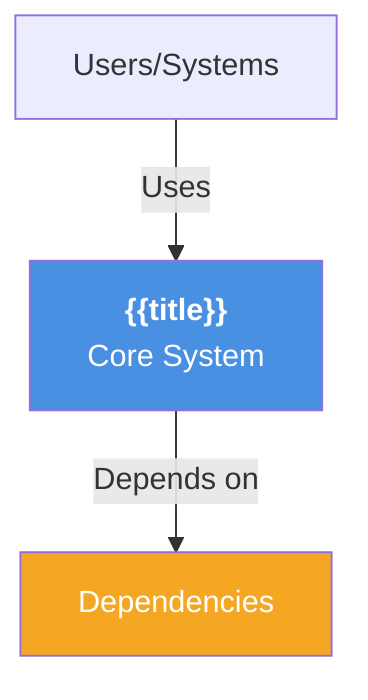

# {{title}}

## Overview

Brief description of what this system does, its purpose in the enterprise, and key characteristics.

## System Properties

| Property | Value |
|----------|-------|
| **System ID** | `{{systemId}}` |
| **APM Number** | APM0001234 |
| **Aliases** | PAD, Aerospace & Defence |
| **Type** | Application / Platform / Infrastructure |
| **Status** | Active / Planned / Deprecated |
| **Criticality** | High / Medium / Low |
| **Owner** | [[Person Name]] or Team |
| **Vendor** | Internal / External |
| **Confluence** | [Application Library](https://yourorg.atlassian.net/wiki/spaces/AL/pages/...) |

## Technology Stack

### Core Technologies
- **Language**: Java / Python / Node / Go
- **Runtime**: JVM / .NET / Node.js / Go
- **Framework**: Spring / Django / FastAPI / Kubernetes
- **Database**: PostgreSQL / Oracle / DynamoDB / Snowflake
- **Messaging**: Kafka / RabbitMQ / AWS SQS / Google Pub/Sub
- **Hosting**: AWS / Azure / On-Prem / SaaS

### Infrastructure
- **Deployment**: Kubernetes / Docker / VM / Serverless
- **Regions**: AWS eu-west-1, us-east-1
- **Scaling**: Auto-scaling / Manual / Horizontal / Vertical

## Architecture Diagram



## Key Capabilities

- **Capability 1**: Description and business impact
- **Capability 2**: Description and business impact
- **Capability 3**: Description and business impact

## Integrations

| Target System | Pattern | Protocol | Frequency | Criticality | Link |
|---------------|---------|----------|-----------|-------------|------|
| [[System - DataPlatform]] | Real-time sync | REST API | Continuous | High | [[Integration - System to DataPlatform]] |
| [[System - Snowflake]] | Batch export | S3 + Spark | Daily 23:00 UTC | Medium | [[Integration - System to Snowflake]] |
| [[System - Kong]] | API gateway | REST | Always-on | Critical | [[Integration - Kong to System]] |

**Inbound Integrations:**
```dataview
TABLE target, pattern, frequency, criticality
FROM ""
WHERE type = "Integration" AND contains(targetSystem, this.file.name)
```

**Outbound Integrations:**
```dataview
TABLE source, pattern, frequency, criticality
FROM ""
WHERE type = "Integration" AND contains(sourceSystem, this.file.name)
```

## Operational Characteristics

### SLA & Performance
- **Availability Target**: 99.95% uptime
- **Response Time (p99)**: < 500ms
- **Throughput**: 5,000 requests/second
- **RTO (Recovery Time)**: 4 hours
- **RPO (Data Loss)**: 1 hour

### Monitoring & Health
- **Health Check**: `https://system.example.com/health`
- **Check Interval**: Every 60 seconds
- **Monitoring Tool**: Datadog / Splunk / CloudWatch
- **Incident Response**: < 1 hour to triage and escalate
- **MTTR**: Target 2 hours

### Maintenance & Updates
- **Maintenance Window**: 2nd Sunday, 02:00-06:00 UTC
- **Current Version**: v2.5.1
- **Supported Versions**: 2.5.x, 2.4.x
- **Planned Upgrade**: Q2 2026 to v3.0
- **Last Update**: [date]

## Data Sources & Datasets

```dataview
TABLE dataType, recordCount, volumePerDay, refreshFrequency
FROM ""
WHERE type = "DataSource" AND contains(sourceSystem, this.file.name)
```

**Key Data Entities**:
- `entities`: Employees, Vendors, Assets (sources: SAP HR, Procurement)
- `transactions`: Orders, Invoices, Payments (sources: SAP FI/CO)
- `master_data`: Products, Customers, Cost Centers (sources: SAP MM, CRM)

## Data & Security

### Classification & Governance
- **Data Classification**: Internal / Confidential / Secret
- **GDPR Applicable**: Yes / No
- **Personal Data Types**: Email, Phone, Address, Passport
- **Data Residency**: EU / US / APAC / Multi-region
- **Retention Policy**: 7 years for audit, 1 year for transactional
- **DPIA Required**: Yes / No
- **DPIA Status**: [[Form Submission - DPIA for System Name]]

### Security
- **Authentication**: OAuth2, SAML, MFA
- **Encryption in Transit**: TLS 1.3
- **Encryption at Rest**: AES-256
- **Security Assessment Date**: [last assessment]
- **Compliance Frameworks**: ISO27001, SOC2, PCI-DSS
- **Penetration Test Date**: [last pentest]

## Cost & Budget

| Category | Value | Notes |
|----------|-------|-------|
| **Annual Run-Rate** | £250,000 | Software + maintenance |
| **Cost Center** | 4521 | Engineering Operations |
| **Budget Owner** | [[Person Name]] | |
| **License Type** | Subscription | SAP annual license |
| **License Expiry** | 2027-12-31 | Renewal planning starts Q3 2027 |
| **Infrastructure Cost** | £150,000/year | AWS compute + storage |

## Dependencies & Impact

### Systems This Depends On

```dataview
TABLE system, reason, criticality
FROM ""
WHERE contains(dependsOn, this.file.name)
```

**Critical Dependencies:**
- [[System - SAP S/4HANA]] - Master data source for all business transactions
- [[System - AWS]] - Cloud infrastructure for high-availability deployment
- [[System - Kafka]] - Real-time event streaming for data integration

### Systems Depending On This One

```dataview
TABLE system, reason, criticality
FROM ""
WHERE contains(requiredBy, this.file.name)
```

**Dependents:**
- [[System - Snowflake]] - Data warehouse consumes data from this system
- [[System - Analytics]] - BI tools require near-real-time data feed
- [[Project - MyDataIntegration]] - Core system for inventory management integration

## Related Architecture & Decisions

| Document | Type | Link |
|----------|------|------|
| [[ADR - System Selection Criteria]] | Architecture Decision | Explains why this system was chosen |
| [[Architecture - Current State HLD]] | High-Level Design | System placement in enterprise architecture |
| [[Page - System Integration Architecture]] | Design Documentation | Detailed integration patterns and middleware |

## Lifecycle Status

### Current Status
- **Status**: Active / Planned / Paused / Deprecated / Retired
- **Launch Date**: 2020-06-15
- **Sunset Date**: (null if active, or target retirement date)
- **Support Until**: 2027-12-31

### Modernisation Plans
- **Modernisation Target**: [[Project - Cloud Migration]] or [[Incubator - Cloud Redesign]]
- **Current Readiness**: 60% (needs architecture review)
- **Timeline**: 2026-Q3 to 2026-Q4

## Recent Changes & Events

- **2026-01-14**: Updated SLA targets based on business requirements
- **2025-12-20**: Infrastructure upgrade to AWS t3.xlarge instances
- **2025-11-30**: Security assessment completed, 2 findings remediated

## Canvas Visualizations

- [[Canvas - System - {{title}} - Dependencies]] - Interactive dependency graph
- [[Canvas - System - {{title}} - Integrations]] - Integration topology
- [[Canvas - {{title}} - Architecture Context]] - C4 context diagram

## Related Notes

```dataview
TABLE type, status
FROM ""
WHERE type = "Integration" AND (contains(sourceSystem, this.file.name) OR contains(targetSystem, this.file.name))
SORT type ASC
```

## Quick Links

- **Owner**: [[Person Name]]
- **Related Project**: [[Project - System Implementation]]
- **Related ADRs**: [[ADR - System Selection]]
- **Cost Center**: 4521

---

## Version History

| Date | Change | Author |
|------|--------|--------|
| 2026-01-14 | Initial creation | [[David Oliver]] |
