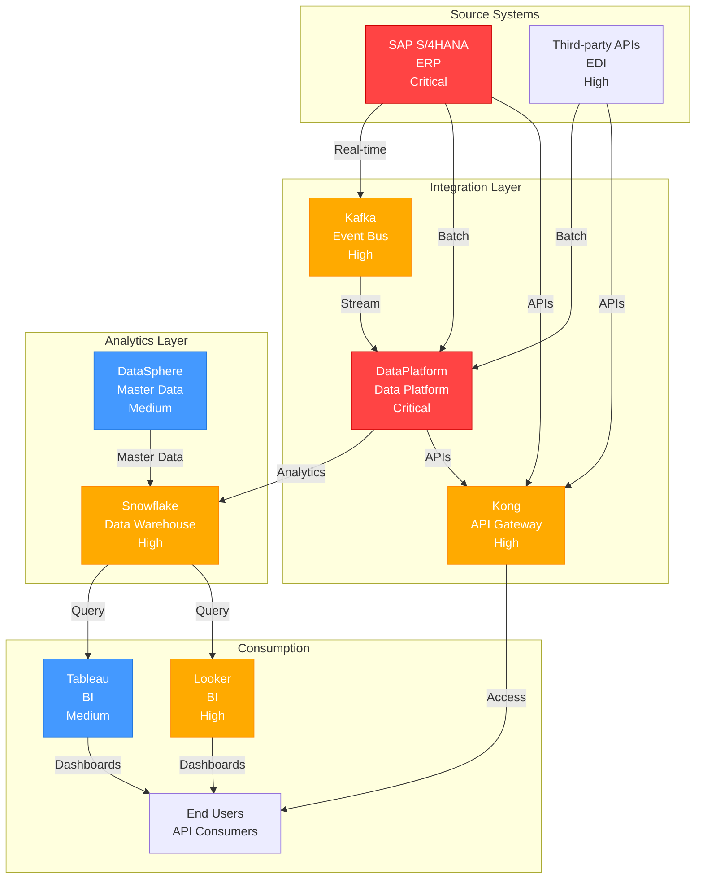

# /dependency-graph Skill

Visualize system dependencies and identify critical paths, bottlenecks, and single points of failure.

## When to Use This Skill

Use `/dependency-graph` when you need to:
- Understand what systems depend on a critical system
- Identify single points of failure
- Plan outage impact for maintenance
- Design disaster recovery strategies
- Perform risk assessment on architecture
- Plan system decommissioning (understand what breaks)
- Optimize architecture to reduce critical dependencies

## Usage

```
/dependency-graph [root-system] [options]
```

### Parameters

| Parameter | Description | Required |
|-----------|-------------|----------|
| `root-system` | System to analyze (or "all" for enterprise graph) | Optional |
| `--depth` | How many hops to follow (1=direct, 2=direct+indirect, all) | Optional |
| `--direction` | Direction to follow (upstream=sources, downstream=consumers, both) | Optional |
| `--visualization` | Graph format (text, ascii-art, mermaid, d3) | Optional |

## Workflow

### Phase 1: Define Graph Scope

User specifies:

1. **Root system** (optional - default: all systems)
   - Single system (system:SAP)
   - All systems (enterprise)
   - Critical systems only

2. **Depth** (optional)
   - `1` - Direct dependencies only (immediate consumers/producers)
   - `2` - Direct + indirect (one level deeper)
   - `all` - All paths to edges (complete dependency closure)

3. **Direction** (optional)
   - `upstream` - What feeds into this system (sources)
   - `downstream` - What consumes from this system
   - `both` - Both upstream and downstream (default)

4. **Visualization** (optional)
   - `text` - ASCII text representation
   - `ascii-art` - Fancy ASCII visualization
   - `mermaid` - Mermaid diagram (for markdown)
   - `d3` - Interactive D3 visualization (HTML)

### Phase 2: Analyze Dependencies

The skill:

1. **Builds dependency graph**
   - Reads all Integration notes
   - Maps directional relationships
   - Calculates paths and cycles

2. **Identifies critical paths**
   - Paths that affect critical systems
   - Paths with no redundancy (single points of failure)
   - Paths with high latency impact

3. **Scores risk**
   - If root system fails, how many others affected?
   - What is average recovery time?
   - Are there failover paths?

4. **Detects patterns**
   - Hub systems (many connections)
   - Isolated clusters
   - Circular dependencies (if any)
   - Chain reactions (cascading failures)

### Phase 3: Generate Visualization

Creates graph showing:
- Nodes: Systems (colored by criticality)
- Edges: Integrations (colored by type: real-time, batch, API)
- Edge labels: Latency, criticality, frequency
- Highlighted: Critical paths, single points of failure

### Phase 4: Output

Generates report with:
- Visual dependency graph (multiple formats)
- Text analysis of critical paths
- Risk assessment
- Recommendations for resilience improvements
- Outage impact matrix (if X fails, what breaks?)

## Visualization Examples

### Example 1: SAP as Root System

```
/dependency-graph system:SAP --direction downstream --depth all
```

**Text Output:**

```
SAP S/4HANA Downstream Dependencies
═══════════════════════════════════════════════════════

Direct Consumers (1 hop):
────────────────────────
SAP → Kafka (Event Stream)
  • 50K invoices/day + 100K GL postings/day
  • <1 second latency
  • Criticality: Critical

SAP → Kong (API Gateway)
  • 150 API endpoints
  • <500ms latency
  • Criticality: Critical

SAP → DataPlatform (Batch Extract)
  • Daily 04:00 UTC
  • 80 tables
  • Criticality: High

Indirect Consumers (2+ hops):
─────────────────────────────
SAP → Kafka → DataPlatform → Snowflake
  • Real-time path (5 second latency)
  • 500 events/sec
  • Criticality: Critical

SAP → Kong → End Users
  • 5,000 API requests/sec
  • <500ms p99 latency
  • Criticality: Critical

SAP → DataPlatform → Snowflake → Tableau
  • Daily analytics (4 hour latency)
  • Criticality: High

Risk Analysis:
───────────────
If SAP fails:
  • Kafka: Immediately stops receiving events
  • Kong: Returns stale data or error responses
  • DataPlatform: Batch job fails next scheduled run
  • Snowflake: No new data loaded
  • End Users: Cannot get real-time or API data
  • Impact Score: 10/10 (Critical)
  • Recovery: Full restore from RDS backup (1-2 hours)

Single Points of Failure:
  1. SAP is sole source of business data
     Mitigation: Backup integration from on-prem source (exists)
  2. Kafka is sole event bus
     Mitigation: 3-broker cluster (good redundancy)
  3. DataPlatform is sole ETL platform
     Mitigation: Can fall back to manual exports (limited)
```

### Example 2: DataPlatform as Root System

```
/dependency-graph system:DataPlatform --direction both --depth 2
```

**ASCII Art Output:**

```
                SAP                Kafka              Third-Party APIs
                 │                  │                      │
                 └──┬───────────┬───┘                       │
                    │           │                           │
              ┌─────┴─────┐     │                      ┌────┴────┐
              │           │     │                      │         │
           Real-time    Batch   │                  Streaming  Batch
           Events       Extract │                 Connectors  APIs
              │           │     │                      │        │
              └─────┬─────┴─────┼──────────────────────┴────────┘
                    │           │
            ┌───────▼───────────▼─────────┐
            │     DataPlatform                    │
            │   Data Integration         │
            │   150 TB, 450 pipelines    │
            └───────┬────────┬───────────┘
                    │        │
         ┌──────────┤        ├──────────┐
         │          │        │          │
    Real-time    Batch    APIs    Data Lake
    Streaming    Tables   JSON     (S3)
         │          │        │          │
         └──────────┼────────┼──────────┘
                    │        │
         ┌──────────▼─┬──────▼──────────┐
         │            │                 │
      Snowflake    Kong API    Other Tools
      (Data Warehouse) Gateway  (Tableau, Looker)
         │            │                 │
      Analytics   End Users         Dashboards
      Queries     (5K req/sec)       (Real-time)
         │            │                 │
         └──────┬──────┴─────┬──────────┘
                │            │
           Finance  Operations Marketing
           Reports   Dashboards Analytics


Criticality Color Legend:
  Red = Critical (if down, major impact)
  Orange = High (affects multiple teams)
  Blue = Medium (limited impact)
```

### Example 3: Enterprise Graph (All Systems)

```
/dependency-graph all --direction both --visualization mermaid
```

**Mermaid Output:**



**D3 Interactive Output:**
- Generates HTML file with interactive force-directed graph
- Click nodes to see details
- Drag to reposition
- Zoom and pan
- Hover to highlight paths

## Dependency Analysis Report

### Section 1: Executive Summary

```
Enterprise Dependency Analysis Report
═════════════════════════════════════════════════════════
Generated: 2026-01-14
Scope: All systems (25 systems analyzed)

Critical Finding:
──────────────────
✗ SINGLE POINT OF FAILURE IDENTIFIED: SAP S/4HANA
  • 15 of 25 systems depend directly or indirectly on SAP
  • No redundancy for source data
  • If SAP fails: 60% of enterprise blind (limited fallback)
  • Recommended: Implement SAP failover + backup integration

Architecture Health Score: 7.2/10
  • Connectivity: Good (well-connected)
  • Redundancy: Fair (some SPOFs)
  • Resilience: Fair (manual recovery in some cases)
  • Scalability: Good (no bottlenecks identified)

Recommendations:
  1. (Critical) Implement SAP disaster recovery strategy
  2. (High) Add redundancy to Kafka event bus (already 3-broker)
  3. (Medium) Decouple DataPlatform from SAP for certain operations
  4. (Medium) Plan DataPlatform scaling for growth trajectory
```

### Section 2: System Criticality Ranking

```
System Criticality Ranking
═══════════════════════════════════════════════════════

Tier 1 - Business Critical (Impacts All):
──────────────────────────────────────────
1. SAP S/4HANA
   • Upstream: None (primary source)
   • Downstream: 15 systems (60% of enterprise)
   • If down: No transactions, orders, financial data
   • Recovery: 1-2 hours (RDS backup restore)
   • Recommended SLA: 99.95% (4 hours unplanned downtime/year)

2. DataPlatform Data Platform
   • Upstream: SAP, third-party APIs, Kafka
   • Downstream: Snowflake, Kong APIs, analytics
   • If down: Real-time analytics stops, batch delayed
   • Recovery: 30 minutes (Kubernetes pod restart)
   • Recommended SLA: 99.95% (4 hours/year)

Tier 2 - Enterprise Critical (Impacts Many):
─────────────────────────────────────────────
3. Snowflake Data Warehouse
   • Upstream: DataPlatform, DataSphere
   • Downstream: BI tools, analytics users
   • If down: No analytics/reporting (batch delayed)
   • Recovery: 30 minutes (cross-region failover available)
   • Recommended SLA: 99.9% (9 hours/year)

4. Kong API Gateway
   • Upstream: SAP, DataPlatform, Snowflake
   • Downstream: External API consumers (5K req/sec)
   • If down: APIs unavailable, integrations fail
   • Recovery: <5 minutes (redundant instances)
   • Recommended SLA: 99.95%

5. Kafka Event Bus
   • Upstream: SAP (event generation)
   • Downstream: DataPlatform real-time processing
   • If down: Real-time processing stops
   • Recovery: <5 minutes (3-broker failover)
   • Recommended SLA: 99.9%

Tier 3 - Department Critical (Impacts Few):
────────────────────────────────────────────
6. Tableau BI
   • If down: Finance/ops dashboards unavailable
   • Recovery: ~1 hour (Looker fallback partial)
   • Recommended SLA: 99% (3.6 days/year acceptable)

[... additional systems ...]
```

### Section 3: Failure Impact Matrix

Shows cascading failures if any system goes down:

```
System Failure Impact Analysis
═════════════════════════════════════════════════════════

If SAP fails (Probability: Low, Impact: Critical):
────────────────────────────────────────────────────
Immediate Impact (0-5 min):
  ✗ All new transactions stop
  ✗ API responses stale (last 24 hours)
  ✗ Real-time dashboards freeze

Short-term Impact (5-30 min):
  ✗ Batch ETL failure (next scheduled run in 3 hours)
  ✗ Analytics warehouse not updated
  ✗ Reports delayed

Long-term Impact (30+ min):
  ✗ Finance closure processes blocked (critical)
  ✗ Supply chain planning affected
  ✗ Customer orders not processed

Mitigation:
  • Backup integration from on-prem source (tested weekly)
  • RDS Multi-AZ failover (automatic, <2 min)
  • Recovery procedure: Restore from backup (1-2 hours)

Affected Systems:
  15 of 25 systems (60% of enterprise)
  • Critical: Kafka, DataPlatform, Snowflake, Kong
  • High: BI tools, analytics
  • Medium: Reporting, planning tools

If DataPlatform fails (Probability: Very Low, Impact: High):
──────────────────────────────────────────────────────
Immediate (0-5 min):
  ✗ Real-time analytics stop (< 30 second lag)
  ✗ Batch ETL paused

Short-term (5-30 min):
  ⚠ Kubernetes auto-recovery may restore (typical time)
  ✗ If not recovered: Snowflake not updated

Long-term:
  ✗ Analytics 4+ hours behind source

Mitigation:
  • EKS multi-AZ deployment (pods restart <5 min)
  • S3 canary jobs monitor pipeline health
  • Manual intervention: Restart pods via kubectl

Affected Systems:
  8 of 25 systems (32% of enterprise)
  • Direct: Snowflake, Kong APIs
  • Indirect: BI tools, end users

[... additional failure scenarios ...]
```

### Section 4: Critical Path Analysis

Identifies paths that matter most:

```
Critical Paths (Highest Business Impact)
═════════════════════════════════════════════════════════

Path 1: Real-time Analytics (Critical)
───────────────────────────────────────
SAP → Kafka → DataPlatform → Snowflake → Looker Dashboard
  Latency: 5 seconds end-to-end
  Criticality: Critical (exec dashboards depend on this)
  Single Points of Failure:
    • SAP: No backup (MUST have disaster recovery)
    • Kafka: 3-broker failover (good)
    • DataPlatform: EKS auto-recovery (good)
    • Snowflake: Cross-region failover (good)

Path 2: Financial Batch Processing (Critical)
──────────────────────────────────────────────
SAP → DataPlatform → Snowflake → Financial Reports
  Frequency: Daily 04:00 UTC
  Criticality: Critical (month-end close depends on this)
  Dependencies:
    • SAP must export GL postings correctly
    • DataPlatform must transform per GL rules
    • Snowflake must load before 08:00 UTC
  Single Point of Failure: DataPlatform (if down, reports 1 day late)

Path 3: API Integration (High)
──────────────────────────────
SAP ↔ Kong ↔ Third-party Partners
  Throughput: 5,000 req/sec (peak)
  Criticality: High (customer orders)
  If Kong fails: Orders can't be placed
  If SAP fails: Stale data served from cache
```

### Section 5: Resilience Recommendations

Specific actions to improve resilience:

```
Resilience Improvement Recommendations
═════════════════════════════════════════════════════════

Priority 1: CRITICAL (Implement in Q1 2026)
─────────────────────────────────────────

1. Implement SAP Disaster Recovery
   • Current: RDS Multi-AZ failover (good for infrastructure)
   • Gap: No application-level fallback
   • Recommendation: Secondary on-prem data source
   • Benefit: If RDS fails, can pull from on-prem
   • Cost: £50K setup, £20K/year ops
   • Implementation: 3 months
   • Impact: Eliminates #1 SPOF

2. Implement DataPlatform High Availability
   • Current: EKS multi-AZ (good)
   • Gap: No cross-region failover
   • Recommendation: Warm standby in eu-west-2
   • Benefit: RTO <15 min, RPO 5 min
   • Cost: £30K setup, £10K/year
   • Implementation: 2 months
   • Impact: Increases DataPlatform resilience

Priority 2: HIGH (Q2 2026)
──────────────────────────

3. Decouple DataPlatform from Real-time SAP (Optional Buffer)
   • Add Kafka topic as buffer
   • If SAP slow: DataPlatform can use cached state
   • Benefit: Reduces real-time dependency on SAP
   • Cost: £20K
   • Implementation: 1 month

4. Improve Monitoring
   • Current: CloudWatch + Datadog
   • Add: Distributed tracing (Jaeger/Tempo)
   • Benefit: Faster MTTR on multi-hop failures
   • Cost: £10K setup, £5K/year
   • Implementation: 2 weeks

Priority 3: MEDIUM (Q3 2026+)
──────────────────────────────

5. Evaluate Event Sourcing for Kafka
   • Current: 7-day retention
   • Recommendation: 30-day retention
   • Benefit: Can replay events if DataPlatform delayed
   • Cost: £5K additional storage
   • Trade-off: Higher latency if needed to replay

[... additional recommendations ...]
```

### Section 6: Dependency Graph Visualization

Provides visual representation in multiple formats:
- ASCII art (text output)
- Mermaid diagram (markdown)
- Interactive D3 graph (HTML)

Each visualization highlights:
- Critical paths (bold/red)
- Single points of failure (circled)
- Failover paths (dashed lines)
- Latency labels on edges
- Criticality color-coding on nodes

## Advanced Options

### Filter by Criticality

```
/dependency-graph --criticality critical
```

Show only critical systems and their dependencies.

### Show Cycles (Circular Dependencies)

```
/dependency-graph --show-cycles
```

Highlights any circular dependencies (rare in well-designed systems):
```
Warning: Circular dependency detected!
  A → B → C → A
  Recommendation: Break cycle
```

### Calculate Shortest Paths

```
/dependency-graph system:SAP system:Tableau --show-paths
```

Show all paths from SAP to Tableau:
```
Shortest Path (3 hops):
  SAP → DataPlatform → Snowflake → Tableau (latency: 4+ hours)

Alternative Paths:
  None (single path)
```

### Network Statistics

```
/dependency-graph --statistics
```

Calculate graph metrics:
- Graph density (connectivity)
- Average path length
- Central nodes (hubs)
- Isolated clusters

```
Network Statistics
──────────────────
Total Systems: 25
Total Integrations: 31
Graph Density: 0.84 (well-connected)
Average Path Length: 2.1 hops
Most Connected: SAP (10 connections)
Most Isolated: Tableau (2 connections)
Clusters Identified: 1 main, 0 isolated
```

## Integration with Other Skills

The `/dependency-graph` skill works with:

- **`/impact-analysis`** - Analyze impact of system failures
- **`/architecture-report`** - Include dependency analysis section
- **`/system-sync`** - Update graph when dependencies change
- **`/cost-optimization`** - Identify redundant connections to eliminate

## Output Formats

### Text (ASCII)

Simple text-based dependency list:
```
SAP
├── Kafka
│   └── DataPlatform
│       ├── Snowflake
│       │   ├── Tableau
│       │   └── Looker
│       └── Kong
└── Kong
    └── End Users
```

### Mermaid Diagram

Embeddable in markdown files and Obsidian Canvas.

### D3 Interactive

HTML file with interactive force-directed graph:
- Clickable nodes (see details)
- Draggable (rearrange layout)
- Zoomable/pannable
- Hover highlighting

### GraphML

Export for use in other tools:
- Gephi (network analysis)
- Neo4j (graph database)
- Custom tools

## Next Steps

After generating dependency graph:

1. Review with architecture/security teams
2. Prioritize resilience improvements
3. Create projects for priority 1 recommendations
4. Update disaster recovery runbooks based on findings
5. Schedule quarterly dependency reviews
6. Monitor actual outage impact vs. predicted

---

**Invoke with:** `/dependency-graph [system]`

**Example:** `/dependency-graph all` → Enterprise dependency graph showing all systems and critical paths
