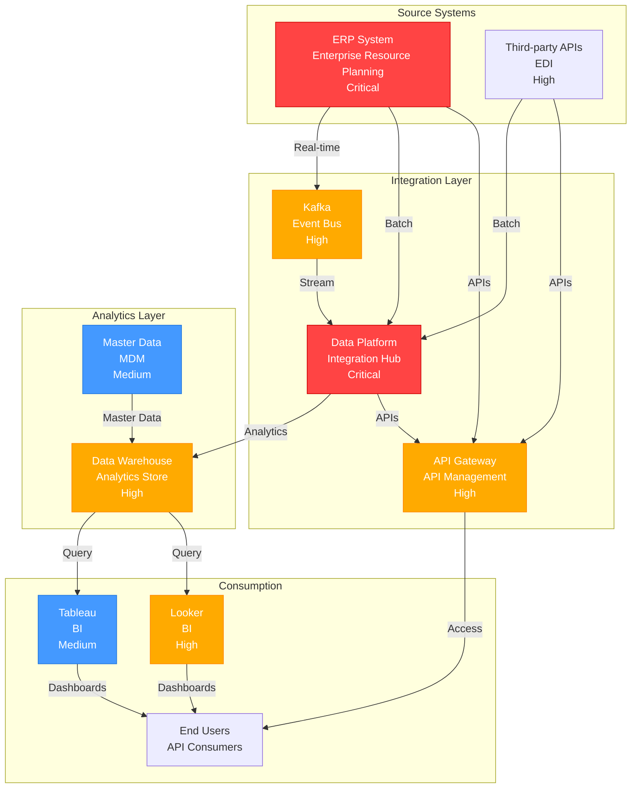

# /dependency-graph Skill

Visualize system dependencies and identify critical paths, bottlenecks, and single points of failure.

## When to Use This Skill

Use `/dependency-graph` when you need to:
- Understand what systems depend on a critical system
- Identify single points of failure
- Plan outage impact for maintenance
- Design disaster recovery strategies
- Perform risk assessment on architecture
- Plan system decommissioning (understand what breaks)
- Optimize architecture to reduce critical dependencies

## Usage

```
/dependency-graph [root-system] [options]
```

### Parameters

| Parameter | Description | Required |
|-----------|-------------|----------|
| `root-system` | System to analyze (or "all" for enterprise graph) | Optional |
| `--depth` | How many hops to follow (1=direct, 2=direct+indirect, all) | Optional |
| `--direction` | Direction to follow (upstream=sources, downstream=consumers, both) | Optional |
| `--visualization` | Graph format (text, ascii-art, mermaid, d3) | Optional |

## Workflow

### Phase 1: Define Graph Scope

User specifies:

1. **Root system** (optional - default: all systems)
   - Single system (system:ERP)
   - All systems (enterprise)
   - Critical systems only

2. **Depth** (optional)
   - `1` - Direct dependencies only (immediate consumers/producers)
   - `2` - Direct + indirect (one level deeper)
   - `all` - All paths to edges (complete dependency closure)

3. **Direction** (optional)
   - `upstream` - What feeds into this system (sources)
   - `downstream` - What consumes from this system
   - `both` - Both upstream and downstream (default)

4. **Visualization** (optional)
   - `text` - ASCII text representation
   - `ascii-art` - Fancy ASCII visualization
   - `mermaid` - Mermaid diagram (for markdown)
   - `d3` - Interactive D3 visualization (HTML)

### Phase 2: Analyze Dependencies

The skill:

1. **Builds dependency graph**
   - Reads all Integration notes
   - Maps directional relationships
   - Calculates paths and cycles

2. **Identifies critical paths**
   - Paths that affect critical systems
   - Paths with no redundancy (single points of failure)
   - Paths with high latency impact

3. **Scores risk**
   - If root system fails, how many others affected?
   - What is average recovery time?
   - Are there failover paths?

4. **Detects patterns**
   - Hub systems (many connections)
   - Isolated clusters
   - Circular dependencies (if any)
   - Chain reactions (cascading failures)

### Phase 3: Generate Visualization

Creates graph showing:
- Nodes: Systems (colored by criticality)
- Edges: Integrations (colored by type: real-time, batch, API)
- Edge labels: Latency, criticality, frequency
- Highlighted: Critical paths, single points of failure

### Phase 4: Output

Generates report with:
- Visual dependency graph (multiple formats)
- Text analysis of critical paths
- Risk assessment
- Recommendations for resilience improvements
- Outage impact matrix (if X fails, what breaks?)

## Visualisation Examples

### Text Output (ERP Downstream)

`/dependency-graph system:ERP --direction downstream --depth all` produces a structured text output showing:
- **Direct consumers** (1 hop) with volume, latency, criticality per edge
- **Indirect consumers** (2+ hops) with full path chains
- **Risk analysis** — cascading impact if root system fails, impact score, recovery time
- **Single points of failure** with mitigations

### Mermaid Output (Enterprise Graph)

```
/dependency-graph all --direction both --visualization mermaid
```

**Mermaid Output:**



## Analysis Report Sections

The generated report includes:

1. **Executive Summary** — Architecture health score (connectivity, redundancy, resilience, scalability), critical findings (SPOFs), prioritised recommendations
2. **System Criticality Ranking** — Tier 1 (business critical), Tier 2 (enterprise critical), Tier 3 (department critical) with upstream/downstream counts, recovery times, recommended SLAs
3. **Failure Impact Matrix** — Per-system cascading failure analysis: immediate (0-5 min), short-term (5-30 min), long-term (30+ min) impacts with mitigations and affected system counts
4. **Critical Path Analysis** — Highest business-impact paths with latency, criticality, dependencies, and SPOFs per hop
5. **Resilience Recommendations** — Prioritised actions (P1 critical, P2 high, P3 medium) with current state, gap, recommendation, cost, implementation timeline
6. **Dependency Graph Visualisation** — Multiple formats (ASCII, Mermaid, D3) with critical paths highlighted, SPOFs circled, failover paths dashed, criticality colour-coding

## Advanced Options

### Filter by Criticality

```
/dependency-graph --criticality critical
```

Show only critical systems and their dependencies.

### Show Cycles (Circular Dependencies)

```
/dependency-graph --show-cycles
```

Highlights any circular dependencies (rare in well-designed systems):
```
Warning: Circular dependency detected!
  A → B → C → A
  Recommendation: Break cycle
```

### Calculate Shortest Paths

```
/dependency-graph system:ERP system:Tableau --show-paths
```

Show all paths from ERP to Tableau:
```
Shortest Path (3 hops):
  ERP → Data Platform → Data Warehouse → Tableau (latency: 4+ hours)

Alternative Paths:
  None (single path)
```

### Network Statistics

```
/dependency-graph --statistics
```

Calculates graph density, average path length, central nodes (hubs), and isolated clusters.

## Integration with Other Skills

The `/dependency-graph` skill works with:

- **`/impact-analysis`** - Analyze impact of system failures
- **`/architecture-report`** - Include dependency analysis section
- **`/system-sync`** - Update graph when dependencies change
- **`/cost-optimization`** - Identify redundant connections to eliminate

## Output Formats

| Format | Description |
|--------|-------------|
| **Text (ASCII)** | Tree-style dependency list (e.g., `ERP ├── Kafka │ └── Data Platform`) |
| **Mermaid** | Embeddable in markdown and Obsidian Canvas |
| **D3 Interactive** | HTML force-directed graph (clickable, draggable, zoomable) |
| **GraphML** | Export for Gephi, Neo4j, or custom tools |

## Next Steps

After generating dependency graph:

1. Review with architecture/security teams
2. Prioritize resilience improvements
3. Create projects for priority 1 recommendations
4. Update disaster recovery runbooks based on findings
5. Schedule quarterly dependency reviews
6. Monitor actual outage impact vs. predicted

---

**Invoke with:** `/dependency-graph [system]`

**Example:** `/dependency-graph all` → Enterprise dependency graph showing all systems and critical paths
