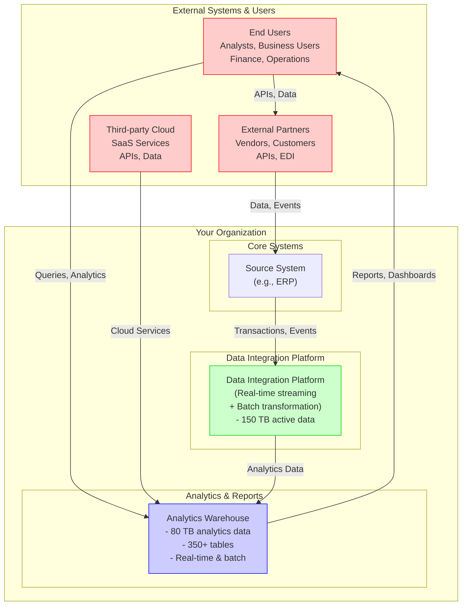

# Sample C4 Context Diagram

C4 Context (Level 1) showing the Data Integration Platform in relation to external systems.

## Visual Context



## Components

### External Actors
- **End Users** - Data analysts, business users, executives
- **External Partners** - Suppliers, vendors, business partners
- **Third-party Cloud** - SaaS services, cloud platforms

### Core Systems
- **Source System** - Enterprise transaction system (e.g., your ERP)
  - Generates business events (invoices, orders, etc.)
  - Source of truth for master data

### Data Integration Platform
**"Black box" containing:**
- Event streaming infrastructure (Kafka-like)
- Data transformation (Spark-like)
- Orchestration (Airflow-like)
- Data lake (Delta Lake-like)

### Analytics Platform
- **Analytics Warehouse** - Analytics database (cloud-native)
  - Single source of truth for analytics
  - Feeds dashboards, reports, APIs

## Data Flows

### Real-time Path (Sub-second latency)
```
Source System Events → Event Bus → Data Platform → Analytics Warehouse
Latency: <5 seconds total
Used by: Real-time dashboards, operational monitoring
```

### Batch Path (Daily latency)
```
Source System Extract → Data Platform → Analytics Warehouse
Frequency: 04:00 UTC daily
Used by: Analytics reports, compliance
```

### API Path (Sub-second latency)
```
External Users → API Gateway → Source/Data/Analytics APIs
Latency: 100-500ms
Used by: Mobile apps, dashboards, integrations
```

## System Responsibilities

| System | Responsibility |
|--------|---|
| **Source System** | Transaction generation, master data |
| **Data Integration** | Data integration, transformation, enrichment |
| **Analytics Warehouse** | Analytics platform, reporting, BI |
| **API Gateway** | API access, security, rate limiting |

## Deployment Context

```
┌─────────────────────────────────────────┐
│        Your Cloud Platform              │
│  ┌─────────────────────────────────────┐│
│  │  Data Integration Platform          ││
│  │  - Source System (Database)         ││
│  │  - Event Bus (Kafka-like)           ││
│  │  - Stream Processing (Spark-like)   ││
│  │  - Batch Orchestration (Airflow)    ││
│  └─────────────────────────────────────┘│
│                                         │
│  ┌─────────────────────────────────────┐│
│  │  DR Replica (Secondary Region)      ││
│  │  - Warm standby                     ││
│  │  - Cross-region replication         ││
│  └─────────────────────────────────────┘│
└─────────────────────────────────────────┘

┌─────────────────────────────────────────┐
│     Analytics Platform (SaaS)           │
│  - Primary warehouse region             │
│  - Cross-region backup                  │
└─────────────────────────────────────────┘
```

## Key Metrics

| Metric | Target | Current |
|--------|--------|---------|
| Real-time latency | <5 sec | <5 sec |
| Batch latency | <2 hours | ~2 hours |
| API response time | <500ms p99 | <150ms p99 |
| Data freshness | Real-time | Continuous streaming |
| System availability | 99.95% | 99.95% |

## Customization Guide

1. **Replace System Names**:
   - "Source System" → Your ERP name
   - "Data Integration Platform" → Your platform name
   - "Analytics Warehouse" → Your warehouse name

2. **Update External Actors**:
   - Add/remove user types specific to your org
   - Add external partners you integrate with
   - List external services you depend on

3. **Adjust Data Flows**:
   - Show your actual data paths
   - Add any custom flows unique to your architecture
   - Update latency targets

4. **Link to System Notes**:
   - Create individual System notes for each component
   - Cross-link: `[[System - Your ERP Name]]`

## Use Cases

- **Architecture Review** - Show C4 context to stakeholders
- **Onboarding** - Help new team members understand system boundaries
- **Design Review** - Document external dependencies
- **Risk Assessment** - Identify external dependencies and risks

## Next Level (Expand To)

To add more detail, create child canvases for:
- **C4 Container Diagram** - Show major components/services
- **C4 Component Diagram** - Detailed component interactions
- **System Landscape** - All systems in your organization
- **Data Flow** - Detailed data movement and transformations

## Related Documents

- [[Canvas - Sample System Landscape]] - All systems overview
- [[Canvas - Sample Data Flow Diagram]] - Data movement detail
- [[Architecture - Sample Data Integration Platform HLD]] - Full HLD

---

**Tip**: This is a template. Customize it to match your actual architecture!
