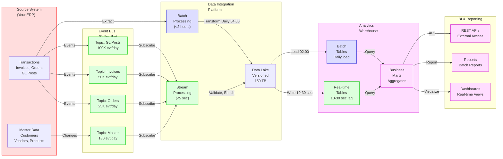

# Sample Data Flow Diagram Canvas

Detailed view of how data flows through the sample architecture via real-time and batch paths.

## Main Data Flows

## Flow Details

### Flow 1: Real-time Stream (Sub-5 seconds)

**Path**: Source Events → Event Bus → Data Platform → Analytics → Dashboards

**Steps**:
1. Invoice created in Source System (14:32:15)
2. Published to Event Bus (14:32:16)
3. Data Platform consumer receives (14:32:17)
4. Validation & enrichment (14:32:17-18)
5. Written to Analytics (14:32:18)
6. Dashboard reflects data (14:32:20)

**Latency**: 5 seconds (14:32:15 → 14:32:20)
**Volume**: 500+ events/second
**Use Cases**: Real-time dashboards, operational alerts

---

### Flow 2: Batch ETL (Daily)

**Path**: Source Extract → Data Platform → Data Lake → Analytics → Reports

**Steps**:
1. Scheduled at 04:00 UTC
2. Platform exports 80 tables from Source
3. Transforms data in Data Lake
4. Loads to Analytics Warehouse (02:00 UTC)
5. Queries available for analysts (08:00 UTC)

**Latency**: 4 hours (04:00 → 08:00)
**Volume**: 10 TB/day (80 tables)
**Use Cases**: Analytics, reporting, compliance

---

### Flow 3: API Access (Sub-500ms)

**Path**: External User → API Gateway → Platform/Analytics → JSON Response

**Steps**:
1. External app calls API (OAuth)
2. Gateway routes to backend
3. Backend queries data source
4. Returns JSON to client
5. Client displays in app

**Latency**: 100-500ms p99
**Volume**: 5,000 requests/sec peak
**Use Cases**: Mobile apps, dashboards, integrations

---

## Data Quality Checks

### In Data Platform
- ✓ Schema validation (CloudEvents format)
- ✓ Deduplication (event ID + timestamp)
- ✓ Null check (mandatory fields)
- ✓ Range validation (amounts > 0)

### In Analytics (with dbt)
- ✓ Not null tests
- ✓ Unique tests (primary keys)
- ✓ Foreign key tests
- ✓ Custom data quality rules
- ✓ Test pass rate: >99%

---

## Performance Metrics

| Path | Latency | Throughput | SLA | Status |
|------|---------|-----------|-----|--------|
| Real-time | <5 sec | 500 evt/sec | <10 sec | ✓ Exceeding |
| Batch | <2 hours | 10 TB/day | 4h target | ✓ Exceeding |
| API | <500ms | 5K req/sec | <500ms | ✓ Exceeding |

## Failure Scenarios

### Scenario 1: Event Bus Down
- **Impact**: Real-time stream pauses
- **Detection**: Consumer lag alert (>5 min)
- **Recovery**: Auto-failover to replica (3 brokers)
- **Time**: <5 minutes

### Scenario 2: Analytics Slow
- **Impact**: Dashboards slow to load
- **Detection**: Query latency alert (>30 sec)
- **Recovery**: Increase warehouse size, optimize query
- **Time**: 5-15 minutes

### Scenario 3: Source Extract Fails
- **Impact**: Batch load delayed
- **Detection**: Load not started by 06:00 UTC
- **Recovery**: Manual restart or rerun from snapshot
- **Time**: 1-2 hours

---

## Canvas Setup Instructions

1. **Create node groups**:
   - Source System (left)
   - Event Bus topics (middle-left)
   - Data Platform (middle)
   - Analytics (middle-right)
   - BI Tools (right)

2. **Add directional connections**:
   - Source → Event Bus (event publishing)
   - Event Bus → Data Platform (event consuming)
   - Data Platform → Analytics (real-time + batch)
   - Analytics → BI (consumption)

3. **Label flows**:
   - Add latency labels
   - Add volume labels
   - Add SLA labels

4. **Color by flow type**:
   - Green: Real-time
   - Blue: Batch
   - Purple: API

## Customization

Replace these with your actual systems:
- "Source System" → Your ERP/source name
- "Event Bus" → Your messaging (Kafka, Pub/Sub, etc.)
- "Data Platform" → Your ETL tool (Spark, Talend, etc.)
- "Analytics" → Your data warehouse (Snowflake, Redshift, BigQuery, etc.)

Add any custom flows:
- External APIs you consume
- Batch imports from partners
- Real-time webhooks
- Legacy system integrations

## Related Canvases

- [[Canvas - Sample System Landscape]] - System overview
- [[Canvas - Sample C4 Context Diagram]] - Context view
- [[Integration - ...]] notes - Detailed integration specs

---

**Tip**: Use this to understand data movement in your architecture. Update to match your actual data flows!
