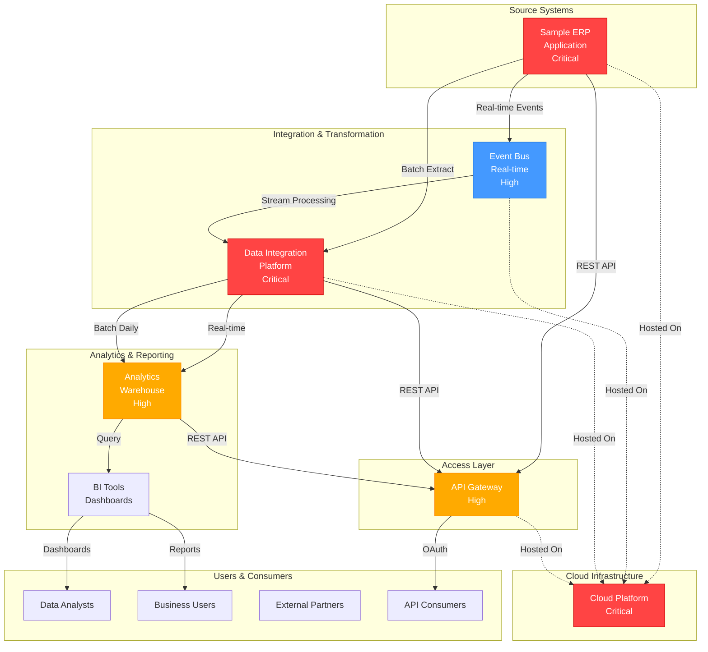

# Sample System Landscape Canvas

This is a generic example showing how to visualize your enterprise system architecture. Replace the sample systems with your own.

## Visual System Map

## System Overview

### Critical Systems (99.95% SLA)
- **Sample ERP Application** - Enterprise transactions, master data
- **Data Integration Platform** - Real-time + batch transformation
- **Cloud Infrastructure** - Hosting all systems

### High Priority Systems (99.9% SLA)
- **Analytics Warehouse** - Analytics data, reporting
- **API Gateway** - API management, security

### Integration Pattern
- **Real-time**: ERP → Event Bus → Data Platform → Analytics (5 seconds)
- **Batch**: ERP → Data Platform → Analytics (4 hours)
- **API**: Consumers → API Gateway → Backend Systems

## Connection Types

### Real-time (Orange lines)
- ERP → Event Bus → Data Platform (Kafka events, <1 sec latency)
- Data Platform → Analytics (streaming, 10-30 sec lag)

### Batch (Blue lines)
- ERP → Data Platform (daily extract, 04:00 UTC)
- Data Platform → Analytics (batch ETL, 10 TB/day)

### API Access (Green lines)
- API Gateway → consumers (REST APIs, rate limited)
- Analytics → BI Tools (dashboard queries)

## Key Metrics

| Metric | Value |
|--------|-------|
| **Real-time Latency** | <5 seconds |
| **Batch Latency** | ~2 hours |
| **API Response** | <500ms p99 |
| **Data Volume** | 150 TB active |
| **Peak Throughput** | 5K requests/sec |

## Customization Guide

### To Use This With Your Organization:

1. **Replace System Names**
   - Change "Sample ERP" → Your actual ERP (SAP, Oracle, NetSuite, etc.)
   - Change "Data Integration" → Your platform (Talend, Informatica, custom, etc.)
   - Change "Cloud Platform" → Your hosting (AWS, Azure, GCP, on-prem, etc.)

2. **Update Connections**
   - Add/remove systems based on your architecture
   - Adjust flow directions for your data paths
   - Update latency targets for your SLAs

3. **Link to Your System Notes**
   - Click on node to link to your System note
   - Example: `[[System - Your ERP Name]]`

4. **Add Your Metrics**
   - Update cost figures
   - Add your throughput numbers
   - Specify your availability targets

5. **Color Code by Criticality**
   - Red: Critical systems (must have <2hr RTO)
   - Orange: High priority (4h RTO acceptable)
   - Blue: Medium priority (1-day RTO acceptable)
   - Green: Low/informational

## Canvas Setup Instructions

1. **View this Canvas**:
   - Open in Obsidian Canvas view
   - Drag nodes to rearrange
   - Click nodes to jump to System notes

2. **Edit for Your Organization**:
   - Rename systems to match your environment
   - Add/remove systems as needed
   - Update connection labels
   - Adjust colors based on your criticality levels

3. **Create Related Canvases**:
   - C4 Context Diagram (high-level system boundary)
   - Data Flow Diagram (detailed data movement)
   - AWS/Cloud Architecture (infrastructure detail)
   - Disaster Recovery (failover paths)

4. **Add Annotations**:
   - Add cost labels
   - Add SLA labels
   - Add team ownership
   - Add deployment regions

## Use Cases

- **Executive Briefing**: Show system landscape at a glance
- **Onboarding**: Help new team members understand system relationships
- **Incident Response**: Quickly trace impact of system failures
- **Planning**: Visualize dependencies for new features
- **Risk Management**: Identify single points of failure

## Next Steps

1. Replace sample systems with your actual systems
2. Create individual [[System - ...]] notes for each system
3. Add [[Integration - ...]] notes for connections
4. Create [[Architecture - ...]] HLD document
5. Build [[Scenario - ...]] notes for future states

## Related Canvases (Create These)

- **Canvas - C4 Context Diagram** - High-level system context
- **Canvas - Data Flow Diagram** - Detailed data movement
- **Canvas - Infrastructure** - Cloud/on-prem deployment
- **Canvas - Disaster Recovery** - Failover and recovery paths
- **Canvas - Scenario Comparison** - Current vs future state

---

**Note**: This is a template. Customize it with your organization's systems, metrics, and architecture!
