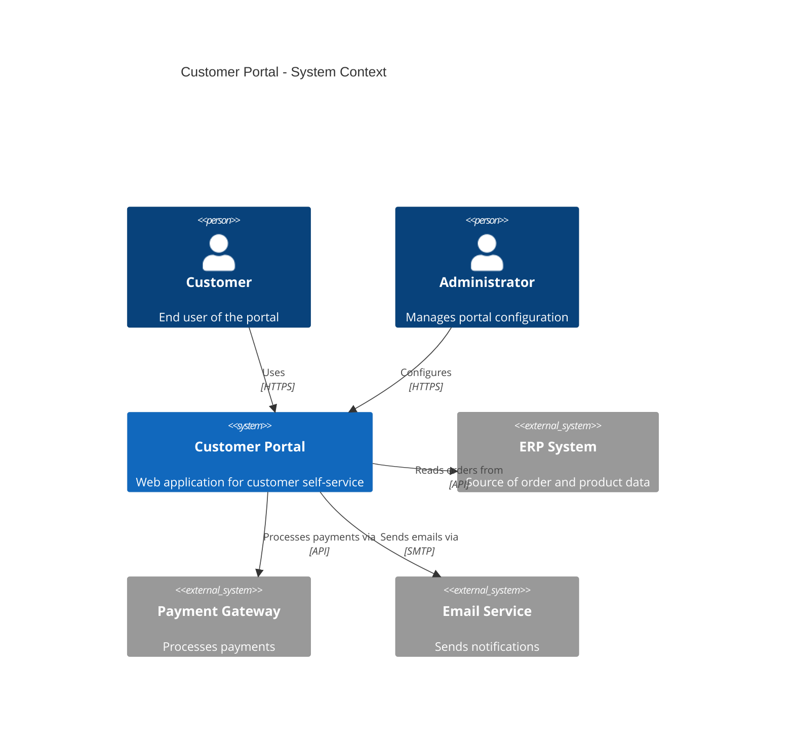
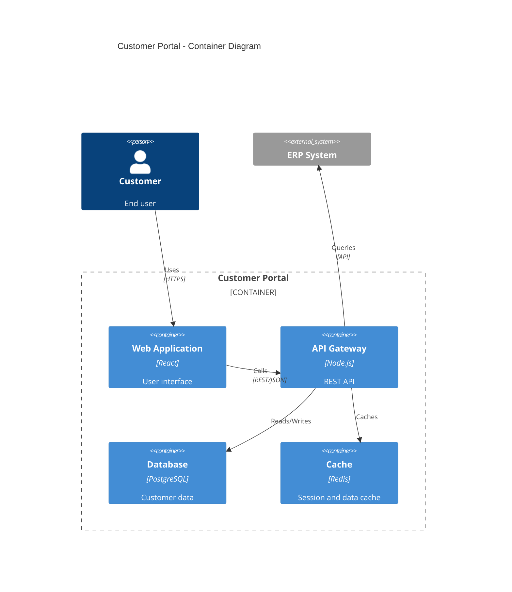
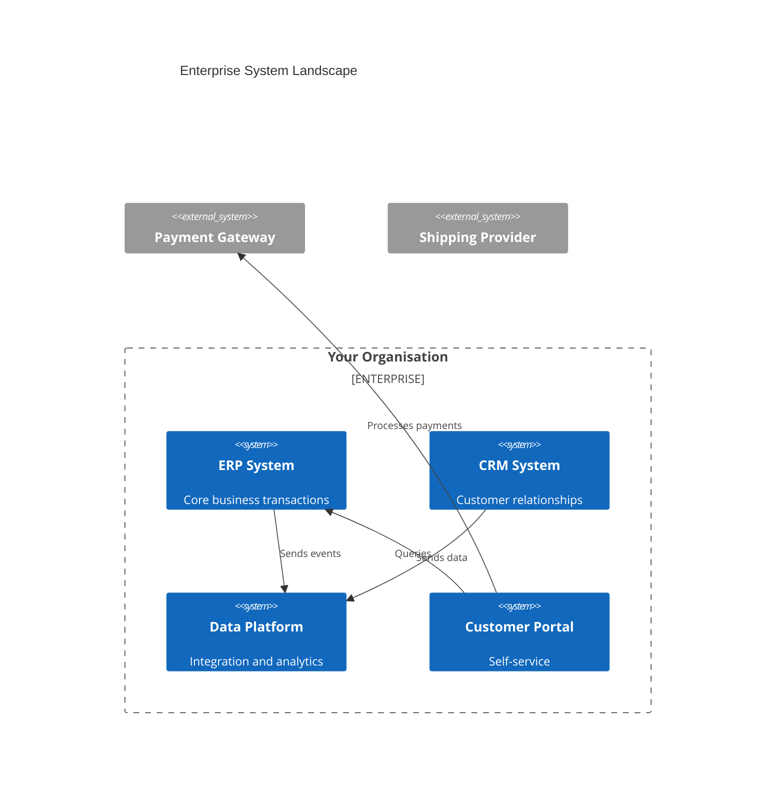
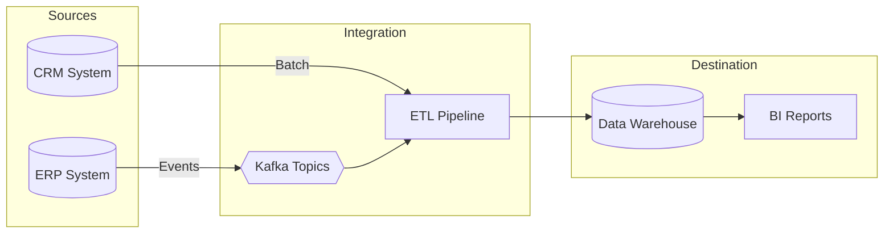
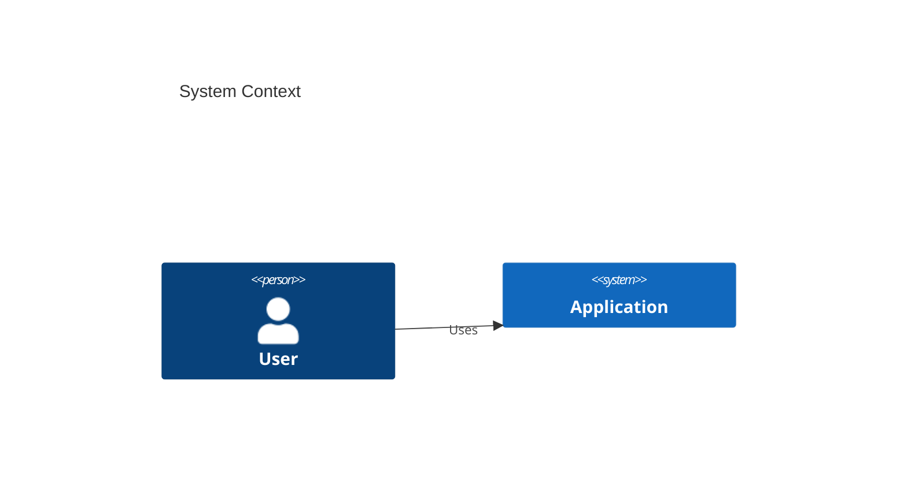

# Diagram and Visualisation Guide

This guide covers creating architecture diagrams using the `/diagram` and `/canvas` skills. Learn to generate C4 diagrams, system landscapes, data flows, and AWS architecture visualisations.

---

## Diagram Types Overview

| Type              | Skill                       | Output       | Best For                         |
| ----------------- | --------------------------- | ------------ | -------------------------------- |
| C4 Context        | `/diagram c4-context`       | Mermaid/PNG  | System boundaries and actors     |
| C4 Container      | `/diagram c4-container`     | Mermaid/PNG  | Internal system components       |
| System Landscape  | `/diagram system-landscape` | Mermaid/PNG  | Enterprise overview              |
| Data Flow         | `/diagram data-flow`        | Mermaid/PNG  | Data movement and transformation |
| AWS Architecture  | `/diagram aws`              | PNG (Python) | Cloud infrastructure             |
| Canvas (Obsidian) | `/canvas`                   | .canvas      | Interactive visual diagrams      |

---

## Using the `/diagram` Skill

### C4 Context Diagram

Shows a system in its environment with actors and external systems.

```
/diagram c4-context CustomerPortal
```

**What Claude generates:**



**Customisation options:**

```
/diagram c4-context CustomerPortal --include-actors
/diagram c4-context CustomerPortal --show-relationships
```

### C4 Container Diagram

Shows internal components of a system.

```
/diagram c4-container CustomerPortal
```

**What Claude generates:**



### System Landscape

Shows multiple systems and their relationships.

```
/diagram system-landscape
```

**With filters:**

```
/diagram system-landscape --domain data
/diagram system-landscape --criticality critical
/diagram system-landscape --hosting aws
```

**Example output:**



### Data Flow Diagram

Shows how data moves between systems.

```
/diagram data-flow CustomerData
```

**Example output:**



### AWS Architecture Diagram

Generates cloud infrastructure diagrams using Python diagrams library.

```
/diagram aws DataPlatform
```

**Prerequisites:**

- Python 3.8+
- `diagrams` package: `pip install diagrams`
- Graphviz: `brew install graphviz`

**Output:** PNG file in `+Attachments/diagrams/`

**Example components:**

```python
from diagrams import Diagram, Cluster
from diagrams.aws.compute import Lambda
from diagrams.aws.database import RDS
from diagrams.aws.network import APIGateway
from diagrams.aws.analytics import Kinesis

with Diagram("Data Platform"):
    api = APIGateway("API")

    with Cluster("Processing"):
        stream = Kinesis("Event Stream")
        processor = Lambda("Processor")

    with Cluster("Storage"):
        db = RDS("Database")

    api >> stream >> processor >> db
```

---

## Using the `/canvas` Skill

Obsidian Canvas provides interactive visual diagrams within your vault.

### Creating a Canvas

```
/canvas System Landscape
```

Claude creates `Canvas - System Landscape.canvas` with:

- Nodes for each system
- Colour-coded by criticality
- Edges showing relationships

### Canvas Best Practices

**Critical Warning:**

> ⚠️ **Disable Obsidian linters before editing .canvas files.** Linters can corrupt the JSON structure.

**Node Properties:**

| Property | Purpose               | Example              |
| -------- | --------------------- | -------------------- |
| `id`     | Unique identifier     | `"node-1"`           |
| `type`   | Node type             | `"text"` or `"file"` |
| `text`   | Content (NOT `label`) | `"Customer Portal"`  |
| `x`, `y` | Position              | `0`, `100`           |
| `width`  | Node width            | `250`                |
| `height` | Node height           | `60`                 |
| `color`  | Background colour     | `"1"` (red) to `"6"` |

**Colour Coding:**

| Colour | Code | Recommended Use    |
| ------ | ---- | ------------------ |
| Red    | `1`  | Critical systems   |
| Orange | `2`  | High criticality   |
| Yellow | `3`  | Medium criticality |
| Green  | `4`  | Low criticality    |
| Blue   | `5`  | External systems   |
| Purple | `6`  | Special/highlight  |

### Canvas Types

**System Landscape:**

```
/canvas System Landscape
```

Shows all systems with criticality coding.

**C4 Context:**

```
/canvas C4 Context CustomerPortal
```

Shows actors, the system, and external integrations.

**Data Flow:**

```
/canvas Data Flow CustomerData
```

Shows data movement stages with latency annotations.

### Manual Canvas Editing

Canvas files are JSON. Basic structure:

```json
{
  "nodes": [
    {
      "id": "system-1",
      "type": "text",
      "text": "Customer Portal",
      "x": 0,
      "y": 0,
      "width": 250,
      "height": 60,
      "color": "4"
    }
  ],
  "edges": [
    {
      "id": "edge-1",
      "fromNode": "system-1",
      "toNode": "system-2",
      "label": "API"
    }
  ]
}
```

**Important:**

- Use `text` for node content, not `label`
- `label` is only for edge labels
- Empty `text` fields cause Obsidian to delete nodes

---

## Mermaid Integration

Obsidian natively renders Mermaid diagrams in markdown.

### C4 Diagrams in Mermaid

````markdown

````

````

### Flowcharts

```markdown
```mermaid
flowchart TD
    A[Start] --> B{Decision}
    B -->|Yes| C[Action 1]
    B -->|No| D[Action 2]
    C --> E[End]
    D --> E
````

````

### Sequence Diagrams

```markdown
```mermaid
sequenceDiagram
    participant User
    participant API
    participant Database

    User->>API: Request
    API->>Database: Query
    Database-->>API: Results
    API-->>User: Response
````

````

### Class Diagrams

```markdown
```mermaid
classDiagram
    class Customer {
        +String name
        +String email
        +placeOrder()
    }
    class Order {
        +Date date
        +calculate()
    }
    Customer "1" --> "*" Order
````

```

---

## Diagram Workflow Examples

### Documenting a New System

```

# 1. Create system note

/system Payment Gateway

# 2. Generate C4 context

/diagram c4-context PaymentGateway

# 3. Generate C4 container (if complex)

/diagram c4-container PaymentGateway

# 4. Add to system landscape

/diagram system-landscape --update

```

### Data Integration Documentation

```

# 1. Document data flow

/diagram data-flow OrderProcessing

# 2. Create canvas for interactive view

/canvas Order Data Flow

# 3. Document integrations

/integration ERP DataPlatform
/integration DataPlatform Analytics

```

### Cloud Architecture

```

# 1. Generate AWS diagram

/diagram aws DataPlatform

# 2. Create system note

/system Cloud Infrastructure

# 3. Link diagram in note

````

---

## Styling Options

### Mermaid Themes

Add to your Mermaid block:

```mermaid
%%{init: {'theme': 'dark'}}%%
flowchart TD
    A --> B
````

Available themes: `default`, `dark`, `forest`, `neutral`

### Canvas Styling

Use colour codes consistently:

- **Red (1)**: Critical/down
- **Orange (2)**: Warning/high priority
- **Yellow (3)**: Medium priority
- **Green (4)**: Good/operational
- **Blue (5)**: Information/external
- **Purple (6)**: Special/highlight

### C4 Styling

Standard C4 colours are applied automatically:

- Blue: Internal systems
- Grey: External systems
- Orange: People/actors

---

## Troubleshooting

### "Canvas won't open"

1. Check JSON syntax is valid
2. Ensure all nodes have `text` property
3. Disable linters before editing

### "Mermaid not rendering"

1. Check for syntax errors
2. Verify plugin is enabled
3. Try simpler diagram first

### "Diagram skill not generating"

1. For AWS diagrams, check Python dependencies
2. Verify graphviz is installed
3. Check `.claude/skills/diagram.md` exists

### "Nodes missing in Canvas"

1. Canvas may have been corrupted by linter
2. Check `text` fields are not empty
3. Restore from git or recreate

### "C4 diagram labels missing"

1. Use `Rel()` function with description
2. Check Mermaid C4 syntax
3. Try updating Mermaid plugin

---

## Quick Reference

### Diagram Commands

| Task             | Command                          |
| ---------------- | -------------------------------- |
| C4 Context       | `/diagram c4-context <system>`   |
| C4 Container     | `/diagram c4-container <system>` |
| System Landscape | `/diagram system-landscape`      |
| Data Flow        | `/diagram data-flow <name>`      |
| AWS Architecture | `/diagram aws <name>`            |

### Canvas Commands

| Task             | Command                       |
| ---------------- | ----------------------------- |
| System Landscape | `/canvas System Landscape`    |
| C4 Context       | `/canvas C4 Context <system>` |
| Data Flow        | `/canvas Data Flow <name>`    |
| Custom Canvas    | `/canvas <name>`              |

### Mermaid Quick Reference

| Diagram Type | Start With                     |
| ------------ | ------------------------------ |
| C4 Context   | `C4Context`                    |
| C4 Container | `C4Container`                  |
| Flowchart    | `flowchart TD` (or LR, BT, RL) |
| Sequence     | `sequenceDiagram`              |
| Class        | `classDiagram`                 |
| ER           | `erDiagram`                    |
| Gantt        | `gantt`                        |

---

## Related Guides

- [Page - Claude Code Skills Quick Reference](Page%20-%20Claude%20Code%20Skills%20Quick%20Reference.md) - All skills reference
- [Page - Architecture Workflow Guide](Page%20-%20Architecture%20Workflow%20Guide.md) - Multi-skill workflows
- [Dashboard - Architecture Knowledge Graph](Dashboard%20-%20Architecture%20Knowledge%20Graph.md) - Architecture navigation
- [Canvas - Sample System Landscape](Canvas%20-%20Sample%20System%20Landscape.md) - Example canvas
