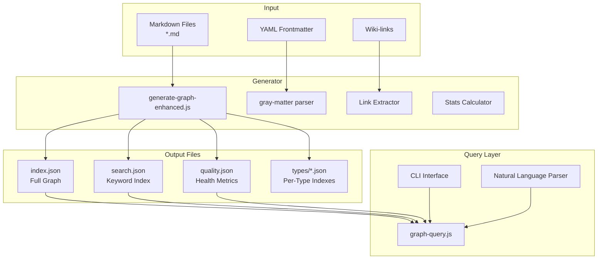
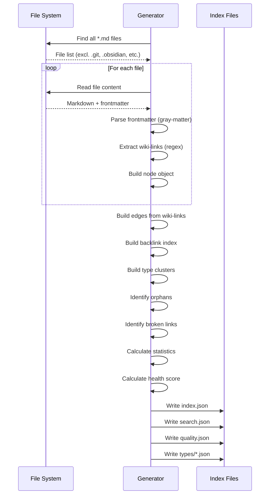

# JSON Graph Index Technical Reference

## Overview

The ArchitectKB JSON Graph Index System is a pre-computed knowledge graph that provides **60-500x faster** querying compared to traditional grep-based searches. It transforms the Obsidian vault's markdown files into a structured graph database stored as JSON files.

### Purpose and Benefits

| Capability | Grep-Based | Graph Index |
|------------|------------|-------------|
| Find all ADRs | ~2-5 seconds | ~5-20ms |
| Filter by status | Requires full scan | Instant lookup |
| Find broken links | Complex regex | Pre-computed |
| Orphan detection | Multi-pass scan | Pre-computed |
| Backlink lookup | Reverse scan | O(1) lookup |
| Type distribution | Count + parse | Pre-computed |

**Key Benefits:**
- **Instant structured queries** - Filter by type, status, priority, tags
- **Pre-computed relationships** - Backlinks, broken links, orphans ready to use
- **Type-specific indexes** - Dedicated files per note type for fast filtering
- **Keyword search index** - Stemmed terms for fuzzy matching
- **Quality metrics** - Health score, freshness tracking, completeness checks

---

## Architecture Overview



### Data Flow

1. **Generation Phase**: `generate-graph-enhanced.js` scans all markdown files
2. **Parsing Phase**: Extracts frontmatter (via gray-matter) and wiki-links (via regex)
3. **Graph Construction**: Builds nodes, edges, backlinks, and type clusters
4. **Analysis Phase**: Identifies orphans, broken links, calculates health score
5. **Output Phase**: Writes JSON files to `.graph/` directory
6. **Query Phase**: `graph-query.js` loads indexes and executes queries

---

## File Structure

```
.graph/
  .gitignore           # Excludes generated files from git
  index.json           # Full graph (nodes, edges, backlinks, issues)
  search.json          # Keyword search index
  quality.json         # Health metrics and quality issues
  types/
    adr.json           # ADR-specific index
    project.json       # Project-specific index
    task.json          # Task-specific index
    system.json        # System-specific index
    meeting.json       # Meeting-specific index
    page.json          # Page-specific index
    person.json        # Person-specific index
    weblink.json       # Weblink-specific index
    moc.json           # MOC-specific index
    ... (22 type files)
```

---

## JSON Schema Reference

### index.json - Main Graph Index

The primary index file contains the complete graph structure.

#### TypeScript Type Definition

```typescript
interface GraphIndex {
  metadata: IndexMetadata;
  nodes: Node[];
  edges: Edge[];
  typeClusters: Record<string, TypeCluster>;
  backlinks: Record<string, string[]>;
  orphanedNodes: OrphanedNode[];
  brokenLinks: BrokenLink[];
}

interface IndexMetadata {
  generated: string;         // ISO 8601 timestamp
  vault: string;             // Vault name (e.g., "ArchitectKB")
  version: string;           // Schema version (currently "2.0")
  stats: IndexStats;
}

interface IndexStats {
  totalNodes: number;
  totalEdges: number;
  totalBacklinks: number;
  orphanedCount: number;
  brokenLinksCount: number;
  typeDistribution: Record<string, number>;
  freshness: {
    current: number;         // Modified within 30 days
    recent: number;          // Modified 30-180 days ago
    stale: number;           // Not modified in 180+ days
  };
  qualityIndicators: {
    withTags: number;
    withStatus: number;
    withPriority: number;
    adrWithQualityFields: number;
    totalADRs: number;
  };
  averages: {
    linksPerNote: string;    // Decimal string (e.g., "5.86")
    wordCount: number;
    backlinksPerNote: string;
  };
  healthScore: number;       // 0-100 composite score
}
```

#### Example metadata

```json
{
  "metadata": {
    "generated": "2026-01-15T22:09:44.376Z",
    "vault": "ArchitectKB",
    "version": "2.0",
    "stats": {
      "totalNodes": 88,
      "totalEdges": 516,
      "totalBacklinks": 516,
      "orphanedCount": 14,
      "brokenLinksCount": 252,
      "typeDistribution": {
        "Weblink": 2,
        "Task": 3,
        "System": 6,
        "Project": 4,
        "Page": 7,
        "Adr": 4,
        "MOC": 10
      },
      "freshness": {
        "current": 88,
        "recent": 0,
        "stale": 0
      },
      "healthScore": 77
    }
  }
}
```

---

### Node Schema

Each node represents a markdown file in the vault.

#### TypeScript Type Definition

```typescript
interface Node {
  // Identity
  id: string;                    // Filename without .md extension
  path: string;                  // Relative path from vault root
  type: string;                  // Frontmatter type (e.g., "Adr", "Project")

  // Frontmatter Fields
  frontmatter: {
    title: string;               // Display title
    status: string | null;       // Lifecycle status
    priority: string | null;     // Priority level
    created: string | null;      // ISO date string
    modified: string | null;     // ISO date string
    tags: string[];              // Tag array
    project: string | null;      // Project wiki-link
    confidence: string | null;   // Quality indicator
    freshness: string | null;    // Quality indicator
    relatedTo: string[];         // Relationship links
    supersedes: string[];        // Superseded ADRs
    dependsOn: string[];         // Dependency links
  };

  // Extracted Relationships
  relationships: {
    wikilinks: string[];         // All extracted wiki-links
    mentionedPeople: string[];   // Person references detected
    projects: string[];          // Project references detected
  };

  // Content Statistics
  textStats: {
    wordCount: number;
    lineCount: number;
  };

  // File Metadata
  meta: {
    fileModified: string;        // ISO 8601 timestamp
    fileSize: number;            // Bytes
  };
}
```

#### Example Node

```json
{
  "id": "ADR - Adopt GraphQL for API Layer",
  "path": "ADR - Adopt GraphQL for API Layer.md",
  "type": "Adr",
  "frontmatter": {
    "title": "Adopt GraphQL for API Layer",
    "status": "proposed",
    "priority": null,
    "created": "2025-12-01T00:00:00.000Z",
    "modified": "2026-01-07T00:00:00.000Z",
    "tags": [
      "ADR",
      "activity/architecture",
      "technology/graphql",
      "technology/api",
      "project/api-modernization"
    ],
    "project": null,
    "confidence": "high",
    "freshness": "current",
    "relatedTo": [],
    "supersedes": [],
    "dependsOn": []
  },
  "relationships": {
    "wikilinks": [
      "Project - API Gateway Modernization",
      "Jane Smith",
      "Page - Architecture Principles"
    ],
    "mentionedPeople": ["Jane Smith"],
    "projects": ["Project - API Gateway Modernization"]
  },
  "textStats": {
    "wordCount": 1245,
    "lineCount": 189
  },
  "meta": {
    "fileModified": "2026-01-07T20:17:04.234Z",
    "fileSize": 8542
  }
}
```

---

### Edge Schema

Edges represent directed relationships between nodes (wiki-links).

#### TypeScript Type Definition

```typescript
interface Edge {
  source: string;              // Source node ID (the file containing the link)
  target: string;              // Target node ID (the linked file)
  type: EdgeType;              // Semantic edge type
  exists: boolean;             // Whether target file exists
}

type EdgeType =
  | "links-to"      // Generic link (default)
  | "broken"        // Target does not exist
  | "belongs-to"    // Task -> Project
  | "discusses"     // Meeting -> Project
  | "impacts"       // ADR -> Project
  | "relates-to"    // ADR -> ADR
  | "involves"      // Meeting/Task -> Person
  | "works-for"     // Person -> Organisation
  | "references";   // Any -> Weblink
```

#### Edge Type Assignment Logic

| Source Type | Target Type | Edge Type |
|-------------|-------------|-----------|
| Any | (non-existent) | `broken` |
| Task | Project | `belongs-to` |
| Meeting | Project | `discusses` |
| Adr | Project | `impacts` |
| Adr | Adr | `relates-to` |
| Meeting/Task | Person | `involves` |
| Person | Organisation | `works-for` |
| Any | Weblink | `references` |
| Any | Any | `links-to` |

#### Example Edges

```json
[
  {
    "source": "Task - Review GraphQL ADR",
    "target": "ADR - Adopt GraphQL for API Layer",
    "type": "links-to",
    "exists": true
  },
  {
    "source": "Task - Review GraphQL ADR",
    "target": "Project - API Gateway Modernization",
    "type": "belongs-to",
    "exists": true
  },
  {
    "source": "Canvas - Sample System Landscape",
    "target": "System - Your ERP Name",
    "type": "broken",
    "exists": false
  }
]
```

---

### Backlinks Structure

The `backlinks` object provides O(1) lookup of which notes link TO a given note.

```typescript
// Record<targetNoteId, sourceNoteIds[]>
interface Backlinks {
  [targetId: string]: string[];
}
```

#### Example

```json
{
  "backlinks": {
    "ADR - Adopt GraphQL for API Layer": [
      "Task - Review GraphQL ADR",
      "Task - Document API standards",
      "Page - Architecture Principles",
      "MOC - ADRs MOC",
      "2026-01-07"
    ],
    "Project - Cloud Migration": [
      "ADR - Use Kubernetes for Container Orchestration",
      "Weblink - AWS Well-Architected Framework",
      "Organisation - CloudVendor Inc",
      "Dashboard - Main Dashboard",
      "MOC - Projects MOC"
    ]
  }
}
```

**Usage**: To find all notes that reference "Project - Cloud Migration":
```javascript
const referencingNotes = index.backlinks["Project - Cloud Migration"];
// Returns: ["ADR - Use Kubernetes...", "Weblink - AWS...", ...]
```

---

### Type Clusters

Pre-computed groupings of nodes by type with status/priority breakdowns.

```typescript
interface TypeCluster {
  count: number;
  nodes: string[];             // Node IDs of this type
  byStatus: Record<string, number>;
  byPriority: Record<string, number>;
}
```

#### Example

```json
{
  "typeClusters": {
    "Adr": {
      "count": 4,
      "nodes": [
        "ADR - Use Kubernetes for Container Orchestration",
        "ADR - Standardize on PostgreSQL",
        "ADR - Microservices vs Monolith Decision",
        "ADR - Adopt GraphQL for API Layer"
      ],
      "byStatus": {
        "accepted": 2,
        "superseded": 1,
        "proposed": 1
      },
      "byPriority": {}
    },
    "Project": {
      "count": 4,
      "nodes": ["Project - Cloud Migration", "..."],
      "byStatus": {
        "active": 2,
        "completed": 1,
        "paused": 1
      },
      "byPriority": {
        "high": 1,
        "medium": 2,
        "low": 1
      }
    }
  }
}
```

---

### Orphaned Nodes

Notes with zero backlinks (no other notes link to them).

```typescript
interface OrphanedNode {
  id: string;
  path: string;
  type: string;
  title: string;
  created: string | null;
  modified: string;            // Date portion only (YYYY-MM-DD)
}
```

**Exclusions**: The following are NOT considered orphans:
- MOC notes (navigation hubs)
- Dashboard notes
- README files
- CLAUDE files
- Template files
- DailyNote entries

#### Example

```json
{
  "orphanedNodes": [
    {
      "id": "Task - Research service mesh options",
      "path": "Task - Research service mesh options.md",
      "type": "Task",
      "title": "Research service mesh options",
      "created": "2025-11-10T00:00:00.000Z",
      "modified": "2026-01-07"
    },
    {
      "id": "Meeting - 2026-01-08 Architecture Review",
      "path": "+Meetings/Meeting - 2026-01-08 Architecture Review.md",
      "type": "Meeting",
      "title": "Architecture Review",
      "created": "2026-01-08T00:00:00.000Z",
      "modified": "2026-01-07"
    }
  ]
}
```

---

### Broken Links

Wiki-links that reference non-existent files.

```typescript
interface BrokenLink {
  source: string;              // Note containing the broken link
  target: string;              // The non-existent target
  sourcePath: string;          // Full path to source file
}
```

#### Example

```json
{
  "brokenLinks": [
    {
      "source": "Task - Research service mesh options",
      "target": "Weblink - Service Mesh Comparison",
      "sourcePath": "Task - Research service mesh options.md"
    },
    {
      "source": "Architecture - Sample Data Integration Platform HLD",
      "target": "ADR - Event Bus Selection",
      "sourcePath": "Architecture - Sample Data Integration Platform HLD.md"
    }
  ]
}
```

---

## search.json - Keyword Search Index

A lightweight index optimized for keyword-based searching.

### TypeScript Type Definition

```typescript
interface SearchEntry {
  id: string;
  path: string;
  type: string;
  title: string;
  keywords: string[];          // Stemmed/normalized keywords
  tags: string[];
  status: string | null;
  priority: string | null;
  excerpt: string;             // Currently equals title
}
```

### Keyword Extraction Algorithm

1. **Title tokenization**: Split title into words, lowercase, remove punctuation
2. **Filter short words**: Remove words < 3 characters
3. **Merge with tags**: Combine title keywords with frontmatter tags
4. **Deduplicate**: Return unique keyword set

### Example Entry

```json
{
  "id": "ADR - Adopt GraphQL for API Layer",
  "path": "ADR - Adopt GraphQL for API Layer.md",
  "type": "Adr",
  "title": "Adopt GraphQL for API Layer",
  "keywords": [
    "adopt",
    "graphql",
    "api",
    "layer",
    "adr",
    "activity/architecture",
    "technology/graphql",
    "technology/api"
  ],
  "tags": [
    "ADR",
    "activity/architecture",
    "technology/graphql",
    "technology/api"
  ],
  "status": "proposed",
  "priority": null,
  "excerpt": "Adopt GraphQL for API Layer"
}
```

---

## quality.json - Health Metrics

Focused quality and maintenance data extracted from the main index.

### TypeScript Type Definition

```typescript
interface QualityIndex {
  generated: string;
  healthScore: number;
  orphanedNodes: OrphanedNode[];
  brokenLinks: BrokenLink[];
  staleNotes: StaleNote[];
  missingFields: MissingFieldsEntry[];
  qualityIndicators: QualityIndicators;
  freshness: FreshnessStats;
}

interface StaleNote {
  id: string;
  path: string;
  type: string;
  modified: string;            // YYYY-MM-DD
}

interface MissingFieldsEntry {
  id: string;
  type: string;
  missing: string[];           // Field names
}

interface QualityIndicators {
  withTags: number;
  withStatus: number;
  withPriority: number;
  adrWithQualityFields: number;
  totalADRs: number;
}

interface FreshnessStats {
  current: number;             // < 30 days
  recent: number;              // 30-180 days
  stale: number;               // > 180 days
}
```

### Health Score Calculation

The health score (0-100) is computed from four weighted components:

| Component | Weight | Factors |
|-----------|--------|---------|
| **Connectivity** | 25 pts | Orphan rate (15), avg links/note (10) |
| **Freshness** | 25 pts | Stale rate (15), current rate (10) |
| **Quality** | 25 pts | Tags rate (15), broken link rate (10) |
| **Completeness** | 25 pts | Status rate (15), ADR quality rate (10) |

```javascript
// Simplified calculation
let score = 0;

// Connectivity (25 points)
score += (1 - orphanRate) * 15;
score += Math.min(avgLinksPerNote / 5, 1) * 10;

// Freshness (25 points)
score += (1 - staleRate) * 15;
score += currentRate * 10;

// Quality (25 points)
score += tagsRate * 15;
score += (1 - brokenLinkRate) * 10;

// Completeness (25 points)
score += statusRate * 15;
score += adrQualityRate * 10;

return Math.min(Math.round(score), 100);
```

---

## types/*.json - Per-Type Indexes

Individual JSON files for each note type, optimized for type-specific queries.

### TypeScript Type Definition

```typescript
interface TypeIndex {
  type: string;
  count: number;
  byStatus: Record<string, number>;
  byPriority: Record<string, number>;
  nodes: TypeNode[];
}

interface TypeNode {
  id: string;
  path: string;
  title: string;
  status: string | null;
  priority: string | null;
  created: string | null;
  modified: string;            // YYYY-MM-DD
  tags: string[];
  backlinks: number;           // Count of backlinks to this node
}
```

### Available Type Files

| File | Note Type | Description |
|------|-----------|-------------|
| `adr.json` | Adr | Architecture Decision Records |
| `project.json` | Project | Project documentation |
| `task.json` | Task | Task tracking notes |
| `meeting.json` | Meeting | Meeting notes |
| `page.json` | Page | Long-form documentation |
| `person.json` | Person | Contact/colleague notes |
| `weblink.json` | Weblink | Saved URLs |
| `system.json` | System | System documentation |
| `integration.json` | Integration | Integration specs |
| `architecture.json` | Architecture | Architecture documents |
| `scenario.json` | Scenario | What-if scenarios |
| `canvas.json` | Canvas | Obsidian canvas files |
| `moc.json` | MOC | Maps of Content |
| `dashboard.json` | Dashboard | Dashboard views |
| `incubator.json` | Incubator | Research ideas |
| `query.json` | Query | Saved Dataview queries |
| `organisation.json` | Organisation | Organisation notes |
| `formsubmission.json` | FormSubmission | Form tracking |
| `dailynote.json` | DailyNote | Daily notes |
| `unknown.json` | Unknown | Notes without type |

### Example: adr.json

```json
{
  "type": "Adr",
  "count": 4,
  "byStatus": {
    "accepted": 2,
    "superseded": 1,
    "proposed": 1
  },
  "byPriority": {},
  "nodes": [
    {
      "id": "ADR - Use Kubernetes for Container Orchestration",
      "path": "ADR - Use Kubernetes for Container Orchestration.md",
      "title": "Use Kubernetes for Container Orchestration",
      "status": "accepted",
      "priority": null,
      "created": "2025-09-15T00:00:00.000Z",
      "modified": "2026-01-07",
      "tags": [
        "ADR",
        "activity/architecture",
        "technology/kubernetes",
        "domain/infrastructure"
      ],
      "backlinks": 9
    }
  ]
}
```

---

## Query Tool Reference

### CLI Usage

```bash
# Structured queries
node scripts/graph-query.js --type=Adr --status=proposed
node scripts/graph-query.js --type=Task --priority=high
node scripts/graph-query.js --search="kafka integration"
node scripts/graph-query.js --backlinks="Project - Cloud Migration"

# Special queries
node scripts/graph-query.js --orphans
node scripts/graph-query.js --broken-links
node scripts/graph-query.js --stale
node scripts/graph-query.js --stats

# Output options
node scripts/graph-query.js --type=Adr --json    # JSON output

# Natural language queries
node scripts/graph-query.js "ADRs with status proposed"
node scripts/graph-query.js "high priority tasks"
node scripts/graph-query.js "meetings about kafka"
```

### Natural Language Parser

The query tool includes a natural language parser that extracts filters from free-form queries.

| Pattern | Extracted Filter |
|---------|-----------------|
| "ADRs", "adr", "adrs" | `type: Adr` |
| "projects", "project" | `type: Project` |
| "tasks", "task" | `type: Task` |
| "meetings", "meeting" | `type: Meeting` |
| "status proposed" | `status: proposed` |
| "high priority" | `priority: high` |
| "orphaned", "orphans" | `orphans: true` |
| "broken links" | `brokenLinks: true` |
| "stale" | `stale: true` |
| `"quoted text"` | `search: quoted text` |
| "backlinks to X" | `backlinks: X` |

### Query Examples

#### Find all proposed ADRs

```bash
node scripts/graph-query.js --type=Adr --status=proposed
```

Output:
```
Found 1 result(s)

Type           Status      Priority  Title
------------------------------------------------------------------------------
Adr            proposed    -         Adopt GraphQL for API Layer
```

#### Find notes referencing a project

```bash
node scripts/graph-query.js --backlinks="Project - Cloud Migration"
```

#### Get vault statistics

```bash
node scripts/graph-query.js --stats
```

Output:
```
Graph Index Statistics

Total Nodes:    88
Total Edges:    516
Total Backlinks: 516
Orphaned Notes: 14
Broken Links:   252

Health Score:
  77/100

Type Distribution:
  Unknown         22
  MOC             10
  Page             7
  Query            7
  System           6
  ...
```

---

## Generation Process

### Running the Generator

```bash
# Full rebuild
node scripts/generate-graph-enhanced.js

# Quiet mode (minimal output)
node scripts/generate-graph-enhanced.js --quiet

# Via npm script
npm run graph:build
```

### Generation Steps



### Excluded Directories

The generator skips these directories:
- `.git`
- `.obsidian`
- `node_modules`
- `.smart-env`
- `scripts`
- `screenshots`
- `.graph`

### When to Rebuild

Rebuild the index when:
- After adding/removing markdown files
- After significant frontmatter changes
- Before running vault health checks
- Periodically (daily or weekly via automation)

---

## Performance Characteristics

### Generation Performance

| Vault Size | Generation Time | Index Size |
|------------|-----------------|------------|
| ~100 notes | 0.3-0.5s | ~250 KB |
| ~500 notes | 1-2s | ~1.2 MB |
| ~1000 notes | 2-4s | ~2.5 MB |
| ~5000 notes | 10-20s | ~12 MB |

### Query Performance

| Operation | Time Complexity | Typical Time |
|-----------|-----------------|--------------|
| Load index | O(n) | 10-50ms |
| Type filter | O(n) | 1-5ms |
| Status filter | O(n) | 1-5ms |
| Backlink lookup | O(1) | <1ms |
| Orphan list | O(1) | <1ms |
| Broken links | O(1) | <1ms |
| Keyword search | O(n*k) | 5-20ms |

Where n = number of nodes, k = search terms

### Memory Usage

The query tool loads indexes into memory:
- `index.json`: Primary consumption (~250KB for 100 notes)
- `search.json`: Additional ~40KB for 100 notes
- `quality.json`: Additional ~40KB for 100 notes
- Type files: Loaded on-demand

---

## Integration with Claude Code Skills

### Graph-First Search Strategy

Skills should query the graph before using grep:

```javascript
// Recommended approach in skills
async function findRelatedContent(topic) {
  // 1. First: Query graph index
  const graphResults = execSync(
    `node scripts/graph-query.js --search="${topic}" --json`
  );

  // 2. Only use grep if graph doesn't have needed data
  if (needsContentSearch) {
    // Grep for content not in frontmatter
  }
}
```

### Common Integration Patterns

#### Pattern 1: Find notes by type and status

```bash
node scripts/graph-query.js --type=Adr --status=proposed --json
```

#### Pattern 2: Find all references to a note

```bash
node scripts/graph-query.js --backlinks="Project - Cloud Migration" --json
```

#### Pattern 3: Quality check before commit

```bash
node scripts/graph-query.js --orphans --json
node scripts/graph-query.js --broken-links --json
```

#### Pattern 4: Type-specific queries

Load type-specific index for faster filtering:

```javascript
const adrIndex = JSON.parse(
  fs.readFileSync('.graph/types/adr.json', 'utf8')
);

const proposedADRs = adrIndex.nodes.filter(n => n.status === 'proposed');
```

---

## Maintenance and Automation

### Automatic Rebuilds

Set up a file watcher for automatic rebuilds:

```bash
npm run graph:watch
```

Or use a pre-commit hook:

```bash
# .git/hooks/pre-commit
npm run graph:build --quiet
```

### Scheduled Rebuilds

For larger vaults, schedule periodic rebuilds:

```bash
# crontab -e
0 */6 * * * cd /path/to/vault && npm run graph:build --quiet
```

### Git Configuration

The `.graph/` directory includes a `.gitignore` to prevent committing generated files:

```
# .graph/.gitignore
*
!.gitignore
```

---

## Schema Evolution

### Version History

| Version | Date | Changes |
|---------|------|---------|
| 1.0 | 2025-01 | Initial graph generator |
| 2.0 | 2026-01 | Enhanced schema with type clusters, quality metrics, search index |

### Future Considerations

Potential schema enhancements:
- **Content excerpts**: First 200 characters of body text
- **Section headings**: Extract H2/H3 structure
- **Embedding vectors**: For semantic search
- **Change history**: Track modification patterns
- **Link context**: Extract surrounding text for links

### Backward Compatibility

The `version` field in metadata allows tools to handle schema changes:

```javascript
if (index.metadata.version === '2.0') {
  // Use new type clusters
} else {
  // Fall back to manual type filtering
}
```

---

## Troubleshooting

### Index Not Found

```
Error: Graph index not found at .graph/index.json
Run 'npm run graph:build' to generate the index.
```

**Solution**: Run the generator to create initial indexes.

### Stale Index

If query results don't match expected files:
1. Check file modification times vs `metadata.generated`
2. Rebuild index: `npm run graph:build`

### High Broken Link Count

Many broken links often indicate:
- Template files with placeholder links
- Imported notes with unresolved references
- Renamed files without link updates

Review broken links: `node scripts/graph-query.js --broken-links`

### Memory Issues on Large Vaults

For vaults with 5000+ notes:
1. Use type-specific indexes instead of main index
2. Implement streaming JSON parser
3. Consider SQLite-based index

---

## Related Documentation

- [[Page - How to Use This Vault]] - General vault usage
- [[Page - Vault Setup Checklist]] - Initial configuration
- [[Dashboard - Architecture Knowledge Graph]] - Visual graph exploration
- [[MOC - Vault Quality Dashboard]] - Quality metrics and maintenance
