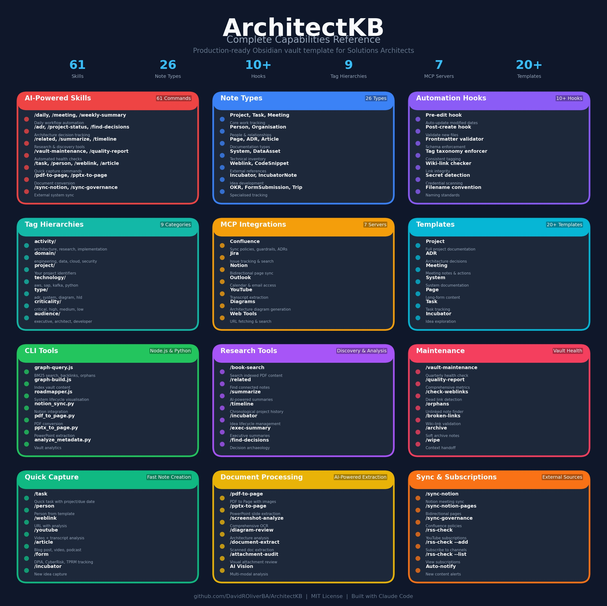
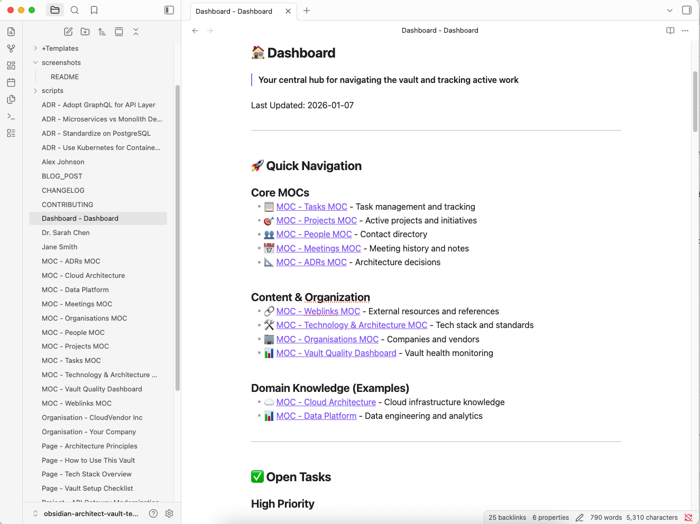
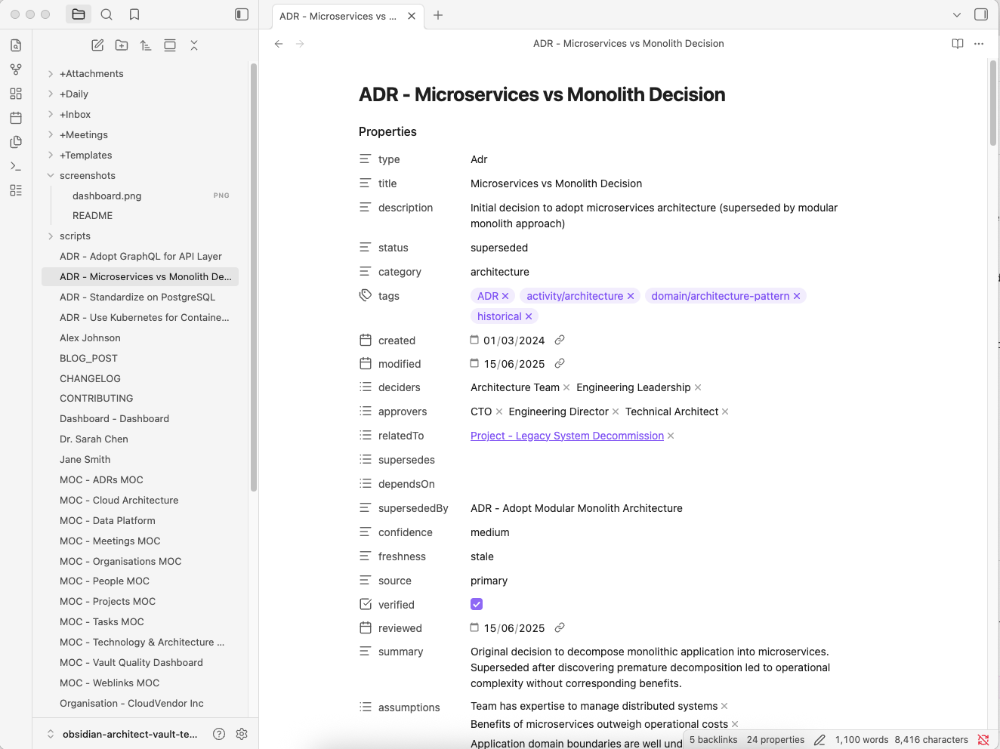
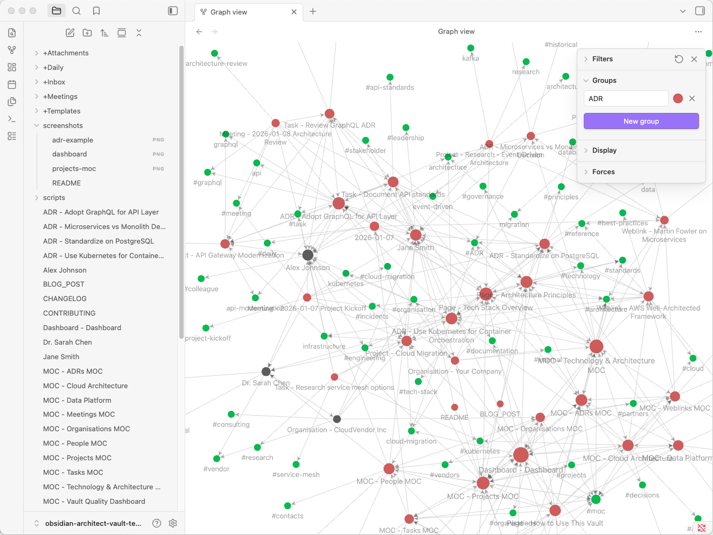
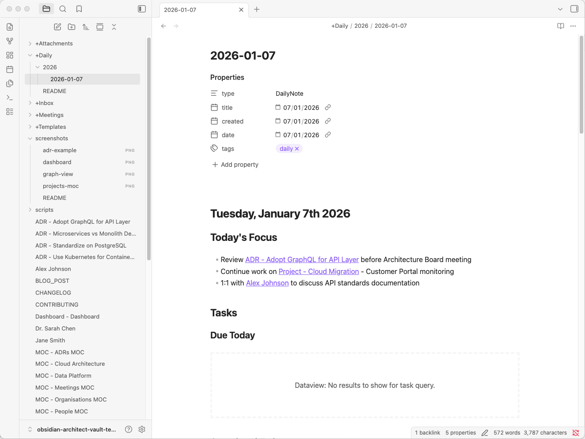
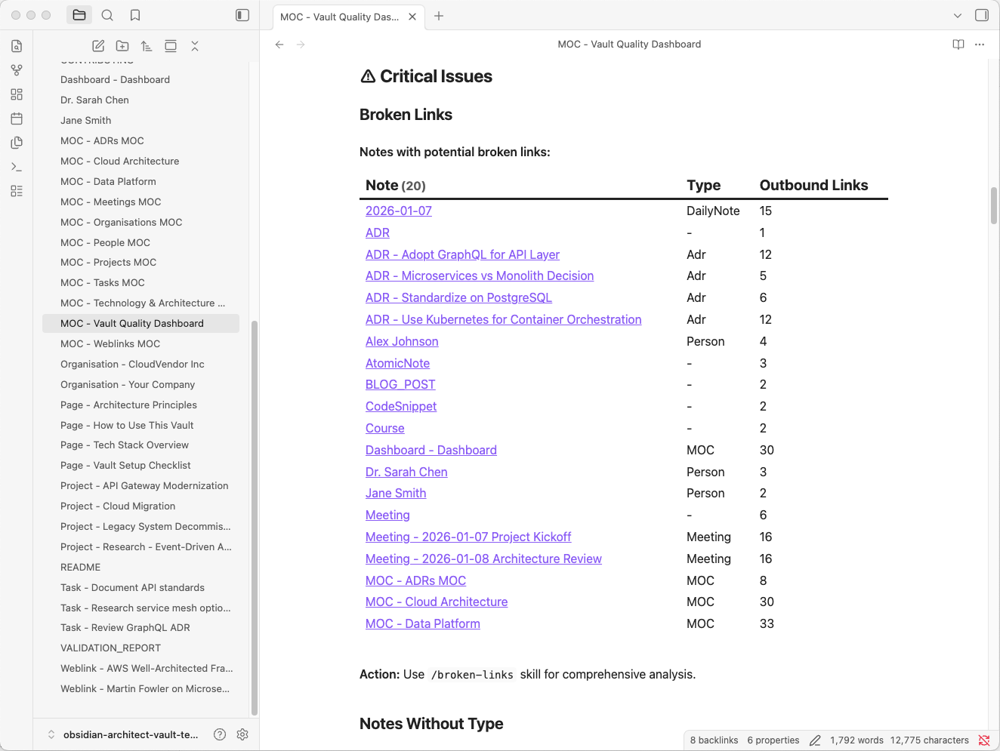

# Architect Knowledge Base

> A production-ready Obsidian vault template for Solutions Architects to manage architecture documentation, decisions, projects, meetings, and build enterprise architecture knowledge graphs.
>
> **v1.9.0 Release:** 62 AI-assisted skills + 11 Claude Code hooks + 26 note templates with **SQLite FTS5 search index (~1000x faster searches)**, BM25 relevance-ranked graph search, PDF content indexing, comprehensive architecture documentation workflow, **security framework with Bitwarden integration**, pre-commit secret detection, and automated quality enforcement ready to customise for any organisation.

## 🎯 What is This?

This is a **production-ready Obsidian vault template** designed specifically for Solutions Architects, Technical Architects, and Enterprise Architects. It provides a complete organisational framework for:

- **Architecture Decision Records (ADRs)** - Document and track technical decisions with relationships and approval workflows
- **Architecture Documentation** - Document enterprise systems, integrations, HLDs, scenarios with 20 generic templates
- **Project Management** - Track active projects, tasks, and deliverables with status and priority tracking
- **Meeting Notes** - Capture and link meetings to projects, people, and decisions
- **Knowledge Management** - Build a personal knowledge base with cross-linked notes and relationship tracking
- **Team Directory** - Track stakeholders, colleagues, and external contacts
- **Quality Monitoring** - Built-in dashboard to maintain vault health and content freshness
- **AI-Assisted Workflows** - 62 Claude Code skills for architecture analysis, document processing, and automation
- **Security Framework** - Pre-commit secret detection, Bitwarden integration, and credential protection hooks

### ✨ Key Features

- **Metadata-Driven Organisation** - Notes organised by `type` field, not folders
- **Powerful Navigation** - 8 Maps of Content (MOCs) + customizable examples powered by Dataview queries
- **Claude Code Integration** - 62 AI-assisted workflows via integrated Obsidian terminal + Node.js automation
- **Security & Credentials** - Bitwarden integration, pre-commit hooks, secret detection, credential protection
- **Graph-First Search** - Pre-computed index with BM25 relevance ranking for instant, ranked queries
- **Quality Indicators** - Track confidence, freshness, and verification status
- **Relationship Tracking** - Link ADRs, projects, and decisions
- **Incubator System** - Idea lifecycle for research and exploration
- **Architecture Knowledge Graph** - Generic sample templates for building enterprise architecture documentation (systems, integrations, HLDs, scenarios, visualisations)
- **Example Content** - Rich examples showing best practices
- **Zero Lock-In** - Plain markdown files, works with any text editor

---

## 📸 Screenshots

### Complete Capabilities Overview



_All 62 AI-assisted skills, 26 note types, 11 automation hooks, and integrations at a glance._

### Dashboard - Your Central Hub



_The Dashboard provides quick navigation to all MOCs, active tasks, current projects, and recent meetings with real-time statistics._

### Projects MOC - Dynamic Dataview Queries


_Projects automatically organise by status (Active, Paused, Completed) with priority filtering and timeline tracking._

### Architecture Decision Record (ADR) Example



_Complete ADR showing context, decision, rationale, consequences, and alternatives with relationship tracking._

### Knowledge Graph View



_Visual representation of interconnected notes - people, projects, meetings, and decisions forming a knowledge graph._

### Daily Note Workflow



_Daily notes capture tasks, reflections, and links to ongoing work with yesterday/today/tomorrow structure._

### Vault Quality Dashboard



_Built-in quality monitoring tracks orphaned notes, stale content, missing metadata, and ADR health._

---

## 🚀 Quick Start

### Prerequisites

1. **Obsidian** - Download from [obsidian.md](https://obsidian.md)

2. **Required Obsidian Plugins** (install from Community Plugins):
   - **[Dataview](https://github.com/blacksmithgu/obsidian-dataview)** - Power queries and navigation for MOCs
   - **[Templater](https://github.com/SilentVoid13/Templater)** - Note templates with automation and dynamic content
   - **[Terminal](https://github.com/polyipseity/obsidian-terminal)** - Integrated terminal for running Claude Code within Obsidian

3. **Claude Code** (for AI-assisted workflows):
   - Install: `curl -fsSL https://claude.ai/install.sh | bash` (or `brew install --cask claude-code` on macOS)
   - Verify: `claude --version`
   - Requires an [Anthropic API key](https://console.anthropic.com/) or Claude Pro/Max subscription

4. **Optional Python Tools** (for document processing skills):
   - **docling** - PDF/PPTX processing: `pip3 install docling`
   - **python-pptx** - PowerPoint extraction: `pip3 install python-pptx`
   - **poppler** - PDF utilities: `brew install poppler` (macOS) or `apt-get install poppler-utils` (Linux)

### Installation

1. **Clone this repository**:

   ```bash
   git clone https://github.com/DavidROliverBA/ArchitectKB.git
   cd ArchitectKB
   ```

2. **Open in Obsidian**:
   - Launch Obsidian
   - Click "Open folder as vault"
   - Select the `ArchitectKB` directory

3. **Install Required Plugins**:
   - Go to Settings → Community Plugins → Turn off Restricted Mode
   - Click Browse, then install and enable each:
     - **Dataview** - for queries and MOC navigation
     - **Templater** - for note templates
     - **Terminal** - for integrated Claude Code terminal

4. **Launch Claude Code** (optional but recommended):
   - Open the terminal: click the Terminal ribbon icon, or press `Ctrl+Shift+`` ` (backtick), or use Command Palette → "Terminal: Open terminal"
   - The terminal opens at your vault root directory
   - Type `claude` to start an interactive session
   - Claude Code automatically detects `CLAUDE.md` and loads all vault rules and skills
   - See [Running Claude Code from Obsidian](#running-claude-code-from-obsidian) below for detailed setup

5. **Review the Dashboard**:
   - Open `Dashboard - Main Dashboard.md`
   - Explore the Maps of Content (MOCs)
   - Review example notes

6. **Read the User Guides** (recommended):
   - [[Page - Claude Code Skills Quick Reference]] - All 62 skills with examples and model recommendations
   - [[Page - Daily Workflow Guide]] - Morning routine, meeting capture, weekly reviews
   - [[Page - Search and Discovery Guide]] - SQLite FTS5, graph queries, discovery skills
   - [[Page - Architecture Workflow Guide]] - Multi-skill workflows for systems, integrations, ADRs
   - [[Page - Diagram and Visualisation Guide]] - C4 diagrams, Canvas, Mermaid
   - [[Page - Claude Code with AWS Bedrock Guide]] - Enterprise deployment with Bedrock
   - [[Page - Secrets and Security Setup Guide]] - Bitwarden integration, pre-commit hooks

7. **Choose Your Starting Point**:
   - **For Architecture Documentation**: Open `[[Dashboard - Architecture Knowledge Graph]]` and read `[[Page - Architecture Knowledge Graph Guide]]`
   - **For General Knowledge Management**: Continue to Customization Guide below
   - **For Examples**: Review projects, ADRs, and daily notes in the vault

---

## 📁 Structure Overview

### Directory Organization

```
obsidian-architect-vault-template/
├── +Archive/               # Soft-archived notes (organised by type)
│   ├── Incubator/          # Graduated and rejected ideas
│   ├── People/             # Former contacts
│   ├── Projects/           # Completed/cancelled projects
│   └── Tasks/              # Completed tasks
├── +Attachments/           # All binary files (images, PDFs, docs)
├── +Daily/                 # Daily journal entries (organised by year)
│   ├── 2026/
│   └── README.md
├── +Incubator/             # Research ideas and exploration
│   └── README.md
├── +Meetings/              # All meeting notes
│   └── README.md
├── +Templates/             # Note templates for each type
├── +Inbox/                 # Temporary landing zone for new notes
├── .claude/                # Claude Code integration
│   ├── skills/             # 62 AI-assisted workflows
│   ├── rules/              # Modular reference documentation
│   ├── context/            # Domain-specific context (customise)
│   └── vault-conventions.md
├── .obsidian/              # Obsidian configuration
├── scripts/                # Node.js automation + Python utilities
│   ├── validate.js         # Frontmatter & link validation
│   ├── health-check.js     # Vault health metrics
│   ├── generate-graph.js   # Knowledge graph export
│   ├── AUTOMATION.md       # Complete automation docs
│   └── *.py                # Python scripts
├── package.json            # Node.js automation scripts
├── [Root Directory]        # All content notes (metadata-driven)
│   ├── Person notes (e.g., "Jane Smith.md")
│   ├── Project notes (e.g., "Project - Cloud Migration.md")
│   ├── ADRs (e.g., "ADR - Use Kubernetes.md")
│   ├── Tasks (e.g., "Task - Review ADR.md")
│   ├── Pages (e.g., "Page - Architecture Knowledge Graph Guide.md")
│   ├── MOCs (e.g., "MOC - Projects MOC.md")
│   ├── System notes (e.g., "System - Sample ERP Application.md")
│   ├── Integration notes (e.g., "Integration - ERP to Data Platform.md")
│   ├── Architecture notes (e.g., "Architecture - Data Platform HLD.md")
│   ├── Scenario notes (e.g., "Scenario - Real-time Analytics Expansion.md")
│   ├── Canvas visualizations (e.g., "Canvas - System Landscape.md")
│   ├── Query notes (e.g., "Query - Critical Systems Inventory.md")
│   └── Dashboard for architecture (e.g., "Dashboard - Architecture Knowledge Graph.md")
└── README.md               # This file
```

### Note Types (23 Total)

| Type              | Prefix             | Example                                 | Purpose                                |
| ----------------- | ------------------ | --------------------------------------- | -------------------------------------- |
| **Person**        | None               | `Jane Smith.md`                         | Contact information                    |
| **Project**       | `Project -`        | `Project - Cloud Migration.md`          | Project tracking                       |
| **Meeting**       | `Meeting -`        | `Meeting - 2026-01-07 Kickoff.md`       | Meeting minutes                        |
| **Task**          | `Task -`           | `Task - Review ADR.md`                  | Task management                        |
| **ADR**           | `ADR -`            | `ADR - Use Kubernetes.md`               | Architecture decisions                 |
| **Page**          | `Page -`           | `Page - Tech Stack.md`                  | Long-form documentation                |
| **Weblink**       | `Weblink -`        | `Weblink - Martin Fowler.md`            | Saved web resources                    |
| **Organisation**  | `Organisation -`   | `Organisation - Your Company.md`        | Companies/vendors                      |
| **MOC**           | `MOC -`            | `MOC - Projects MOC.md`                 | Navigation hubs                        |
| **DailyNote**     | None               | `2026-01-07.md`                         | Daily journal                          |
| **AtomicNote**    | `Atomic Note -`    | `Atomic Note - SOLID.md`                | Single-concept notes                   |
| **Course**        | `Course -`         | `Course - Cloud Architecture.md`        | Learning tracking                      |
| **Incubator**     | `Incubator -`      | `Incubator - New Framework.md`          | Research ideas                         |
| **IncubatorNote** | `Incubator Note -` | `Incubator Note - Analysis.md`          | Supporting research                    |
| **System**        | `System -`         | `System - Sample ERP Application.md`    | Enterprise systems                     |
| **Integration**   | `Integration -`    | `Integration - ERP to Data Platform.md` | System-to-system connections           |
| **Architecture**  | `Architecture -`   | `Architecture - Data Platform HLD.md`   | High-level designs                     |
| **Scenario**      | `Scenario -`       | `Scenario - Cloud Expansion.md`         | Architecture scenarios & roadmaps      |
| **DataSource**    | `DataSource -`     | `DataSource - Customers Table.md`       | Databases, tables, APIs, data entities |
| **Canvas**        | `Canvas -`         | `Canvas - System Landscape.md`          | Visual diagrams & architecture         |
| **Query**         | `Query -`          | `Query - Critical Systems.md`           | Saved Dataview queries                 |

---

## 🧭 Navigation System

### Dashboard (Central Hub)

Start here: `Dashboard - Main Dashboard.md`

The Dashboard provides:

- **Quick Navigation** - Links to all MOCs
- **Open Tasks** - Filtered by priority (high/medium/low)
- **Active Projects** - Current work with status
- **Recent Meetings** - Last 10 meetings
- **Statistics** - Note counts by type
- **Quick Capture** - Create new notes

### Maps of Content & Dashboards

**Core Navigation** (6 MOCs):

1. **Tasks MOC** - All tasks by priority/status
2. **People MOC** - Contact directory
3. **Meetings MOC** - Meeting history
4. **ADRs MOC** - Architecture decisions
5. **Weblinks MOC** - External resources
6. **Form Submissions MOC** - Intake forms and compliance tracking

**Architecture & Knowledge Graphs** (2 Dashboards): 7. **Dashboard - Main Dashboard.md** - General vault hub with all MOCs 8. **Dashboard - Architecture Knowledge Graph.md** - Architecture-specific hub with systems, integrations, scenarios

**Organisation & Monitoring** (2 MOCs): 9. **Vault Quality Dashboard** - Health monitoring and metrics 10. **Incubator - MOC** - Research ideas and exploration

**Customizable Examples** (2 MOCs you should adapt):

- **Cloud Architecture MOC** - Example: customise for your cloud strategy
- **Data Platform MOC** - Example: customise for your data architecture

**Architecture Queries** (7 Queries - NEW):

- **Critical Systems Inventory** - Systems with 99.95% availability SLA
- **Real-time Integrations** - Event-driven paths with <5 sec latency
- **Systems by Hosting Platform** - Infrastructure analysis and grouping
- **Integration Dependency Chain** - Data flow lineage and impact
- **Architecture by Domain** - Architecture documents organized by domain
- **Data Volume by System** - Storage and capacity metrics
- **Annual Cost Breakdown** - Cost allocation and optimization opportunities

---

## 🏛️ Architecture Knowledge Graph Feature

### What is It?

A comprehensive, generic template for building enterprise architecture documentation. It includes sample notes for Systems, Integrations, High-Level Designs (HLDs), Scenarios, and visual Canvas diagrams—all fully customizable for any organisation.

**Perfect for:**

- Building your organisation's architecture knowledge base
- Documenting enterprise data integration platforms
- Creating architecture decision records with supporting context
- Planning and documenting system landscapes
- Analysing expansion scenarios and roadmaps
- Visualising system dependencies and data flows

### What's Included

**20 Generic Template Files (3,961 lines):**

**Systems** (5 files):

- `System - Sample ERP Application.md` - Core transaction system
- `System - Sample Data Integration Platform.md` - Real-time & batch ETL
- `System - Sample Analytics Warehouse.md` - Analytics & reporting
- `System - Sample API Gateway.md` - API management layer
- `System - Sample Cloud Infrastructure.md` - Cloud hosting & disaster recovery

**Integrations** (2 files):

- `Integration - Sample ERP to Data Platform Real-time.md` - Event-driven real-time path (<5 sec)
- `Integration - Sample Data Platform to Analytics Batch.md` - Daily batch ETL (4 hours)

**Architecture** (1 file):

- `Architecture - Sample Data Integration Platform HLD.md` - Enterprise high-level design with multi-region DR, 99.95% availability, cost model

**Scenarios** (1 file):

- `Scenario - Sample Real-time Analytics Expansion.md` - 9-month roadmap, £301K setup, £1.7M annual benefits, 2.1 month ROI

**Visualisations** (3 Canvas files):

- `Canvas - Sample System Landscape.md` - All systems with criticality coding
- `Canvas - Sample C4 Context Diagram.md` - C4 Level 1 system context
- `Canvas - Sample Data Flow Diagram.md` - Real-time/batch/API paths with latency

**Navigation** (1 Dashboard + 7 Queries):

- `Dashboard - Architecture Knowledge Graph.md` - Central navigation hub
- `Query - Critical Systems Inventory.md` - 99.95% SLA systems
- `Query - Real-time Integrations.md` - Event-driven paths
- `Query - Systems by Hosting Platform.md` - Infrastructure analysis
- `Query - Integration Dependency Chain.md` - Data flow lineage
- `Query - Architecture by Domain.md` - Architecture documents
- `Query - Data Volume by System.md` - Storage and capacity metrics
- `Query - Annual Cost Breakdown.md` - Cost allocation & optimisation

### How to Use

**1. Review Generic Examples**

- Read the sample System, Integration, and Architecture notes
- Understand the structure and level of detail
- Review the Canvas visualisations

**2. Customise for Your Organisation**

- Replace "Sample ERP" with your actual ERP (SAP, Oracle, etc.)
- Update "Sample Data Integration Platform" with your actual platform
- Adjust metrics and volumes to match your systems
- Each note includes a "Customisation Guide" section with instructions

**3. Add Your Own Systems**

- Create new System notes for systems not covered in the template
- Use the existing sample notes as a structure reference
- Link integrations and architecture to your systems

**4. Document Your Integrations**

- Create Integration notes for each system-to-system connection
- Document data flows, latency, volume, and quality checks
- Link to source and target systems

**5. Build Your Architecture**

- Create Architecture HLD documents for major components
- Reference your systems and integrations
- Document NFRs, costs, deployment topology

**6. Plan Scenarios**

- Create Scenario notes for expansion plans, optimisations, migrations
- Use the sample scenario as a template for timeline, costs, and risks
- Link to related architecture and projects

**7. Visualise**

- Customise Canvas diagrams for your system landscape
- Update C4 diagrams for your context
- Create data flow diagrams for your actual integrations

**8. Navigate**

- Update Dashboard queries to point to your systems
- Create custom queries for your specific needs
- Use the navigation hub to explore your architecture

### Example: Building a Data Integration Platform Architecture

**Step 1: Document Your Systems**

```
System - Your ERP Application.md
System - Your Data Platform.md
System - Your Analytics Warehouse.md
System - Your Cloud Infrastructure.md
System - Your API Gateway.md
(+ any other systems specific to your architecture)
```

**Step 2: Document Integrations**

```
Integration - Your ERP to Data Platform.md
Integration - Your Data Platform to Analytics.md
(+ any other integration paths)
```

**Step 3: Create Architecture HLD**

```
Architecture - Your Data Platform HLD.md
(Adapted from the sample, with your technology stack and metrics)
```

**Step 4: Plan Scenarios**

```
Scenario - Your Expansion Plan.md
(Timeline, costs, risks, success criteria adapted to your business)
```

**Step 5: Build Visualisations**

```
Canvas - Your System Landscape.md
Canvas - Your C4 Context.md
Canvas - Your Data Flow.md
(Updated with your actual systems and connections)
```

**Step 6: Add Navigation**

```
Dashboard - Your Architecture Knowledge Graph.md
Query - Your System Inventory.md
Query - Your Integration Paths.md
(+ other queries specific to your architecture)
```

### Getting Started

1. Open `Dashboard - Architecture Knowledge Graph.md` to navigate the sample
2. Read `Page - Architecture Knowledge Graph Guide.md` for detailed instructions
3. Copy sample notes and rename for your organisation
4. Update frontmatter with your system names and metrics
5. Customise visualisations and queries
6. Link your projects and ADRs to the architecture

---

## ⚙️ Customization Guide

### 1. Replace Example Content

**People** (3 examples to replace):

- `Jane Smith.md` → Your manager
- `Alex Johnson.md` → Colleague
- `Dr. Sarah Chen.md` → External contact

**Projects** (4 examples to replace):

- `Project - Cloud Migration.md`
- `Project - API Gateway Modernization.md`
- `Project - Legacy System Decommission.md`
- `Project - Research - Event-Driven Architecture.md`

**Tip**: Keep the structure, replace names and content.

### 2. Update Context Files

Customise `.claude/context/` for Claude Code:

- `projects-template.md` → Add your real projects
- `technology-template.md` → Document your tech stack
- `people-template.md` → Add key stakeholders
- `acronyms-template.md` → Your organisation's acronyms
- `architecture-template.md` → Your architecture patterns
- `organisations-template.md` → Your vendors/partners

### 3. Customise Architecture Templates

The vault includes **20 generic architecture template files** (Systems, Integrations, HLDs, Scenarios, Canvas diagrams, Queries, Dashboard). Each is designed to be easily adapted to your organisation.

**Key Customisation Points by Note Type:**

#### Systems (5 files to rename and adapt):

| Sample Template                                | Customise to Your                            | Key Fields to Update                        |
| ---------------------------------------------- | -------------------------------------------- | ------------------------------------------- |
| `System - Sample ERP Application.md`           | Your ERP (SAP, Oracle, etc.)                 | `systemId`, `systemType`, costs, tech stack |
| `System - Sample Data Integration Platform.md` | Your data platform (Kafka, NiFi, etc.)       | Pipelines, throughput, topics, data volume  |
| `System - Sample Analytics Warehouse.md`       | Your BI platform (Snowflake, Redshift, etc.) | Tables, users, dashboards, capacity         |
| `System - Sample API Gateway.md`               | Your API management (Kong, AWS, etc.)        | Endpoints, throughput, security policies    |
| `System - Sample Cloud Infrastructure.md`      | Your cloud provider regions                  | Accounts, services, multi-region design     |

**For each System, update:**

- Frontmatter: `systemId`, `systemType`, `criticality`, `annualCost`
- Technology stack and component details
- Performance metrics (transactions/sec, data volume, concurrent users, etc.)
- Integration points to your actual systems
- Security controls and compliance requirements for your organisation
- Disaster recovery topology and RTO/RPO targets
- Annual cost breakdown and optimisation opportunities

#### Integrations (2 files to rename and adapt):

| Sample Template                                            | Customise to Your         | Key Sections to Update                             |
| ---------------------------------------------------------- | ------------------------- | -------------------------------------------------- |
| `Integration - Sample ERP to Data Platform Real-time.md`   | Your real-time data flows | Source/target systems, events/sec, latency, topics |
| `Integration - Sample Data Platform to Analytics Batch.md` | Your batch processes      | Schedule, tables, duration, SLAs                   |

**For each Integration, update:**

- Source and target system names and IDs
- Integration pattern type (real-time event-streaming, batch-etl, api-gateway, etc.)
- Data volume and frequency (events/sec, records/day, MB/sec, etc.)
- Latency requirements and SLAs
- Data quality validation rules specific to your data
- Topic/schema/table names for your platforms
- Failure scenarios and recovery procedures
- Monitoring and alerting thresholds

#### Architecture HLD (1 file to customise):

- `Architecture - Sample Data Integration Platform HLD.md` → Your enterprise data platform architecture

**Update:**

- Executive summary for your business context
- Architecture vision and objectives
- Technology stack with your actual platforms and versions
- Functional architecture with your integration patterns and data flows
- NFR targets for your organisation (availability %, latency ms, capacity growth, etc.)
- Deployment topology showing your regions/cloud accounts and failover strategy
- Cost model with your actual infrastructure costs and savings opportunities
- Quarterly roadmap tailored to your transformation plan

#### Scenarios (1 file to customise):

- `Scenario - Sample Real-time Analytics Expansion.md` → Your expansion/transformation initiatives

**Update:**

- Timeline and phases relevant to your organisation
- List of systems/data sources you plan to add or modernise
- New capabilities (analytics models, dashboards, APIs, etc.)
- Financial analysis with your actual setup costs and ROI
- Risk assessment specific to your environment and team
- Success criteria and KPIs for your business

#### Canvas Visualisations (3 files to customise):

| Canvas Type                             | Update For Your                               |
| --------------------------------------- | --------------------------------------------- |
| `Canvas - Sample System Landscape.md`   | Your actual system topology and criticality   |
| `Canvas - Sample C4 Context Diagram.md` | Your system context and external integrations |
| `Canvas - Sample Data Flow Diagram.md`  | Your actual data flows and latency            |

**For each Canvas:**

- Replace node labels with your actual system names
- Update system types and criticality colouring
- Adjust connections to match your integration topology
- Include your actual latency and throughput metrics
- Add your specific data flow stages and SLAs

#### Navigation Queries (7 Dataview queries to customise):

Update each Query's `FROM "" WHERE type = "System"` to filter your systems:

- `Query - Critical Systems Inventory.md` → Filter by your SLA/criticality targets
- `Query - Real-time Integrations.md` → List your event-driven integration paths
- `Query - Systems by Hosting Platform.md` → Group by your cloud providers (AWS, Azure, on-prem, etc.)
- `Query - Integration Dependency Chain.md` → Show your data lineage and dependencies
- `Query - Architecture by Domain.md` → Organise by your business domains
- `Query - Data Volume by System.md` → Track your storage and capacity utilisation
- `Query - Annual Cost Breakdown.md` → Allocate your infrastructure costs by system

#### Dashboard (1 file to customise):

- `Dashboard - Architecture Knowledge Graph.md` → Your architecture navigation hub

**Update:**

- Links to your customised System, Integration, and Architecture notes
- Dataview query filters for your systems
- System relationships section showing your integration topology
- Technology stack summary with your actual platforms

#### How to Get Started with Architecture Customisation:

1. **Choose your starting point**: Select one system to customise first (e.g., "System - Sample ERP Application.md")
2. **Read the customisation guide**: Each architecture note includes a "How to adapt for your organisation" section
3. **Rename the file**: Change "Sample [Name]" to your actual system name
4. **Update frontmatter**: Change `systemId`, costs, `criticality`, and technologies
5. **Customise metrics**: Replace sample numbers with your actual data volumes and performance targets
6. **Update integrations**: Replace references to "Sample Data Integration Platform" with your actual platform
7. **Link to your notes**: Update references to other systems and integrations as you customise them
8. **Create Canvas diagrams**: Update visualisations to match your architecture
9. **Customise queries**: Update Dataview queries to filter your systems
10. **Update dashboard**: Link to your customised notes

**See Also:**

- `Page - Architecture Knowledge Graph Guide.md` - Comprehensive 2,000-line customisation guide with examples
- Each architecture note has a built-in "How to adapt for your organisation" section

### 4. Adapt ADR Approval Workflow

Edit `+Templates/ADR.md`:

```yaml
approvers:
  - Your Architecture Lead
  - Your Tech Lead
  - Your Security Lead
```

Replace with your organisation's approval structure.

### 4. Configure External Integrations (Optional)

**JIRA Integration**:

- ADR template has `externalRef` field
- Link to JIRA tickets: `externalRef: PROJ-123`

**Notion Sync**:

- See `/sync-notion` skill in `.claude/skills/sync-notion.md`
- Configure Notion API credentials

---

## 📝 Best Practices

### Daily Note Workflow

1. **Create daily note**: Use `/daily` skill or Templater
2. **Capture**:
   - Tasks for today
   - Notes from meetings
   - Reflections and learnings
3. **Link**: Connect to projects, people, meetings
4. **Review**: End-of-day reflection

See `+Daily/README.md` for a detailed guide.

### Meeting Capture Process

1. **Before meeting**: Create a note with `/meeting` skill
2. **During meeting**:
   - Capture key points
   - Note action items
   - Link attendees: `[[Person Name]]`
3. **After meeting**:
   - Link to related project: `project: "[[Project - Name]]"`
   - Extract tasks to Task notes
   - Add to Meeting MOC (automatic via Dataview)

See `+Meetings/README.md` for a detailed guide.

### ADR Creation Workflow

1. **Identify decision**: Technical choice requiring documentation
2. **Create ADR**: Use `/adr` skill
3. **Fill sections**:
   - **Context**: Problem statement
   - **Decision**: What was decided
   - **Rationale**: Why this decision
   - **Consequences**: Positive/negative impacts
   - **Alternatives**: Options considered
4. **Link relationships**: `relatedTo`, `supersedes`, `dependsOn`
5. **Get approval**: Update `approvers` and `status`
6. **Publish**: Set `status: accepted`

### Project Tracking

1. **Create project**: Use template from `+Templates/Project.md`
2. **Set metadata**:
   - `status: active | paused | completed`
   - `priority: high | medium | low`
   - `category: <program-name>` (optional)
3. **Link related items**:
   - Tasks: `project: "[[Project - Name]]"`
   - Meetings: `project: "[[Project - Name]]"`
   - ADRs: `project: "[[Project - Name]]"`
4. **Track in MOC**: Projects MOC auto-updates via Dataview

### Architecture Documentation Workflow

Follow this structured approach to build your enterprise architecture knowledge graph:

#### 1. Start with Systems

1. **Create System notes** for each system in your landscape
2. **Set critical fields**:
   - `systemId`: Unique identifier (e.g., "erp-prod-sap")
   - `systemType`: application, platform, infrastructure, data-warehouse, middleware
   - `criticality`: critical, high, medium, low
   - `annualCost`: Total annual cost in £
3. **Document**:
   - Technology stack and versions
   - Performance metrics (transactions/sec, data volume, users, capacity)
   - SLAs and availability targets
   - Integration points (what systems connect to this one)
   - Disaster recovery and failover procedures
   - Security controls and compliance
4. **Link**: Reference other systems you integrate with
5. **Explore**: Use `Dashboard - Architecture Knowledge Graph.md` to view relationships

#### 2. Document Integrations

1. **Create Integration notes** for each system-to-system connection
2. **Set critical fields**:
   - `integrationPattern`: real-time, batch-etl, api-gateway, event-streaming, etc.
   - `sourceSystem` and `targetSystem`: Link to your System notes
   - `criticality`: Based on the impact if integration fails
   - `latencyTarget`: Required latency (e.g., "<5 seconds")
3. **Document**:
   - Data volume and frequency (events/sec, records/day, etc.)
   - Data quality validation rules and failure handling
   - Topic/queue/table schemas for your platforms
   - Failure scenarios and recovery procedures
   - SLAs and monitoring thresholds
4. **Example patterns**:
   - **Real-time**: Event streaming (Kafka, Kinesis), <5 second latency
   - **Batch**: Scheduled ETL (Spark, NiFi), 4-24 hour window
   - **API**: Synchronous requests via gateway, <500ms latency
5. **Track lineage**: Create `Query - Integration Dependency Chain.md` to show data flow

#### 3. Create Architecture HLD

1. **Create one Architecture note** for major components (data platform, APIs, etc.)
2. **Include**:
   - Executive summary (business context, objectives)
   - Architecture diagram (C4 Level 2: containers and major components)
   - Technology stack by layer (application, data, infrastructure)
   - Functional architecture (your integration patterns and data flows)
   - NFR targets (availability %, latency ms, throughput, capacity growth)
   - Deployment topology (regions, cloud accounts, failover strategy)
   - Cost model (annual cost by system, optimisation opportunities)
   - Risk assessment and mitigation
   - Quarterly roadmap and evolution plan
3. **Link to**: Systems, Integrations, and related ADRs
4. **Keep current**: Review quarterly, update NFR achievements vs targets

#### 4. Plan Expansion Scenarios

1. **Create Scenario notes** for transformation/expansion plans
2. **Include**:
   - Timeline and phases (e.g., Q1/Q2/Q3 2026)
   - Systems/data sources you plan to add
   - New capabilities (analytics, dashboards, APIs, ML models)
   - Financial analysis: setup cost, annual incremental cost, benefits, ROI
   - Risk assessment: dependencies, failure modes, mitigations
   - Success criteria and KPIs by phase
   - Alternative scenarios (Conservative, Standard, Aggressive)
3. **Publish**: Share Architecture HLD + Scenario with stakeholders for buy-in

#### 5. Visualise with Canvas Diagrams

1. **Create Canvas visualisations** for system landscape, C4 context, and data flows
2. **Best practices**:
   - **System Landscape**: Show all systems with colour-coded criticality (red=critical, yellow=high, etc.)
   - **C4 Context**: External actors, bounded systems, and major integrations
   - **Data Flow**: Stages (source → transform → load), latency per stage, SLAs
3. **Keep updated**: Refresh when systems change, or new integrations are added

#### 6. Create Navigation Queries

1. **Customise the 7 sample Query notes** for your systems
2. **Each query filters specific architecture aspects**:
   - Critical systems (99.95% SLA)
   - Real-time integrations (<5 sec latency)
   - Systems by cloud provider
   - Integration dependency chain (data lineage)
   - Architecture by business domain
   - Data volume and storage capacity
   - Annual cost breakdown by system
3. **Create additional queries** for your specific needs:
   - Systems with pending capacity review
   - Integrations above the cost threshold
   - Systems due for renewal/upgrade
   - Technology stack inventory

#### 7. Use the Dashboard for Discovery

1. **Open `Dashboard - Architecture Knowledge Graph.md`** as your starting point
2. **Use for**:
   - Quick overview of all systems and integrations
   - System relationships and criticality
   - Technology stack summary
   - Entry point to detailed System, Integration, and Architecture notes
3. **Customise**: Add your own sections and queries specific to your context

#### Best Practices for Architecture Documentation

✅ **Keep systems updated**: Review quarterly, update metrics and costs annually
✅ **Link everything**: Use `relatedTo`, `dependsOn` relationships to show architecture flow
✅ **Document trade-offs**: In each System and Integration note, explain why this approach
✅ **Include realistic numbers**: Performance benchmarks, cost models, and data volumes make architecture credible
✅ **Track risk**: Include failure scenarios, SLAs, disaster recovery procedures
✅ **Show alternatives**: Document options considered and why you chose this approach
✅ **Publish visualisations**: Canvas diagrams and C4 context help stakeholders understand architecture
✅ **Create scenarios**: Planned expansions and roadmaps demonstrate architecture evolution
✅ **Use queries**: Custom queries reveal patterns and guide future decisions

---

## 🖥️ Running Claude Code from Obsidian

The recommended way to use Claude Code with this vault is directly from within Obsidian using the **Terminal** community plugin. This gives you an integrated AI assistant that understands your entire knowledge base.

### How It Works

When you run `claude` from a terminal whose working directory is your vault root, Claude Code automatically:

1. Loads `CLAUDE.md` (vault instructions, note types, skill definitions)
2. Loads `.claude/rules/*.md` (frontmatter schemas, tag taxonomy, naming conventions, quality patterns)
3. Detects the Git repository for version tracking
4. Makes all 62 skills available via `/skill-name` commands

### Terminal Plugin Setup

1. **Install the Terminal plugin** (if not already done):
   - Settings → Community Plugins → Browse → search "Terminal"
   - Click Install, then Enable

2. **Open a terminal pane**:
   - Click the **Terminal ribbon icon** in the left sidebar, or
   - Press `Ctrl+Shift+`` ` (backtick) to toggle the terminal, or
   - Command Palette (Cmd/Ctrl+P) → "Terminal: Open terminal"

3. **Verify the working directory** is your vault root:
   ```bash
   pwd
   # Should show: /path/to/your/ArchitectKB
   ```

### Starting a Claude Code Session

**Basic interactive session:**

```bash
claude
```

**With a specific model:**

```bash
claude --model opus    # Deep analysis, complex multi-step tasks
claude --model sonnet  # Balanced for most tasks (default)
claude --model haiku   # Fast queries, simple lookups
```

**Continue your most recent session:**

```bash
claude -c
```

**With additional working directories** (e.g., a related code repository):

```bash
claude --add-dir ../my-project
```

### What You Can Do

Once Claude Code is running, you have access to all vault skills:

| Category           | Examples                                                          |
| ------------------ | ----------------------------------------------------------------- |
| **Daily workflow** | `/daily`, `/meeting Sprint Planning`, `/weekly-summary`           |
| **Architecture**   | `/adr API Gateway Selection`, `/c4-model MySystem`                |
| **Research**       | `/related kafka`, `/book-search event sourcing`                   |
| **Maintenance**    | `/vault-maintenance`, `/quality-report`, `/orphans`               |
| **Quick capture**  | `/task Review PR`, `/weblink https://...`, `/youtube https://...` |

### Tips for Effective Use

- **Session persistence**: Claude Code remembers your conversation per-directory. Use `claude -c` to resume where you left off.
- **Multiple terminals**: Open multiple terminal panes for parallel work (e.g., one for research, one for writing).
- **Model selection**: Use Haiku for quick lookups, Sonnet for balanced work, Opus for complex multi-file tasks.
- **Context awareness**: Claude Code reads your vault structure, so you can reference notes naturally (e.g., "summarise the Caerus project").
- **Keyboard shortcut**: `Ctrl+Shift+`` ` toggles focus between the terminal and your notes.

### Alternative Approaches

| Method                            | Description                                  | When to Use                           |
| --------------------------------- | -------------------------------------------- | ------------------------------------- |
| **Terminal plugin** (recommended) | Integrated terminal pane within Obsidian     | Day-to-day usage, full integration    |
| **External terminal**             | Run `claude` from iTerm2, Terminal.app, etc. | When you prefer a standalone terminal |
| **Claudian plugin**               | Dedicated Claude Code sidebar in Obsidian    | If you prefer a chat-style interface  |
| **Agent Client plugin**           | Multi-agent sidebar (Claude, Codex, Gemini)  | If using multiple AI CLIs             |

---

## 🤖 Claude Code Skills

This vault includes **62 AI-assisted workflows** accessible via Claude Code. Open a terminal in Obsidian and type any skill command:

### Daily Workflow

- `/daily` - Create today's daily note
- `/meeting <title>` - Create meeting note with prompts
- `/weekly-summary` - Generate comprehensive weekly summary (5 parallel sub-agents)

### Architecture Work

- `/adr <title>` - Create new Architecture Decision Record
- `/adr-report [period]` - ADR activity report (week/month/all)
- `/find-decisions <topic>` - Find all decisions about a topic (sub-agents)

### Architecture Documentation & Analysis

- `/system <name>` - Create comprehensive System note with guided prompts (checks for duplicates, gathers tech stack, metrics, SLAs)
- `/integration <source> <target>` - Document system-to-system integration with pattern, latency, data volume, quality checks
- `/architecture <title>` - Create Architecture HLD/LLD with systems, components, NFRs, deployment topology
- `/scenario <name>` - Create what-if scenarios, future-state plans, cost/benefit analysis, risk assessment
- `/datasource <name>` - Document databases, tables, APIs, datasets with schema and access info
- `/diagram <type>` - Generate C4, system landscape, data flow, or AWS architecture diagrams
- `/canvas <name>` - Create visual Canvas diagrams (system landscape, C4 context, data flows)
- `/architecture-report [filter]` - Generate architecture documentation report with system inventory, integration matrix, cost analysis
- `/cost-optimization [scope]` - Identify cost savings across systems (underutilised resources, right-sizing, contract optimisation)
- `/dependency-graph [system]` - Visualise system dependencies, identify single points of failure, plan impact analysis
- `/impact-analysis <system>` - Analyse what breaks if a system fails (downstream consumers, integration paths, risk mitigation)
- `/scenario-compare <baseline> <options>` - Compare multiple architecture scenarios side-by-side (cost, risk, timeline, benefits)
- `/dataasset <name>` - Document data assets (tables, APIs, Kafka topics) with producers, consumers, lineage, and Mermaid diagrams
- `/system-roadmap` - Generate system lifecycle roadmap visualisation (Gartner TIME categories: Tolerate, Invest, Migrate, Eliminate)
- `/system-sync [source]` - Sync systems from external CMDBs (ServiceNow, Jira, Confluence Application Library)
- `/tag-management [action]` - Audit, migrate, normalise tags across vault (find flat tags, migrate to hierarchical, validate taxonomy)

These skills enable comprehensive architecture documentation and knowledge graph building. Create systems, document integrations, design architectures, plan scenarios, analyse costs, visualise dependencies, and maintain quality—all with AI assistance and graph index integration.

### Engineering Management

- `/project-status <project>` - Generate project status report (sub-agents)
- `/project-snapshot [name]` - Quick status of all active projects
- `/dpia-status [filter]` - DPIA compliance status across projects

### Research & Discovery

- `/related <topic>` - Find all notes mentioning a topic (sub-agents)
- `/summarize <note>` - Summarise a note or set of notes
- `/timeline <project>` - Chronological project history (sub-agents)
- `/book-search <topic>` - Search indexed book/PDF content by topic (graph-only, no file reads)

### Document Processing

- `/pdf-to-page <path>` - Convert PDF to Page note with docling (Sonnet or Opus analysis)
- `/pptx-to-page <path>` - Convert PowerPoint to Page note (quick or visual mode)
- `/document-extract <path>` - Extract text from scanned documents/photos (Sonnet sub-agents)
- `/attachment-audit` - Audit all vault attachments with visual analysis (Sonnet sub-agents)

### Sync & Integration

- `/sync-governance` - Sync policies, guardrails, and org ADRs from Confluence (MCP)
- `/sync-notion` - Sync meetings from Notion database
- `/sync-notion-pages` - Bidirectional sync between Obsidian notes and Notion pages

### Visual Analysis

- `/screenshot-analyze <path>` - Analyse screenshots with OCR and visual inspection (3 Sonnet sub-agents)
- `/diagram-review <path>` - Analyse architecture diagrams and technical drawings (4 Sonnet sub-agents)

### Quick Capture

- `/task <title>` - Quick-create task with priority
- `/person <name>` - Create person note (clean links without prefix)
- `/weblink <url>` - Save URL with AI summary
- `/youtube <url>` - Save YouTube video with transcript analysis
- `/article <title>` - Quick-create article (blog post, video, podcast, LinkedIn post)
- `/trip <destination>` - Create trip planning note with flights and accommodation

### Incubator (Idea Lifecycle)

- `incubator <title>` - Quick-create incubator idea
- `incubator <title> [domain]` - Create with domain keywords
- `incubator note <title> for <idea>` - Create research note
- `incubator list [filter]` - List active ideas by status/domain
- `incubator list all` - Include archived (graduated/rejected)
- `incubator graduate <idea>` - Graduate to Project/ADR/Page (archive idea)
- `incubator reject <idea>` - Reject with reason (archives idea)

### Search & Discovery

- `/search <query>` - Smart search: queries graph index first, falls back to grep
- `/graph-query <query>` - Direct graph queries with filters (type, status, priority)
- `/q <query>` - Fast SQLite FTS5 search (~1000x faster than grep)

### Vault Maintenance

- `/wipe` - Generate context handoff, clear session, resume fresh (auto-detects tmux vs manual workflow)
- `/vault-maintenance` - Quarterly health check - all quality checks (sub-agents)
- `/orphans` - Find notes with no backlinks (sub-agents)
- `/broken-links` - Comprehensive broken link detection (3 parallel Sonnet sub-agents)
- `/check-weblinks` - Test all weblink URLs for dead/redirected links (sub-agents)
- `/archive <note>` - Soft archive a note (Project, Task, Page, Person)
- `/rename <pattern>` - Batch rename files with link updates
- `/quality-report` - Content quality analysis with scores (5 parallel Sonnet sub-agents)

### Security & Credentials

- `/secrets status` - Check Bitwarden CLI installation and session status
- `/secrets get <name>` - Retrieve a specific secret from Bitwarden
- `/secrets list` - List all vault secrets in Bitwarden
- `/secrets env` - Generate environment variable exports for scripts
- `/secrets setup` - Initial Bitwarden CLI setup and configuration

### Reference

- `todos` - Guidelines for Claude Code todo list usage and best practices

**See** `.claude/skills/` directory for all skill definitions.

---

## 📊 Quality Monitoring

### Obsidian Dataview Dashboard

Use `MOC - Vault Quality Dashboard.md` to monitor vault health:

- **Stale Content** - Notes not reviewed in >12 months
- **Low Confidence** - Notes needing verification
- **Orphaned Notes** - No backlinks (isolated)
- **Missing Metadata** - Incomplete frontmatter
- **ADR Health** - Missing status/relationships
- **Statistics** - Note distribution by type

### Node.js Automation

Professional-grade validation, health checks, and knowledge graph export:

```bash
# Install dependencies (one-time)
npm install

# Validate frontmatter and links
npm run validate

# Vault health metrics and quality score
npm run health

# Build graph index (for fast queries)
npm run graph:build

# Query the graph index
npm run graph:query -- --type Adr --status proposed
npm run graph:query -- --search "kafka"
npm run graph:query -- --orphans

# Watch for changes and auto-rebuild
npm run graph:watch

# Build SQLite FTS5 index (~1000x faster searches)
npm run vault:index

# View SQLite database statistics
npm run vault:stats

# Test the SQLite index
npm run test:vault-index

# Run all checks
npm run test
```

**Key Scripts:**

- **validate.js** - Validates frontmatter schema, required fields, date formats, enumerated values, and wiki-links
- **health-check.js** - Analyses note counts, orphaned notes, stale content, link statistics, and calculates overall health score (0-100)
- **generate-graph.js** - Exports complete knowledge graph with nodes (notes) and edges (links) for visualisation
- **generate-graph-enhanced.js** - Builds pre-computed graph index for fast queries (outputs to `.graph/`)
- **graph-query.js** - CLI with BM25 relevance ranking for instant structured queries with ranked results
- **graph-watcher.js** - File watcher for auto-rebuilding index on changes
- **vault-to-sqlite.js** - SQLite FTS5 index generator for ~1000x faster full-text searches (outputs to `.data/vault.db`)

**Output Formats:**

- Console (colourised, human-readable)
- JSON (programmatic access)
- Markdown (reports and documentation)

**Integration Examples:**

- Pre-commit hooks (validate before commit)
- CI/CD pipelines (GitHub Actions)
- Weekly health reports (cron jobs)

**See** `scripts/AUTOMATION.md` for complete documentation.

**Recommended Review Cadence**:

- **Weekly**: Check open tasks, active projects, run `npm run health`
- **Monthly**: Review stale content (5-10 notes), fix broken links
- **Quarterly**: Comprehensive quality audit, run `npm run test`

---

## 🔄 Sync & External Updates

This vault supports syncing content from external sources and receiving updates from the template repository.

### Syncing from Confluence (MCP)

Use `/sync-governance` to pull policies, guardrails, and organisational ADRs from Confluence:

```bash
/sync-governance                    # Incremental sync (changes since last sync)
/sync-governance --full             # Full sync (re-fetch everything)
/sync-governance --check            # Check for updates without syncing
/sync-governance --type policies    # Sync only policies
/sync-governance --type guardrails  # Sync only guardrails
/sync-governance --type adrs        # Sync only external ADRs
```

**What gets synced:**

| Content Type        | Confluence Source                            | Local Path          |
| ------------------- | -------------------------------------------- | ------------------- |
| Policies            | Pages with `governance-policy` label         | `+Sync/Policies/`   |
| Guardrails          | Pages in guardrail directories               | `+Sync/Guardrails/` |
| Organisational ADRs | Pages with `Approved_Architecture_ADR` label | `+Sync/Org-ADRs/`   |

**Prerequisites:**

- Atlassian MCP plugin connected and authenticated
- Configure source pages in `.claude/sync/manifest.json`

**Benefits:**

- **Offline access** to governance content during architecture work
- **Cross-referencing** with local ADRs and projects
- **AI-assisted analysis** when creating new designs
- **Version tracking** to detect policy changes

### Syncing from Notion

Use `/sync-notion` to pull meetings from a Notion database:

```bash
/sync-notion                        # Sync all new/modified meetings
/sync-notion --since 2026-01-01     # From specific date
/sync-notion --dry-run              # Preview only, no changes
```

**Prerequisites:**

- Notion API token configured
- `scripts/notion_sync.py` script exists

### Updating from Template Repository

This vault is based on a GitHub template. To receive updates:

**1. Add template as upstream remote (one-time):**

```bash
git remote add template https://github.com/DavidROliverBA/ArchitectKB.git
```

**2. Fetch and review updates:**

```bash
git fetch template main
git log HEAD..template/main --oneline  # See what's new
```

**3. Merge updates (carefully):**

```bash
git merge template/main --no-commit    # Merge without auto-commit
# Review changes, resolve conflicts
git commit -m "Merge template updates"
```

**What typically updates:**

- `.claude/skills/` - New and improved AI workflows
- `.claude/rules/` - Updated conventions and reference docs
- `scripts/` - New automation scripts
- `+Templates/` - Improved note templates
- `package.json` - New npm automation scripts

**What you should NOT merge:**

- Your personal notes and content
- Custom context files in `.claude/context/`
- Your `.claude/sync/manifest.json`

**Recommended cadence:** Check for template updates monthly.

---

## 🛠️ Advanced Features

### Quality Indicators

Add to critical notes (ADRs, Pages, Projects, Architecture notes):

```yaml
# Quality Indicators
confidence: high | medium | low # How authoritative
freshness: current | recent | stale # How up-to-date
source: primary | secondary | synthesis | external
verified: true | false # Fact-checked
reviewed: 2026-01-07 # Last review date
```

**Benefits**:

- AI can prioritise high-confidence content
- Identify content needing updates
- Track information provenance
- Track when architecture requires refresh

### Relationship Metadata

Link related notes (ADRs, Architecture, Systems, Integrations):

```yaml
# Relationships
relatedTo:
  ["[[System - Sample Data Platform]]", "[[ADR - Event-driven Architecture]]"]
supersedes: ["[[Architecture - Old Batch Design]]"] # Replaces
dependsOn: ["[[System - Cloud Infrastructure]]"] # Requires
```

**Benefits**:

- Navigate decision evolution
- Understand dependencies
- Build a knowledge graph
- Track architecture dependencies and data flow lineage

### Hierarchical Tags for Architecture

Use domain-specific tagging for architecture work:

```yaml
tags: [System, activity/architecture, technology/kafka, domain/data, criticality/critical]
tags: [Integration, activity/architecture, technology/aws, domain/integration, pattern/real-time]
tags: [Architecture, activity/architecture, domain/data, domain/integration, technology/multi-cloud]
```

**Categories**:

- `activity/` - architecture, implementation, evaluation, research
- `technology/` - kubernetes, aws, kafka, postgresql, snowflake, etc.
- `project/` - cloud-migration, api-modernisation, data-platform, etc.
- `domain/` - infrastructure, data, security, integration, cloud, etc.
- `criticality/` - critical, high, medium, low (for Systems)
- `pattern/` - real-time, batch, api-gateway, event-streaming (for Integrations)

### Architecture-Specific Metrics

Track key architecture metrics in System notes:

```yaml
# Performance Metrics
performanceTargets:
  throughput: "5,000 req/sec" # Peak capacity
  latency: "<100ms p95" # Latency percentile
  availability: "99.95%" # Uptime target
  rtoMinutes: 30 # Recovery time objective
  rpoMinutes: 5 # Recovery point objective

# Financial Metrics
annualCost: 2500000 # Annual cost in £
costOptimizationOpportunities:
  - "Switch to reserved instances (£200K/year savings)"
  - "Archive cold data (£100K/year savings)"

# Capacity Metrics
capacityMetrics:
  activeDataVolume: "150 TB"
  activeRecords: "35 billion"
  concurrentUsers: 500
  tablesCount: 350
  pipelinesActive: 450
```

**Use these metrics to:**

- Track against NFR targets
- Identify cost optimisation opportunities
- Plan capacity scaling
- Monitor system health over time

---

## 🐛 Troubleshooting

### Dataview Queries Not Working

**Problem**: MOCs show `Dataview: Query not found` or empty results

**Solution**:

1. Verify the Dataview plugin is installed and enabled
2. Check Settings → Dataview → Enable JavaScript Queries
3. Reload Obsidian (Ctrl/Cmd + R)

### Templates Not Creating Files

**Problem**: Templates don't auto-fill or rename

**Solution**:

1. Verify the Templater plugin is installed and enabled
2. Check Settings → Templater → Template folder location = `+Templates`
3. Check Settings → Templater → Enable "Trigger Templater on new file creation"

### Broken Links After Customisation

**Problem**: Links show as broken after replacing example content

**Solution**:

1. Use `/rename` skill to batch rename with link updates
2. Or: Manually update links using Obsidian's backlink pane
3. Run `/broken-links` skill to find remaining issues

### Claude Skills Not Working

**Problem**: `/skill` commands not recognised

**Solution**:

1. Ensure you're running Claude Code from the vault root directory (run `pwd` to check)
2. Verify Claude Code is installed: `claude --version`
3. Check `.claude/skills/` directory exists in your vault
4. Verify `CLAUDE.md` is present at the vault root
5. Check Claude Code settings: `claude settings show`
6. Try opening a fresh session: close the terminal and reopen with the Terminal plugin

### Architecture Queries Returning Wrong Systems

**Problem**: Custom Dataview queries show only sample systems

**Solution**:

1. Make sure you've renamed System notes (e.g., `System - Sample ERP` → `System - Your ERP`)
2. Update Query frontmatter: change `WHERE type = "System"` to match your note naming
3. Verify `systemType`, `criticality`, and other filter fields match your systems
4. Run `/broken-links` to find references to old sample names
5. Use `/rename` to batch-update all references

### Integrations Not Showing Data Flow

**Problem**: Canvas or query shows incomplete integration topology

**Solution**:

1. Ensure all Integration notes have `sourceSystem` and `targetSystem` links
2. Verify those System notes exist and are correctly named
3. Check Integration frontmatter fields: `integrationPattern`, `criticality`, `latencyTarget`
4. For Canvas diagrams, update node connections and source names
5. Create corresponding `Query - Integration Dependency Chain` entries

### Scenario ROI Numbers Don't Match

**Problem**: Financial analysis in Scenario appears inconsistent

**Solution**:

1. Verify annual costs in System notes match Scenario assumptions
2. Check for double-counting (e.g., infrastructure cost shouldn't include system costs if already listed separately)
3. Update Scenario with your actual cost baselines
4. Recalculate benefits based on your specific business case
5. Document assumptions in the Scenario "Financial Methodology" section

---

## 📚 Additional Resources

### Architecture Knowledge Graph

**Getting started with architecture documentation:**

- **`Page - Architecture Knowledge Graph Guide.md`** - Comprehensive 2,000-line guide covering:
  - Understanding each note type (System, Integration, Architecture, Scenario, Canvas)
  - Step-by-step customisation for your organisation
  - 6-phase implementation plan
  - Best practices for naming, metrics, and linking
  - Real-world architecture patterns
  - Troubleshooting guide

**Example architecture notes:**

- `System - Sample ERP Application.md` - Complete System example with 2,000+ tables
- `System - Sample Data Integration Platform.md` - Platform example with 450 pipelines
- `System - Sample Cloud Infrastructure.md` - Multi-region infrastructure example
- `Integration - Sample ERP to Data Platform Real-time.md` - Real-time event-driven example
- `Integration - Sample Data Platform to Analytics Batch.md` - Batch ETL example
- `Architecture - Sample Data Integration Platform HLD.md` - Enterprise HLD example
- `Scenario - Sample Real-time Analytics Expansion.md` - Roadmap & ROI example
- `Dashboard - Architecture Knowledge Graph.md` - Navigation hub
- `Query - Critical Systems Inventory.md` - Example Dataview query

**Canvas visualisations:**

- `Canvas - Sample System Landscape.md` - System topology with criticality
- `Canvas - Sample C4 Context Diagram.md` - C4 Level 1 context
- `Canvas - Sample Data Flow Diagram.md` - Real-time/batch/API flows

### General Documentation

- `Page - How to Use This Vault.md` - Internal usage guide
- `Page - Vault Setup Checklist.md` - Onboarding checklist
- `+Daily/README.md` - Daily note practice guide
- `+Meetings/README.md` - Meeting capture guide
- `.claude/vault-conventions.md` - Metadata formatting rules

### User Guides (NEW in v1.9.1)

Comprehensive guides for effective vault usage:

- **`Page - Claude Code Skills Quick Reference.md`** - All 62 skills organised by category with examples and model recommendations
- **`Page - Daily Workflow Guide.md`** - Practical routines for morning setup, meeting capture, weekly reviews
- **`Page - Search and Discovery Guide.md`** - SQLite FTS5 queries, graph index, discovery skills
- **`Page - Architecture Workflow Guide.md`** - Multi-skill workflows for documenting systems, integrations, ADRs
- **`Page - Diagram and Visualisation Guide.md`** - C4 diagrams, Canvas files, Mermaid integration
- **`Page - Claude Code with AWS Bedrock Guide.md`** - Enterprise deployment with AWS Bedrock
- **`Page - Secrets and Security Setup Guide.md`** - Bitwarden CLI integration, pre-commit hooks, credential management

### Example Notes by Type

Review these examples for best practices:

- `ADR - Use Kubernetes for Container Orchestration.md` - Complete ADR example
- `Project - Cloud Migration.md` - Active project example
- `Page - Architecture Principles.md` - Documentation example
- `+Daily/2026/2026-01-07.md` - Daily note example
- `+Meetings/Meeting - 2026-01-07 Project Kickoff.md` - Meeting example

### External Resources

- [Obsidian Documentation](https://help.obsidian.md/)
- [Dataview Plugin Guide](https://blacksmithgu.github.io/obsidian-dataview/)
- [Templater Plugin Guide](https://silentvoid13.github.io/Templater/)
- [Claude Code Documentation](https://claude.com/code)
- [C4 Model Documentation](https://c4model.com/) - For architecture visualisations

---

## 🤝 Contributing

We welcome contributions! Please see `CONTRIBUTING.md` for:

- How to suggest improvements
- How to report bugs
- Code of conduct
- Development workflow

### Architecture Template Contributions

We especially welcome contributions that enhance the Architecture Knowledge Graph:

**New architecture patterns:**

- Real-world System examples from different industries
- Integration patterns not currently covered (e.g., CDC, streaming analytics, hybrid cloud)
- Scenario templates for common transformation initiatives
- Canvas visualisation examples for specific architectural styles

**Improvements to existing templates:**

- Better customisation guidance
- Additional metrics and performance examples
- Risk assessment templates
- Cost model refinements
- Security compliance examples

**To contribute architecture content:**

1. Fork this repository
2. Create a new System, Integration, Architecture, or Scenario note following the examples
3. Ensure all metrics are realistic and well-documented
4. Include a "How to adapt" section for customisation
5. Submit a pull request with a description of your contribution
6. Include examples relevant to the template audience

**Quality standards for contributions:**

- Real-world metrics and performance data
- Clear technology stack and versioning
- Complete disaster recovery and security sections
- Example customisation guide for organisations
- Dataview query examples if adding new query types

---

## 📄 License

MIT License - see `LICENSE` file for details.

Free to use, modify, and distribute. No attribution required (but appreciated!).

---

## 🙏 Acknowledgments

This template is based on real-world Solutions Architecture practice at enterprise organisations. Special thanks to the Obsidian community for plugins and inspiration.

**Built with**:

- [Obsidian](https://obsidian.md) - The knowledge base tool
- [Dataview](https://github.com/blacksmithgu/obsidian-dataview) - Query engine
- [Templater](https://github.com/SilentVoid13/Templater) - Template automation
- [Terminal](https://github.com/polyipseity/obsidian-terminal) - Integrated terminal for Claude Code
- [Claude Code](https://claude.com/code) - AI-assisted workflows

---

## 🗺️ Roadmap

**v1.0.0** (Released 2026-01-07):

- ✅ Initial release with metadata-driven framework
- ✅ 11 Claude Code skills
- ✅ Quality indicator system
- ✅ 12 Maps of Content with Dataview queries

**v1.1.0** (Released 2026-01-08):

- ✅ Visual analysis skills (screenshot-analyse, diagram-review)
- ✅ Document processing skills (pdf-to-page, pptx-to-page)
- ✅ Parallel agent architecture with `context: fork` frontmatter
- ✅ Screenshots and visual documentation

**v1.2.0** (Released 2026-01-09):

- ✅ Node.js automation infrastructure (validate.js, health-check.js, generate-graph.js)
- ✅ 3 new vault maintenance skills (broken-links, weekly-summary, quality-report)
- ✅ Comprehensive testing and quality baseline metrics established
- ✅ 8 reusable analysis scripts generated (Python + Node.js)
- ✅ Performance benchmarks: 50-200 notes/second

**v1.3.0** (Released 2026-01-10):

- ✅ 18 new Claude Code skills (37 total with sync-governance)
- ✅ Incubator system for research ideas with lifecycle management
- ✅ Incubator archive workflow - graduated/rejected ideas move to `+Archive/Incubator/`
- ✅ Graduate and reject commands with automatic archiving
- ✅ Rules directory with modular reference documentation
- ✅ Archive system for soft-archiving notes
- ✅ Engineering management skills (project-status, project-snapshot, dpia-status, adr-report)
- ✅ Research & discovery skills (related, summarise, timeline, find-decisions)
- ✅ Enhanced quick capture (YouTube, incubator)

**v1.4.0** (Released 2026-01-12):

- ✅ **Hybrid Graph Index System** - Pre-computed indexes for instant queries
- ✅ Graph-first search strategy with `/search` skill
- ✅ PreToolUse hook for search optimisation hints
- ✅ `npm run graph:build`, `graph:watch`, `graph:query` commands
- ✅ 52 total Claude Code skills
- ✅ Sanitised for generic use - removed all BA-specific content and projects

**v1.5.0** (Released 2026-01-14):

- ✅ **Architecture Knowledge Graph** - Generic templates for building enterprise architecture documentation
- ✅ 5 System notes with real-world metrics and customisation guides
- ✅ 2 Integration notes (real-time event-driven, batch ETL)
- ✅ 1 Architecture HLD with enterprise patterns, costs, deployment topology
- ✅ 1 Scenario note with 9-month roadmap, financial analysis, risk assessment
- ✅ 3 Canvas visualisations (System Landscape, C4 Context, Data Flow)
- ✅ 1 Dashboard + 7 Query notes for navigation and discovery
- ✅ Comprehensive Architecture Knowledge Graph Guide

**v1.7.0** (Released 2026-01-15):

- ✅ **16 New Architecture Skills** - Complete AI-assisted architecture documentation workflow
- ✅ `/system`, `/integration`, `/architecture`, `/scenario`, `/datasource` - Create architecture notes with guided prompts
- ✅ `/diagram`, `/canvas` - Generate visual architecture diagrams
- ✅ `/cost-optimization`, `/dependency-graph`, `/impact-analysis` - Architecture analysis and optimisation
- ✅ `/architecture-report`, `/scenario-compare`, `/system-sync` - Comprehensive reporting and external system sync
- ✅ `/tag-management` - Audit and migrate tags to hierarchical taxonomy
- ✅ **6 New Templates** - Architecture, Integration, Scenario, System, DataSource, EAKB Submission
- ✅ 53 total Claude Code skills
- ✅ 23 note templates
- ✅ Complete template repository genericisation - all organisation-specific content removed

**v1.8.0** (Released 2026-01-16):

- ✅ **BM25 Relevance Ranking** - Graph search now returns results ranked by relevance score
- ✅ `/wipe` skill - Session context management with auto-detect tmux vs manual workflow
- ✅ Dashboard renamed to `Dashboard - Main Dashboard.md` for clarity
- ✅ `Page - JSON Graph Index Technical Reference.md` - Technical documentation for graph index
- ✅ MOC updates with cleaner generic content
- ✅ 54 total Claude Code skills

**v1.8.1** (Released 2026-01-21):

- ✅ **Skills documentation improvements** - Updated task, meeting, and form skills for consistency
- ✅ Task skill now uses correct date fields (`dueBy`/`doDate`) and `assignedTo` array format
- ✅ Meeting skill includes `collections` field for categorisation
- ✅ Form skill uses hierarchical tags with a domain lookup table
- ✅ Added `keywords` field to quality indicators in frontmatter-reference.md
- ✅ Expanded tag guidance in quality-patterns.md with full prefix table and minimum tags

**v1.8.2** (Released 2026-01-21):

- ✅ **Claude Code Hooks System** - 11 hooks for automated quality enforcement
- ✅ PostToolUse hooks: frontmatter-validator, tag-taxonomy-enforcer, wiki-link-checker, filename-convention-checker, code-formatter, file-protection
- ✅ UserPromptSubmit hooks: secret-detection, skill-context-loader
- ✅ PreToolUse hooks: graph-search-hint (existing)
- ✅ Notification helper: notify.sh for macOS desktop alerts
- ✅ All hooks include CUSTOMIZE comments for organisation-specific configuration
- ✅ Configuration example for `.claude/settings.json`

**v1.8.3** (Released 2026-01-24):

- ✅ **6 new skills**: article, book-search, dataasset, system-roadmap, trip, sync-notion-pages
- ✅ **3 new templates**: Article, DataAsset, Trip
- ✅ **Tag taxonomy v2.0** - Comprehensive hierarchical tag taxonomy rules file
- ✅ **Enhanced graph index** - PDF content indexing, exclusions system, tag validation
- ✅ **System lifecycle** - Gartner TIME model with roadmap generation script
- ✅ **Subtask support** - Task skill and template with parent/child relationships
- ✅ 62 total Claude Code skills, 26 templates, 4 rules files

**v1.9.0** (Released 2026-01-28):

- ✅ **SQLite FTS5 Search Index** - ~1000x faster full-text search
- ✅ `vault-to-sqlite.js` script with FTS5, porter stemming, wiki-link indexing
- ✅ `/q` skill - Fast SQLite search (type filters, tag search, backlinks, orphans)
- ✅ `npm run vault:index`, `vault:stats`, `test:vault-index` scripts
- ✅ Comprehensive test suite for index validation
- ✅ **Security Framework** - Comprehensive credential protection and secret management
- ✅ `/secrets` skill - Bitwarden CLI integration for secure credential retrieval
- ✅ **Pre-commit hooks** - detect-secrets, private key detection, large file prevention
- ✅ **Enhanced security hooks** - secret-detection.py (UserPromptSubmit), secret-file-scanner.py (PreToolUse), file-protection.py (PreToolUse)
- ✅ **Migration tooling** - migrate-to-bitwarden.cjs for exporting secrets to password manager
- ✅ **Security documentation** - Page - Vault Security Hardening with setup guides and best practices
- ✅ `.secrets.baseline` - detect-secrets baseline file with known false positives
- ✅ 62 total Claude Code skills

**v2.0** (Planned):

- Video walkthrough and tutorials
- More domain-specific MOC examples
- Mobile optimisation and mobile-first workflows
- Integration templates (Jira, ADO, GitHub Issues)
- Community skill contributions

**v2.1** (Future):

- Obsidian Publish demo site
- Historical quality trend tracking
- Alternative theme support
- Web dashboard for quality metrics
- Docker-based setup for automation

---

## ❓ FAQ

**Q: Can I use this for personal knowledge management?**
A: Yes! While designed for architects, it works for any knowledge-intensive role.

**Q: Do I need Claude Code?**
A: No. The vault works without it for note-taking and Dataview queries. Claude Code adds 62 AI-assisted skills (optional). Install the Terminal plugin to run it directly within Obsidian.

**Q: Can I use this with Notion/Roam/Logseq?**
A: Partially. It's optimised for Obsidian, but Markdown is portable.

**Q: How do I update to the new template versions?**
A: Pull changes from git, merge carefully (your content stays in separate notes).

**Q: Is this production-ready?**
A: Yes. This structure has been used in enterprise environments.

---

**Getting Started**: Open `Dashboard - Main Dashboard.md` and start exploring!

**Questions?**: Open an issue on GitHub or check the FAQ above.

**Enjoy building your knowledge base! 🚀**
