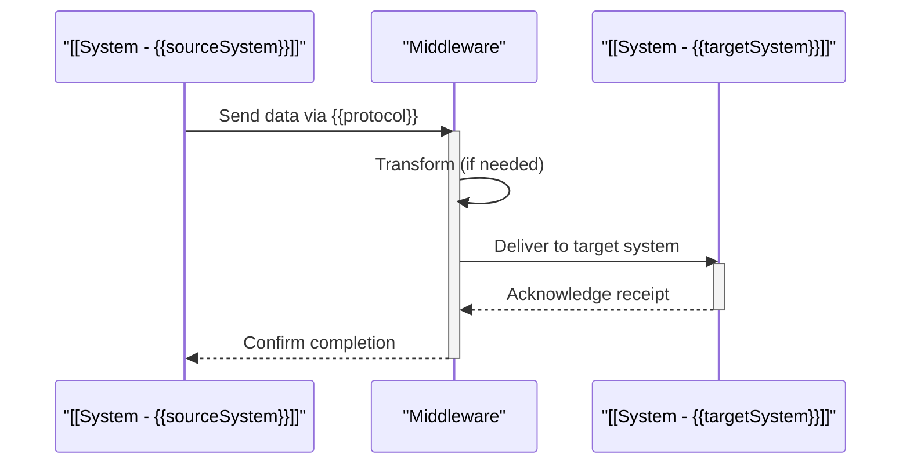
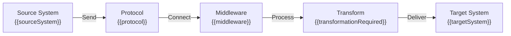

# {{sourceSystem}} → {{targetSystem}}

## Overview

Brief description of why this integration exists, business purpose, and strategic importance.

**Quick Facts**:
- **Source**: [[System - {{sourceSystem}}]]
- **Target**: [[System - {{targetSystem}}]]
- **Pattern**: Real-time API sync / Batch ETL / Event streaming
- **Status**: Active / Planned / Deprecated
- **Criticality**: Critical / High / Medium / Low

## Integration Properties

| Property | Value |
|----------|-------|
| **Integration ID** | `{{integrationId}}` |
| **Pattern** | API Sync / Batch ETL / Event Stream |
| **Protocol** | REST / Kafka / SFTP |
| **Frequency** | Real-time / Hourly / Daily |
| **Direction** | One-way / Bidirectional |
| **SLA** | 99.5% availability, < 100ms latency |

## Architecture Diagram

### Data Flow Sequence



### Integration Component Diagram



## Data Flow Details

### Source Data

**System**: [[System - {{sourceSystem}}]]

**Data Source**: [[DataSource - {{sourceDataSource}}]]

| Aspect | Details |
|--------|---------|
| **Records Per Second** | {{recordsPerSecond}} |
| **Average Payload Size** | {{averagePayloadSize}} |
| **Peak Throughput** | {{peakThroughput}} |
| **Data Refresh Frequency** | Daily at 23:00 UTC |

**Key Fields Being Extracted**:
- `invoice_id` - Invoice unique identifier
- `vendor_id` - Vendor master data reference
- `amount` - Invoice amount in GBP
- `invoice_date` - Transaction date

### Target Data

**System**: [[System - {{targetSystem}}]]

**Data Source**: [[DataSource - {{targetDataSource}}]]

| Aspect | Details |
|--------|---------|
| **Target Records** | ~{{peakThroughput}} daily |
| **Deduplication** | By invoice_id + company_code |
| **Late Arrival Window** | 24 hours |

**Key Fields Being Populated**:
- `revenue_id` - Generated PK in DataPlatform
- `source_invoice_id` - FK to source system
- `vendor_key` - Vendor dimensional reference
- `amount_local` - Amount in original currency
- `amount_gbp` - Converted to GBP

## Middleware & Connectivity

### Middleware Stack

**Primary Middleware**: [[System - {{middleware}}]]

| Component | Technology | Purpose |
|-----------|-----------|---------|
| Message Broker | Apache Kafka / RabbitMQ | Decouple source and target |
| ETL Engine | Spark / Talend / Custom | Transform and enrich data |
| API Gateway | Kong / AWS API Gateway | Route and authenticate requests |
| Schema Registry | Confluent / Custom | Version and validate schemas |

### Protocol & Connection

**Protocol**: {{protocol}}

**Authentication**: {{authenticationMethod}}

**Encryption**: TLS 1.3 end-to-end

**Connection Parameters**:
```yaml
Source Endpoint: https://sap.company.com/api/invoices
Target Endpoint: https://dataPlatform.company.com/v1/revenue
Timeout: 30 seconds
Retry: 3 attempts with exponential backoff
Max Payload: 100MB
Compression: gzip if > 1MB
```

## Data Transformation

### Transformation Required
{{transformationRequired}} - View details in [[Page - {{sourceSystem}} to {{targetSystem}} Data Mapping]]

### Field Mapping

| Source Field | Target Field | Transformation | Notes |
|--------------|--------------|-----------------|-------|
| `INVOICEID` | `revenue_id` | UUID generation | Primary key generation |
| `VENDORID` | `vendor_key` | Lookup SAP Vendor Master | Reference data join |
| `AMOUNT` | `amount_local` | Direct copy | Keep in original currency |
| `AMOUNT` | `amount_gbp` | Convert using daily rate | Apply FX conversion |
| `INVOICE_DATE` | `transaction_date` | Parse and format | ISO 8601 format |

### Data Contract

**Contract Definition**: [[ADR - {{sourceSystem}} Data Product Contract]]

**Schema Versions**:
- **Source Schema**: [[Schema - {{sourceSystem}}-INVOICE-v2.0]]
- **Target Schema**: [[Schema - {{targetSystem}}-REVENUE-v1.0]]

## Error Handling & Resilience

### Failure Scenarios

| Scenario | Trigger | Detection | Recovery |
|----------|---------|-----------|----------|
| **Source Unavailable** | API timeout (30s) | Health check fails 3x | Retry with exponential backoff, alert ops |
| **Schema Mismatch** | Target rejects record | Validation error logged | Route to Dead Letter Queue for manual review |
| **Network Failure** | Connection timeout | Network error exception | Queue locally, retry when connectivity restored |
| **Data Duplication** | Duplicate invoice_id | Uniqueness constraint | Idempotent check prevents duplicate insertion |

### Retry Strategy

```
Attempt 1: Immediate
Attempt 2: After 1 second (2^0)
Attempt 3: After 2 seconds (2^1)
Attempt 4: After 4 seconds (2^2)
Max Attempts: 3 (give up after 7 seconds total)
Dead Letter Queue: Undeliverable messages after all retries
```

### Dead Letter Queue (DLQ)

**Enabled**: Yes

**DLQ Location**: `/topics/{{sourceSystem}}-{{targetSystem}}-dlq`

**DLQ Retention**: 30 days

**Manual Review Process**: Operations team reviews DLQ daily, triage for data/schema issues

## Monitoring & Observability

### Health Checks

**Health Check Endpoint**: `https://{{middleware}}/health/{{integrationId}}`

**Check Interval**: Every 60 seconds

**Check Logic**:
1. Can source system respond? (< 5s)
2. Can target system receive? (< 5s)
3. Are transformations running? (< 10s)
4. DLQ message count < threshold? (< 100)

### Performance Metrics

| Metric | Target | Alert Threshold | Current |
|--------|--------|-----------------|---------|
| **Latency (p99)** | < 100ms | > 500ms | 45ms |
| **Throughput** | 1000 rec/sec | < 500 rec/sec | 980 rec/sec |
| **Success Rate** | 99.5% | < 99% | 99.7% |
| **Schema Errors** | < 0.1% | > 1% | 0.02% |
| **DLQ Messages** | 0 | > 10 | 2 |

### Monitoring Dashboard

**Tool**: Datadog / Splunk / CloudWatch

**Dashboard**: [Link to integration monitoring dashboard]

**Key Visualizations**:
- Throughput (records/sec over time)
- Latency percentiles (p50, p95, p99)
- Error rates by type
- DLQ accumulation
- System health status

### Alerting Rules

**Alert Severity: CRITICAL**
- Integration is down (no records flowing for 5 minutes)
- Latency exceeds 1 second (p99)
- Error rate exceeds 5%

**Alert Severity: WARNING**
- DLQ accumulating > 100 messages
- Latency exceeds 500ms (p99)
- Error rate exceeds 1%

**Notification**: PagerDuty to {{supportTeam}}

## Security & Compliance

### Data Security

**Classification**: Confidential (contains vendor financial data)

**Encryption in Transit**: TLS 1.3

**Encryption at Rest**: AES-256 (if cached/queued)

**Field-Level Encryption**: None (source system responsible)

### Authentication & Authorization

**Service Account**: `erp-to-dataPlatform-integration`

**Auth Method**: OAuth2 with client credentials

**Token Expiry**: 1 hour

**Permissions Required**:
- Source: Read invoices, vendor master
- Target: Write revenue fact table
- Middleware: Execute transformation jobs

### Audit & Logging

**Audit Logging**: Enabled

**Log Retention**: 90 days (meets SOC2 compliance)

**Fields Logged**:
- Integration ID
- Timestamp
- Record count
- Processing status
- User/service account
- Any errors encountered

**Log Location**: Splunk index `integration_audit`

### Compliance

**Applicable Frameworks**: SOC2, GDPR (contains vendor data)

**DPIA Required**: Yes - [[Form Submission - DPIA for {{sourceSystem}}-{{targetSystem}}]]

## Performance & Tuning

### Throughput Optimization

**Current Configuration**:
- Page Size: 500 records per API call
- Batch Size: 10,000 records per transformation batch
- Parallelism: 5 concurrent threads
- Compression: gzip when payload > 1MB

**Tuning Parameters**:
- ↑ Page Size → Fewer API calls, larger memory footprint
- ↑ Batch Size → Fewer database commits, larger transaction
- ↑ Parallelism → Higher throughput, higher resource contention

**Load Test Results**: [Link to load test report]

## Implementation Details

### Deployment

**Deployed By**: [[ADR - {{sourceSystem}} to {{targetSystem}} Connectivity]]

**Deployed On**: {{deploymentDeploymentDate}}

**Version**: v1.2.3

**Deployment Location**: AWS {{region}} / On-Prem {{location}}

### Runbooks & Documentation

**Runbook**: [[Page - {{sourceSystem}} to {{targetSystem}} Integration Runbook]]
- How to monitor the integration
- How to troubleshoot common issues
- How to perform maintenance and updates
- How to handle DLQ messages

**Design Document**: [[Architecture - {{sourceSystem}} {{targetSystem}} Integration Design]]
- Detailed technical design
- Rationale for technology choices
- Data model diagrams

**Change Log**: [Link to recent changes]

## Related Architecture & Decisions

| Document | Type | Relevance |
|----------|------|-----------|
| [[ADR - {{sourceSystem}} to {{targetSystem}} Connectivity]] | Architecture Decision | Why this integration approach was chosen |
| [[ADR - {{middleware}} as Integration Middleware]] | Architecture Decision | Why this middleware was selected |
| [[Architecture - Current State HLD]] | Design Doc | How this integration fits in overall architecture |
| [[Project - {{relatedProject}}]] | Project | Project implementing this integration |

## Integration Status & Lifecycle

### Current Status
- **Status**: Active / Planned / Testing / Deprecated
- **Version**: v1.2.3
- **Last Tested**: {{lastTestedDate}}
- **Last Updated**: {{modified}}

### Production Deployment
- **Deployment Date**: {{productionDeploymentDate}}
- **Time in Production**: [X months]
- **Incidents in Last 30 Days**: 0
- **MTTR**: 2 hours

### Lifecycle Plans
- **Planned Upgrades**: v2.0 targeting Q2 2026
- **Deprecation Date**: (null if not planned)
- **Replacement Integration**: (link to new integration if deprecated)

## Recent Events & Changes

| Date | Event | Impact | Details |
|------|-------|--------|---------|
| 2026-01-14 | Configuration change | Minor | Increased retry count from 2 to 3 |
| 2025-12-20 | Middleware upgrade | Minor | Kafka upgraded from 2.8 to 3.1 |
| 2025-11-30 | Performance tuning | Improvement | Batch size increased 5K→10K, latency reduced 35% |

## Support & Escalation

**Primary Owner**: {{serviceOwner}}

**Support Team**: {{supportTeam}}

**Escalation Contact**: {{serviceOwner}}'s manager

**Support Hours**: 24/7 (critical), Business hours for non-critical

**SLA**:
- Critical issues: Response in 1 hour, resolution in 4 hours
- High issues: Response in 4 hours, resolution in 8 hours
- Medium/Low: Response in business hours next day

---

**Last Updated**: {{modified}}

**Reviewed By**: [[Person Name]]
