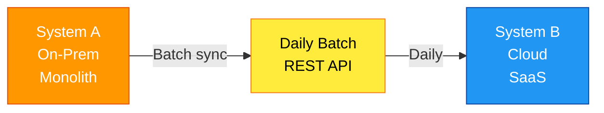
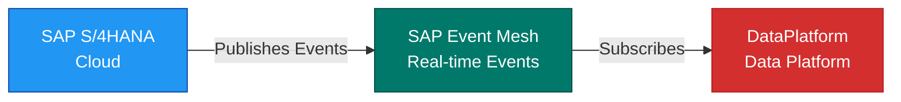
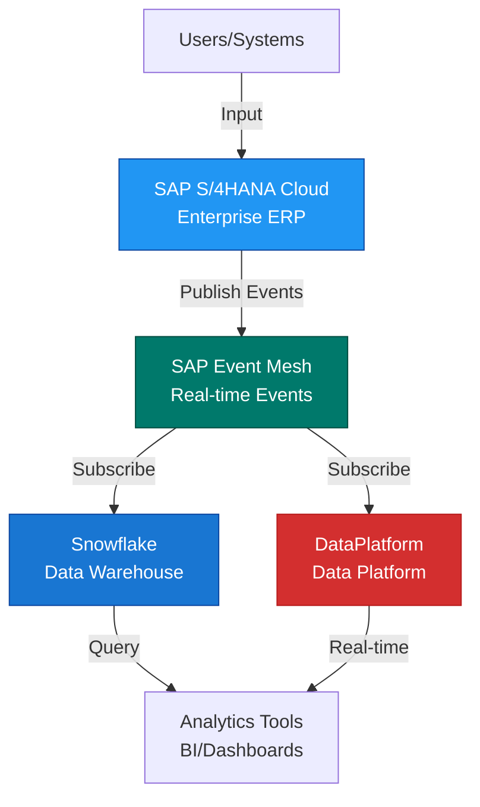

# {{scenarioName}}

## Executive Summary

Clear, concise description of this scenario in business terms.
- **What**: What is being proposed/changed?
- **Why**: What's the business driver?
- **When**: Timeline for implementation
- **Who**: Stakeholders affected
- **Impact**: Expected outcome (positive/negative)

## Scenario Overview

| Property | Value |
|----------|-------|
| **Scenario ID** | `{{scenarioId}}` |
| **Type** | {{scenarioType}} (Current / Future / Alternative / Migration) |
| **Status** | {{decisionStatus}} (Proposed / Approved / Rejected) |
| **Owner** | {{owner}} |
| **Timeline** | {{timeframe}} |

## Baseline Architecture

**Current State**: [[Architecture - {{baselineArchitecture}}]]

**Key Characteristics**:
- System A: On-premises, monolithic, aging
- System B: Cloud-based SaaS, modern
- Integration: REST APIs with daily batch sync
- Data: Decentralized, multiple sources of truth

**Current State Diagram**:

**Key Metrics**:
- Reporting lag: 24 hours
- Integration latency: 5-10 minutes
- System uptime: 99.5%
- Annual cost: £450,000

## Proposed State

### System Changes

#### New Systems

| System | Rationale | Status |
|--------|-----------|--------|
| [[System - SAP S/4HANA Cloud]] | Replace on-prem with cloud | Planned for Q3 2026 |
| [[System - SAP Event Mesh]] | Real-time event streaming | Prerequisite for modernisation |

#### Decommissioned Systems

| System | Timeline | Replacement |
|--------|----------|-------------|
| [[System - Legacy LegacyEngineeringSystem]] | Q4 2026 | [[System - SAP S/4HANA Cloud]] |
| [[System - Old Integration Platform]] | Q4 2026 | SAP Event Mesh |

#### Modified Systems

| System | Change | Impact |
|--------|--------|--------|
| [[System - DataPlatform]] | Add event consumer | Enable real-time data ingestion |
| [[System - Snowflake]] | Increase storage | Support larger event volumes |

### Integration Changes

#### New Integrations

**Integration Details**:
- [[Integration - SAP Cloud to DataPlatform (Event-driven)]]
  - Pattern: Event streaming (publish/subscribe)
  - Protocol: SAP Event Mesh (AMQP)
  - Frequency: Real-time (< 1 second latency)
  - SLA: 99.95% availability

#### Modified Integrations

| Current Integration | Change | New Integration |
|-------------------|--------|-----------------|
| [[Integration - SAP Legacy to DataPlatform]] | Batch daily | [[Integration - SAP Cloud to DataPlatform (Event-driven)]] |
| [[Integration - DataPlatform to Analytics]] | Move from batch | Real-time stream via Kafka |

### Full Scenario Architecture

**Key Differences from Current State**:
- ✓ Real-time data flow (< 1 second)
- ✓ Event-driven architecture (vs batch)
- ✓ Cloud-native infrastructure
- ✓ Reduced data silos (common event stream)

## Detailed Changes

### Change 1: SAP Modernisation

**Current State**:
- SAP LegacyEngineeringSystem (on-prem, 10+ years old)
- Aging infrastructure, cost burden
- Limited functionality

**Proposed State**:
- SAP S/4HANA Cloud
- Modern cloud infrastructure
- Real-time capabilities
- Built-in analytics

**Impact**:
- **Timeline**: Q1 2026 - Q3 2026 (9 months)
- **Effort**: 15 people, £800k cost
- **Risk**: Business continuity during migration
- **Benefit**: Reduced infrastructure costs (£250k/year), real-time data

### Change 2: Integration Modernisation

**Current State**:
- Point-to-point REST APIs
- Daily batch syncs
- High latency (24+ hours)
- Difficult to scale

**Proposed State**:
- Publish/subscribe via SAP Event Mesh
- Real-time event streaming
- Low latency (< 1 second)
- Loosely coupled systems

**Impact**:
- **Timeline**: Q3 2026 - Q4 2026 (4 months)
- **Effort**: 8 people, £300k cost
- **Risk**: Learning curve for event-driven patterns
- **Benefit**: Real-time data, simplified integration, better scalability

### Change 3: Analytics Modernisation

**Current State**:
- Daily refresh of Snowflake
- Dashboards show 24-hour old data
- Limited drill-down capability

**Proposed State**:
- Real-time event stream from SAP
- Snowflake updated < 1 second
- Dashboards with live data
- Streaming analytics capabilities

**Impact**:
- **Timeline**: Q4 2026 (ongoing)
- **Effort**: 4 people, £150k cost
- **Risk**: Queries on live data may slow down
- **Benefit**: Better business decisions, real-time visibility

## Impact Analysis

### Business Impact

**Benefits**:
✓ Real-time business visibility (reporting lag reduced from 24h to <1s)
✓ Faster decision-making (data is current)
✓ Improved customer experience (real-time order status)
✓ Reduced operational costs (£250k/year savings from infra)

**Risks**:
⚠ Migration disruption (potential 1-2 week freeze)
⚠ Higher SAP Event Mesh licensing costs initially
⚠ Learning curve for event-driven patterns
⚠ Depends on SAP Cloud readiness

**Financial Impact**:
- **Implementation Cost**: £1,250,000 total
  - SAP Migration: £800,000
  - Integration: £300,000
  - Analytics: £150,000
- **Annual Savings**: £250,000 (infrastructure reduction)
- **Payback Period**: 5 years
- **NPV (5-year)**: £500,000 positive

### Technical Impact

**Capabilities Enabled**:
1. Real-time data pipelines
2. Event-driven microservices
3. Streaming analytics
4. Better scalability

**Technical Debt Reduced**:
- Legacy LegacyEngineeringSystem system (EOL'd)
- Point-to-point integrations (consolidated)
- Batch-based workflows (replaced with streams)

**Complexity Changes**:
- ↑ Operational complexity (event-driven requires expertise)
- ↓ Integration complexity (publish/subscribe simpler than REST)
- ↑ Monitoring complexity (more systems to observe)

### Organizational Impact

**Resource Requirements**:
- 27 FTE over 12 months
- Budget: £1,250,000
- 5 architects, 12 engineers, 8 operations/support, 2 product managers

**Skills Required**:
- SAP S/4HANA Cloud expertise
- Event-driven architecture patterns
- Apache Kafka / messaging platforms
- Cloud infrastructure (AWS, Azure)
- Real-time analytics

**Training Needs**:
- Team training on event-driven patterns
- SAP Cloud certification for 3-5 people
- Kafka training for integration team

## Comparison Matrix

### Scenario Comparison: Current vs Proposed vs Alternative

| Criteria | Current State | Proposed (Recommended) | Alternative A | Alternative B |
|----------|---------------|----------------------|---------------|---------------|
| **Reporting Lag** | 24 hours | < 1 second | 5 minutes | 1 hour |
| **Infrastructure Cost** | £450k/year | £200k/year | £350k/year | £400k/year |
| **Implementation Cost** | N/A | £1,250k | £500k | £750k |
| **Complexity** | Medium | High | Medium-High | Medium |
| **Timeline** | N/A | 12 months | 6 months | 9 months |
| **Risk Level** | Low (status quo) | Medium (migration risk) | Low | Medium |
| **Business Value** | Low | High | Medium | Medium-High |
| **Technical Debt** | High (legacy) | Low (modern) | Medium | Medium |

**Recommendation**: Proposed scenario offers best balance of cost savings, business value, and long-term sustainability.

## Risk & Mitigation

### Implementation Risks

| Risk | Impact | Probability | Mitigation |
|------|--------|-------------|-----------|
| **SAP migration overrun** | H | M | Hire SAP migration partner, rigorous planning |
| **Skill gap in event-driven** | H | M | Hire consultants, team training, hire specialists |
| **Business continuity impact** | H | L | Parallel run strategy, rollback plan, extensive testing |
| **Cost overrun** | M | M | Detailed budgeting, change control, contingency budget |
| **Schedule delay** | M | M | Agile approach, sprint planning, early risk identification |

### Operational Risks (Post-Implementation)

| Risk | Mitigation |
|------|-----------|
| **Higher complexity** | Invest in monitoring and observability |
| **Skill requirement** | Hire experienced event architects, training program |
| **Increased failure modes** | Design for resilience, implement chaos engineering |

## Assumptions & Constraints

### Key Assumptions
1. SAP Cloud readiness by Q1 2026 (currently 60% ready)
2. Budget of £1.25M available
3. Required personnel available
4. Data residency requirements remain EU-only
5. Existing system integrations can be migrated without breaking changes

### Constraints
- Must maintain 99.5% uptime during migration
- Cannot require new licenses beyond SAP Event Mesh
- Must support current transaction volume (2M daily)
- Backward compatibility with existing APIs (12-month deprecation window)

## Phased Implementation Plan

### Phase 1: Foundation & Planning (Q1 2026, 3 months)
**Deliverables**:
- SAP Cloud architecture design
- Event-driven patterns defined
- Migration detailed plan
- Runbooks developed

**Success Criteria**: Architecture approved, team trained, infrastructure ready

### Phase 2: SAP Cloud Migration (Q1-Q3 2026, 3 months)
**Deliverables**:
- SAP S/4HANA Cloud deployed
- Data migrated
- Users trained
- Parallel run period

**Success Criteria**: Cloud system stable, data validated, users comfortable

### Phase 3: Integration Modernisation (Q3-Q4 2026, 2 months)
**Deliverables**:
- SAP Event Mesh configured
- Event publishers created
- Event subscribers integrated
- Real-time flows operational

**Success Criteria**: Real-time integrations validated, latency < 1s, no data loss

### Phase 4: Analytics Modernisation (Q4 2026 onwards, ongoing)
**Deliverables**:
- Real-time data pipeline to Snowflake
- Live dashboards
- Streaming analytics queries

**Success Criteria**: BI team using real-time data, decision velocity improved

## Success Metrics & KPIs

### Technical KPIs

| KPI | Target | Measurement |
|-----|--------|-------------|
| **Reporting Latency** | < 1 second | P99 latency in dashboards |
| **Availability** | 99.95% | System uptime % |
| **Error Rate** | < 0.1% | % of events with errors |
| **Data Freshness** | < 1 second | Max age in warehouse |

### Business KPIs

| KPI | Target | Measurement |
|-----|--------|-------------|
| **Cost Savings** | £250k/year | Infrastructure spend reduction |
| **User Adoption** | > 80% | % of users using real-time dashboards |
| **Decision Cycle Time** | 50% improvement | Time from data change to action |
| **Incident Response** | < 1 hour | MTTR for reported issues |

## Decision Framework

### Go/No-Go Criteria

**Green Light (Proceed)**:
- ✓ Architecture approved by Enterprise Architecture board
- ✓ Budget secured (£1.25M)
- ✓ SAP migration partner signed
- ✓ Team assembled and trained
- ✓ Executive sponsorship confirmed

**Yellow Light (Conditions)**:
- ⚠ Budget reduced to £900k (reduces scope)
- ⚠ Timeline extended to 18 months (resource constraints)
- ⚠ Pilot approach only (smaller initial scope)

**Red Light (Hold/Reject)**:
- ✗ SAP Cloud readiness drops below 40%
- ✗ Budget cannot be secured
- ✗ Key resources unavailable
- ✗ Major business disruption expected

## Canvas Visualizations

Interactive visual comparisons of this scenario:

- [[Canvas - {{scenarioName}} - System Changes]]
- [[Canvas - {{scenarioName}} vs Alternatives]]
- [[Canvas - {{scenarioName}} - Timeline & Phases]]

## Related Documentation

| Document | Type | Relevance |
|----------|------|-----------|
| [[Architecture - SAP Cloud Future State]] | Design Doc | Target architecture |
| [[ADR - Event-Driven Architecture Adoption]] | Decision Record | Technology choice rationale |
| [[Project - SAP S4HANA Cloud Migration]] | Project | Implementation project |
| [[Page - SAP Cloud Migration Runbook]] | Operational Guide | How to execute migration |

## Review & Approval

| Role | Status | Date | Comments |
|------|--------|------|----------|
| **Enterprise Architect** | Reviewing | - | Waiting for financial model |
| **CTO** | Pending | - | Will review next week |
| **CFO** | Pending | - | Budget approval needed |
| **Program Sponsor** | Approved | 2026-01-10 | Supports recommendation |

---

**Scenario Status**: {{decisionStatus}} (Proposed / Approved / Rejected)

**Recommended**: {{recommendedApproach}} (Yes / No)

**Last Updated**: {{modified}}

**Next Review**: 2026-02-14
