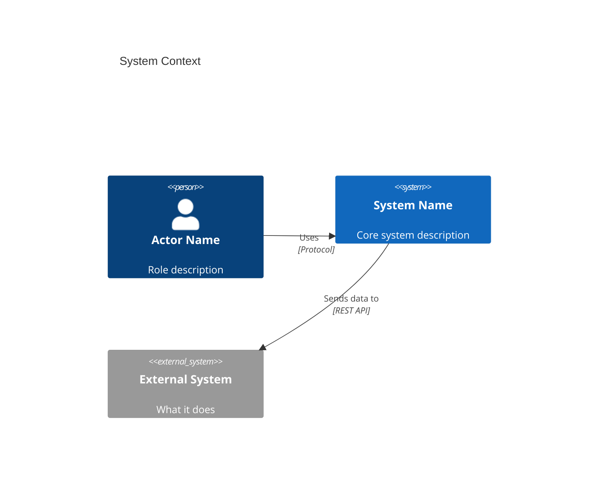

# <% tp.file.title %>

## Overview

Brief description of what this system does, its purpose in the enterprise, and key characteristics.

## System Properties

| Property        | Value       |
| --------------- | ----------- |
| **System ID**   |             |
| **APM Number**  |             |
| **Type**        |             |
| **Status**      |             |
| **Criticality** |             |
| **Owner**       |             |
| **Vendor**      |             |

## Technology Stack

- **Languages**:
- **Framework**:
- **Database**:
- **Messaging**:
- **Hosting**:

## C4 Architecture Diagrams

> [!tip] Generating C4 diagrams
> Use `/c4-diagram <system-name>` to auto-generate these diagrams from the `c4:` frontmatter data on this note.

### C4 Context (Level 1)



## Key Capabilities

-

## Integrations

| Target System | Pattern | Protocol | Frequency | Criticality |
| ------------- | ------- | -------- | --------- | ----------- |
|               |         |          |           |             |

## Operational Characteristics

### SLA & Performance

- **Availability Target**:
- **RTO (Recovery Time)**:
- **RPO (Data Loss)**:

### Monitoring & Health

- **Monitoring Tool**:
- **Incident Response SLA**:

## Data & Security

- **Data Classification**:
- **GDPR Applicable**:
- **Authentication**:
- **Encryption in Transit**:
- **Encryption at Rest**:

## Lifecycle Status

- **Status**:
- **Launch Date**:
- **Sunset Date**:
- **Modernisation Target**:

## Related Notes

```dataview
TABLE type, status
FROM ""
WHERE contains(file.outlinks, this.file.link) AND file.name != this.file.name
SORT type ASC
```
